# Section 10: Configuring Protection Groups

## Table of contents

- [Section 10: Configuring Protection Groups](#section-10-configuring-protection-groups)
  - [Table of contents](#table-of-contents)
  - [About Protection Groups](#about-protection-groups)
    - [About the default protection group](#about-the-default-protection-group)
    - [About adding protection groups](#about-adding-protection-groups)
    - [Protection group concepts](#protection-group-concepts)
    - [About managing the protection groups from Arbor Enterprise Manager](#about-managing-the-protection-groups-from-arbor-enterprise-manager)
    - [Prefix matching in protection groups](#prefix-matching-in-protection-groups)
  - [About the Protection Levels](#about-the-protection-levels)
    - [User access](#user-access)
    - [About the different protection levels](#about-the-different-protection-levels)
    - [About the protection levels for protection groups and the outbound threat filter](#about-the-protection-levels-for-protection-groups-and-the-outbound-threat-filter)
    - [About the protection levels for the protection settings](#about-the-protection-levels-for-the-protection-settings)
    - [Viewing the current protection level](#viewing-the-current-protection-level)
    - [Balancing protection and risk](#balancing-protection-and-risk)
    - [Recommended protection levels for protection settings](#recommended-protection-levels-for-protection-settings)
  - [Adding Protection Groups](#adding-protection-groups)
    - [About server types](#about-server-types)
    - [Adding a protection group](#adding-a-protection-group)
    - [Protection group settings](#protection-group-settings)
    - [About protection level automation](#about-protection-level-automation)
    - [About the threshold graphs](#about-the-threshold-graphs)
    - [Adding protection groups on AEM](#adding-protection-groups-on-aem)
  - [Editing and Deleting Protection Groups](#editing-and-deleting-protection-groups)
    - [About the default protection group](#about-the-default-protection-group-1)
    - [About configuring protection groups in AEM](#about-configuring-protection-groups-in-aem)
    - [Editing a protection group](#editing-a-protection-group)
    - [Deleting a protection group](#deleting-a-protection-group)
  - [Viewing the Status of Protection Groups](#viewing-the-status-of-protection-groups)
    - [Navigating to the List Protection Groups page](#navigating-to-the-list-protection-groups-page)
    - [About the List Protection Groups page](#about-the-list-protection-groups-page)

## About Protection Groups

- Represent either the IPv4 hosts or the IPv6 hosts that you need to protect on your network
- Each protection group is associated with a server type and one or more host servers of that type

### About the default protection group

-  Provide protection for all of the IPv4 hosts in your enterprise
-  The default protection group is preconfigured to protect all Ipv4 hosts and is associated with the generic server type
-  Only can configure its protection mode, protection level, and bandwidth alert threshold
-  Cannot delete

### About adding protection groups

- Can add protection groups too protect either Ipv4 hosts or IPv6 hosts
- Throughout AED and AED
  - Monitor traffic
  - Mitigate attack
  - Focus attention on your most critical hosts

- Recommend that you add a protection group for each of the services that you want to protect

- AED-HD1000 appliances support up to 2000 protection groups (199 custom + 1 default)
- All other AED appliances support up to 100 protection groups (99 custom + 1 default)

### Protection group concepts

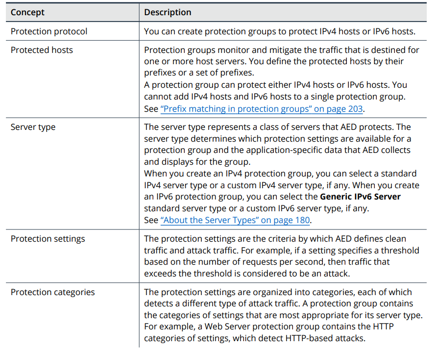

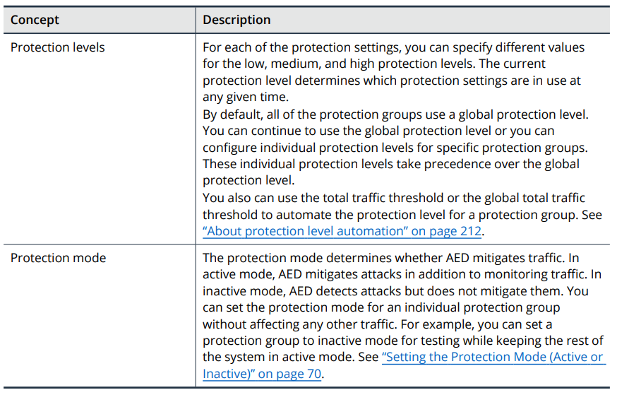

### About managing the protection groups from Arbor Enterprise Manager

- Can add the protection groups in AEM and then assign AED devices to those protection groups
- AEM can determine how may protection groups an AED is assigned to

- Fist connect AED to AEM
  - The protection groups on AEM are merged with any existing protection groups on the assigned AED devices

### Prefix matching in protection groups

- Different length prefixes of the same network are protected by one protection group or separate protection groups
  - AED matches traffic to the most specific (Longest) prefix

- IPv4 prefix matching examples

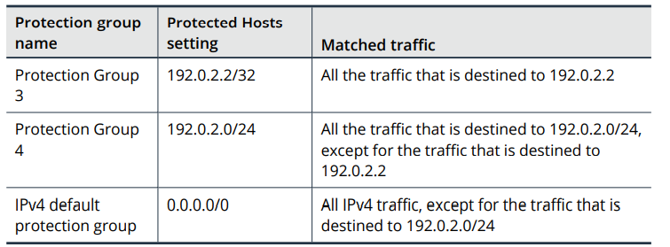

- IPv6 prefix matching examples

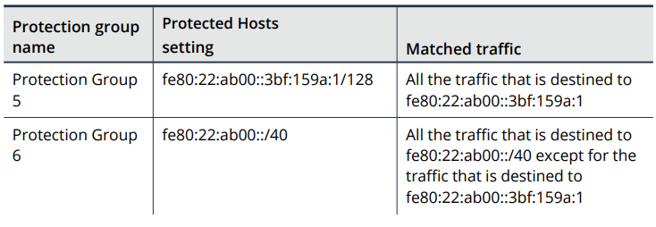

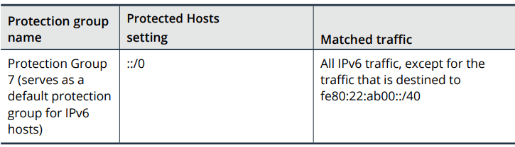

## About the Protection Levels

- Defines the strength of protection that the AED device provides and the associated intrusiveness and risk of block clean traffic
- Levels (low, medium, high)
  
### User access

- Only administrators can change the protection level

### About the different protection levels

- Determines which protection settings are in use at any given time
- A device can use a global protection level or individual protection levels

### About the protection levels for protection groups and the outbound threat filter

- Might change the protection level for a protection group or the outbound threat filter:
  - To respond to attacks and traffic spikes against one protection group without affecting the traffic to the other protection groups
  -  To respond to outbound threats without affecting the inbound traffic
  -  To determine how different protection levels affect the traffic when you create a new protection group or change the settings for an existing protection group

### About the protection levels for the protection settings

- Can specify different values for each of the protection settings
- Inbound traffic:
  - `Protect > Inbound Protection > Server Type Configuration` 
- Outbound traffic:
  - `Protect > Outbound Protection > Outbound Threat Filter`

### Viewing the current protection level

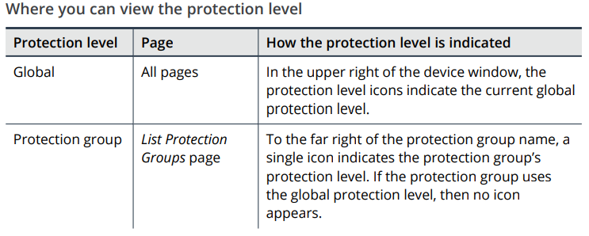

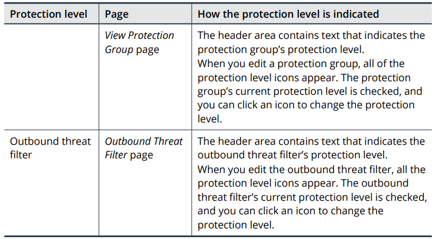

### Balancing protection and risk

- The risk of blocking clean traffic increases with the level of protection

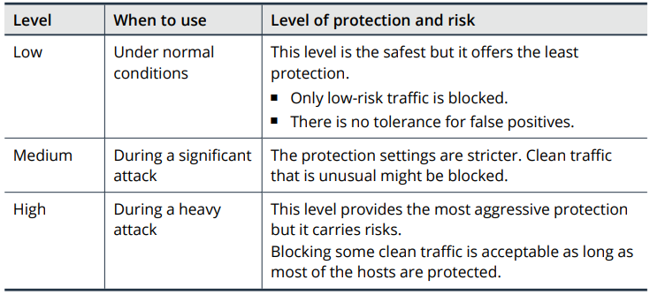

### Recommended protection levels for protection settings

- Low level settings should protect your network against the majority of attacks without blocking any clean traffic
- If a large number of attacks are passed through
  - Configure more aggressive thresholds at the low level

## Adding Protection Groups

- If a hostname resolves to IPv4 addresses and IPv6 addresses
  - Must crete two protection groups

### About server types

### Adding a protection group

- ` Protect > Inbound Protection > Protection Groups`
  - Click **Add IPv4 Protection Group** or **Add IPv6 Protection Group**
  - Configure the settings
  - Click **Add**
  
### Protection group settings

- Click **See threshold graphs** icon to view information about a protection group's traffic levels
  
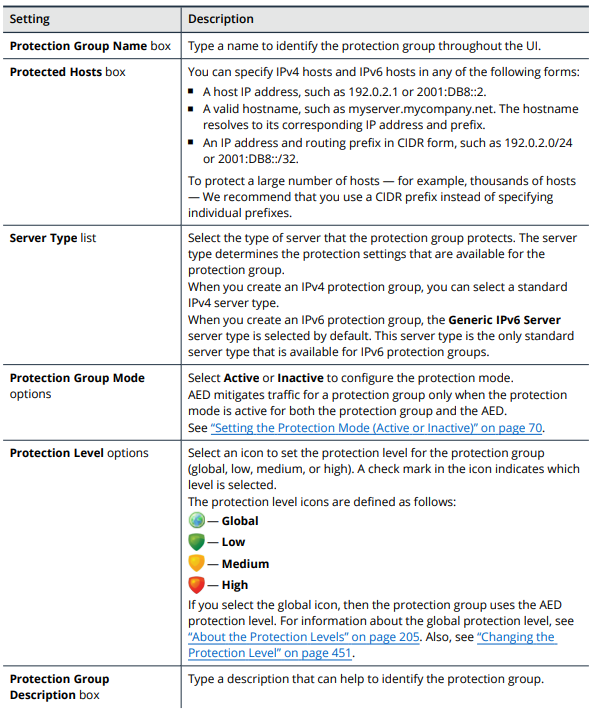

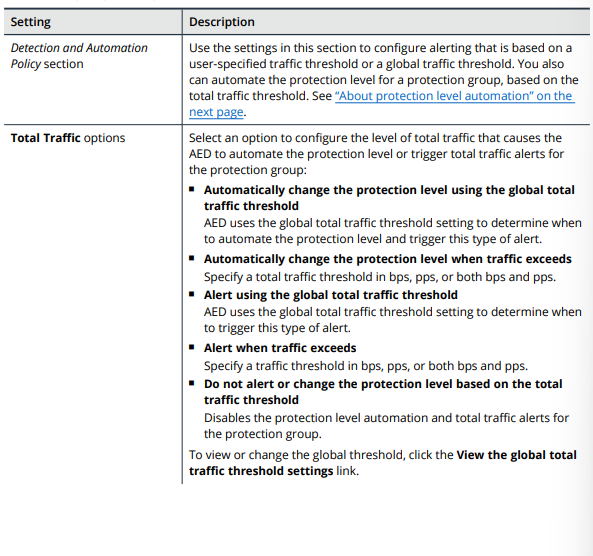

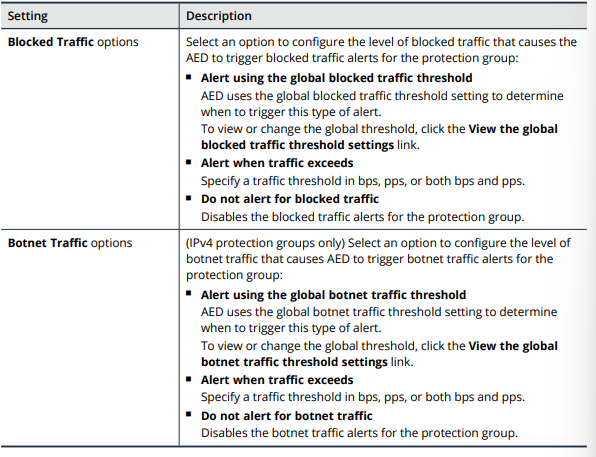

### About protection level automation

- Select `Detection and Automation Policy` for total traffic to change the protection level automatically
  - Initially level is low
  - If traffic exceeds the total traffic threshold in one minute, AED changes the protection level to high and triggers an alert
  - Remain high for at least five minutes and return to low if the traffic level falls below the threshold

- If you change a protection group’s protection level when automation is enabled
  - AED disables the automation

- Can disable the automation by
  - Changing the total traffic settings to an alerting option
  - Turning off the automation and alerting

### About the threshold graphs

- Use **See threshold graphs** icon display graphs that show the protection group's traffic levels in bytes per second and packet per second
  - traffic levels for the last seven days
  - the current baseline
  - the current threshold

### Adding protection groups on AEM

## Editing and Deleting Protection Groups

- Test a new protection group
- Mitigate attacks
- Change the threshold values or the type of threshold that AED uses to determine the amount of traffic that triggers an alert

### About the default protection group

- only can configure protection mode, protection level, bandwidth alert thresholds

### About configuring protection groups in AEM

### Editing a protection group

- `Protect > Inbound Protection > Protection Groups`
  - Click the name link of the protection group to edit
  - Click **Edit** in the header section
  - Change the settings as needed
- Save

### Deleting a protection group

- Delete an IPv4 protection groups => The prefixes are included in the default protection group
- The default protection group does not protect IPv6 prefixes
  - You can configure a custom IPv6 protection group to server as the default IPv6 protection group

- Delete a protection group
  - AED removes the protection group from any scheduled reports that include it
  - Cannot undo

- `Protect > Inbound Protection > Protection Groups`
  - Select the check box for each protection group that you want to delete
  - Select the check box in the table heading row to select all of the protection groups
- Click **Delete**
- OK

## Viewing the Status of Protection Groups

- The **List Protection Groups** page displays all of the protection groups and their status
  - Can expand a specific protection group to view more information

### Navigating to the List Protection Groups page

- `Protect > Inbound Protection > Protection Groups`

### About the List Protection Groups page

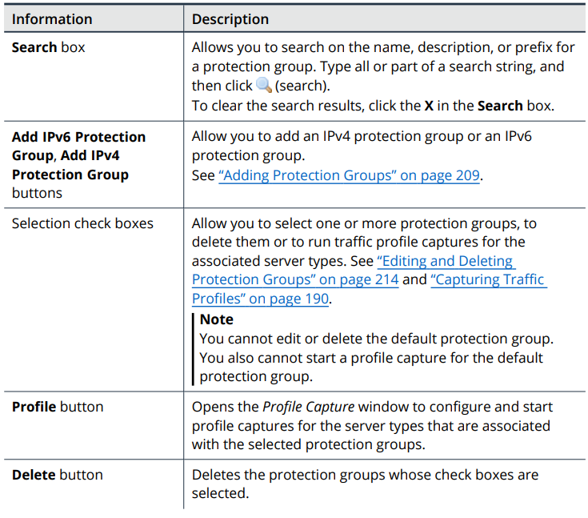

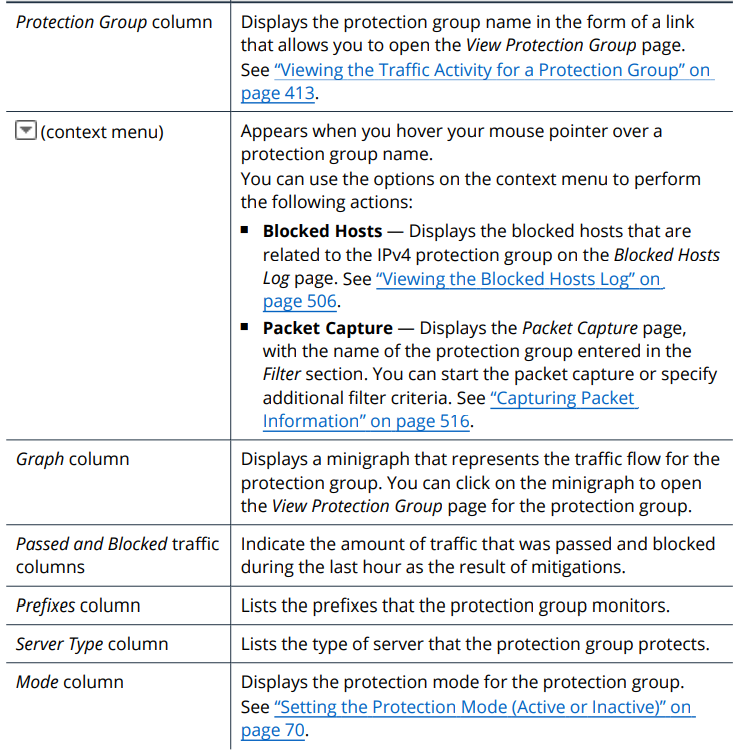

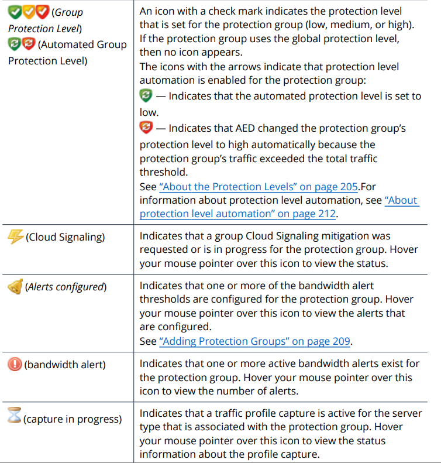

