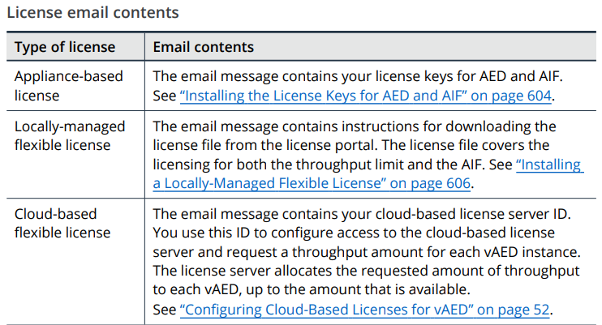

# Section 2: Introduction to AED Licensing

## Table of contents

- [Section 2: Introduction to AED Licensing](#section-2-introduction-to-aed-licensing)
  - [Table of contents](#table-of-contents)
  - [About AED Licensing](#about-aed-licensing)
    - [Types of licenses](#types-of-licenses)
    - [How to obtain licenses](#how-to-obtain-licenses)
    - [About license upgrades](#about-license-upgrades)
    - [License status and expiration](#license-status-and-expiration)
    - [License-related messages and alerts](#license-related-messages-and-alerts)
  - [Types of AED Licenses](#types-of-aed-licenses)
    - [Appliance-based licensing](#appliance-based-licensing)

## About AED Licensing

- Can license the following capabilities:
  - The throughput limit for AED
  - The ATLAS INtelligence Feed (AIF) level

### Types of licenses

- Appliance-based licensing - for physical AED appliances other than the AED-HD1000 and AED 8100
- Locally-managed flexible licensing - for the AED-HD1000 appliance and AED 8100 appliance only
- Cloud-based flexible licensing - for vAED only

### How to obtain licenses

- When you buy a license, you will receive an email message

### About license upgrades

- Can install the AED license and AIF license during the initial process of installing and configuring AED

- Can install or replace the licenses in the following situations:
  - Purchase or renew an AED license
  - Upgrade your AED license to increase traffic throughput limit
  - Subscribe to the AIF or renew your AIF subscription
  - Upgrade your AIF subscription to a different level
  - Upgrade from APS to AED, and you use your existing APS license

### License status and expiration

### License-related messages and alerts

- Informs you about status of your license
  - Expiration messages
    - When the throughput license expires or expired, and throughput limit that is available after the expiration date
    - When the current AIF level expires or expired, and the AIF level that is available after the expiration date
  - System alerts and notifications
  - Status messages

## Types of AED Licenses

### Appliance-based licensing

