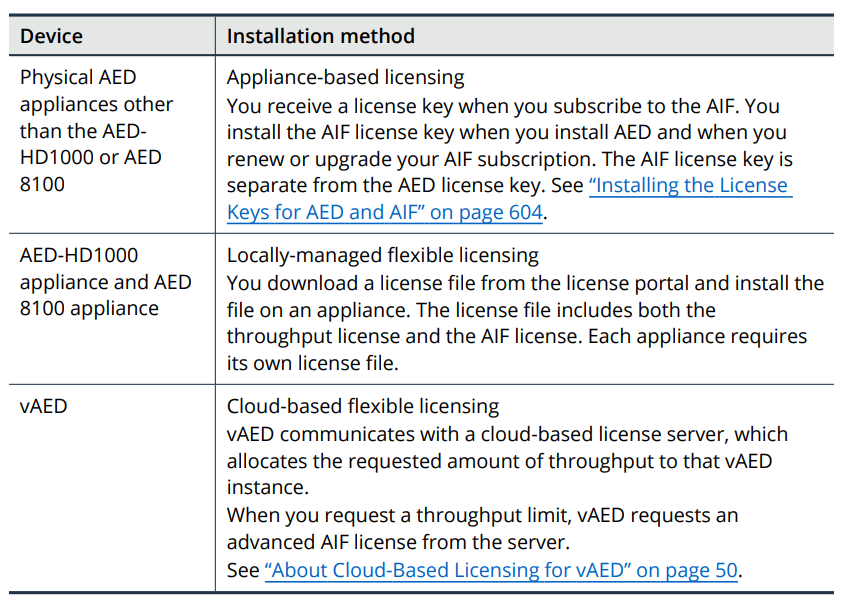

# Section 2: Introduction to AED Licensing

## Table of contents

- [Section 2: Introduction to AED Licensing](#section-2-introduction-to-aed-licensing)
  - [Table of contents](#table-of-contents)
  - [About AED Licensing](#about-aed-licensing)
    - [Types of licenses](#types-of-licenses)
    - [How to obtain licenses](#how-to-obtain-licenses)
    - [About license upgrades](#about-license-upgrades)
    - [License status and expiration](#license-status-and-expiration)
    - [License-related messages and alerts](#license-related-messages-and-alerts)
  - [Types of AED Licenses](#types-of-aed-licenses)
    - [Appliance-based licensing](#appliance-based-licensing)
    - [Locally-managed flexible licensing](#locally-managed-flexible-licensing)
    - [Cloud-based flexible licensing](#cloud-based-flexible-licensing)
  - [About the Licensed Throughput Limit](#about-the-licensed-throughput-limit)
    - [About the throughput limit enforcement](#about-the-throughput-limit-enforcement)
    - [Throughput limit notifications](#throughput-limit-notifications)
    - [Throughput license upgrades](#throughput-license-upgrades)
    - [Supported throughput ranges for AED appliances](#supported-throughput-ranges-for-aed-appliances)
  - [About the ATLAS Intelligence Feed License](#about-the-atlas-intelligence-feed-license)
    - [About installing the AIF license](#about-installing-the-aif-license)
    - [Tiered licensing for ATLAS Intelligence Feed](#tiered-licensing-for-atlas-intelligence-feed)
  - [Viewing the AED License Information](#viewing-the-aed-license-information)
    - [Information about appliance-based licenses and locally-managed flexible licenses](#information-about-appliance-based-licenses-and-locally-managed-flexible-licenses)
    - [Information about cloud-based flexible licenses](#information-about-cloud-based-flexible-licenses)
    - [Information about the cloud-based license server](#information-about-the-cloud-based-license-server)
    - [About the throughput information on the Licenses Page](#about-the-throughput-information-on-the-licenses-page)
  - [Viewing License Details in the CLI](#viewing-license-details-in-the-cli)
    - [Viewing the licensed capabilities](#viewing-the-licensed-capabilities)
    - [Show the license information](#show-the-license-information)
    - [Information about appliance-based licenses](#information-about-appliance-based-licenses)
    - [Information about flexible licenses](#information-about-flexible-licenses)

## About AED Licensing

- Can license the following capabilities:
  - The throughput limit for AED
  - The ATLAS INtelligence Feed (AIF) level

### Types of licenses

- Appliance-based licensing - for physical AED appliances other than the AED-HD1000 and AED 8100
- Locally-managed flexible licensing - for the AED-HD1000 appliance and AED 8100 appliance only
- Cloud-based flexible licensing - for vAED only

### How to obtain licenses

- When you buy a license, you will receive an email message

### About license upgrades

- Can install the AED license and AIF license during the initial process of installing and configuring AED

- Can install or replace the licenses in the following situations:
  - Purchase or renew an AED license
  - Upgrade your AED license to increase traffic throughput limit
  - Subscribe to the AIF or renew your AIF subscription
  - Upgrade your AIF subscription to a different level
  - Upgrade from APS to AED, and you use your existing APS license

### License status and expiration

### License-related messages and alerts

- Informs you about status of your license
  - Expiration messages
    - When the throughput license expires or expired, and throughput limit that is available after the expiration date
    - When the current AIF level expires or expired, and the AIF level that is available after the expiration date
  - System alerts and notifications
  - Status messages

## Types of AED Licenses

### Appliance-based licensing

- Only available for certain physical AED appliances
- Provide fixed access to the capabilities and capacities of AED on a per-appliance basis

### Locally-managed flexible licensing

- Include both the throughput license and the AIF license
- Each appliance requires its own license file
- the appliance model must match the model that is specified in the license
- Available for the AED-HD1000 appliance and AED 8100 appliance

### Cloud-based flexible licensing

- Allows to tailor resources as needs
- NETSCOUT issues flexible licenses for vAED and AIF
- Each vAED connect to the license server and request a portion of total licensed throughput
- The license server allocates the requested amount of throughput to that vAED instance
- Purchase an AIF subscription
  - The subscription level (Standard or Advanced) determines which components which components of the AIF are included

## About the Licensed Throughput Limit

### About the throughput limit enforcement

- Depends on the type of license that is installed:
  - Appliance-based licenses and locally-managed flexible licenses
    - Monitored and enforced separately on each device
  - Cloud-based flexible licenses
    - Monitored and enforced across all of the vAED devices that are included in the cloud-based license

- `The burst limits` (traffic can exceed the licensed throughput limit temporarily)
  - A maximum of two times the throughput limit for licenses with a throughput limit up to 1 Gbps
  - A maximum of 1 Gbps over the throughput limit for licenses with a throughput limit over 1 Gbps

### Throughput limit notifications

- When the amount of traffic that AED forwards exceeds 90 percent of the throughput limit
  - Displaying an alert on the `Summary` page and `System Alerts` page
  - Sending you a license alert message if you configured AED to send messages when a license alert occurs (Include when configure bandwidth notifications)

### Throughput license upgrades

- Physical AED appliances other than the AED-HD1000 or AED 8100 — See “Installing the License Keys for AED and AIF” on page 604
- AED-HD1000 and AED 8100 only — See “Installing a Locally-Managed Flexible License” on page 606
- vAED — See “Process for upgrading the throughput limit” on page 52

### Supported throughput ranges for AED appliances

- Throughput ranges

  

## About the ATLAS Intelligence Feed License

- Provide automatic protection against specific, known threats
- The AIF downloads real-time threat information from the Active Threat Level Analysis System (ATLAS®)

### About installing the AIF license

- License installation methods

### Tiered licensing for ATLAS Intelligence Feed

- Available components by AIF subscription level

    

## Viewing the AED License Information

- Can view information about the licensed capabilities for AED on the `Licenses` page

- Navigating: `Administration > Licenses`

### Information about appliance-based licenses and locally-managed flexible licenses

- Throughput Limit for Clean Traffic
- Current AIF level (None, Standard or Advanced)
- Expiration for the throughput license and the AIF license

### Information about cloud-based flexible licenses

- Only for vAED
- Information:
  - Throughput Limit for Clean Traffic
  - Requested Throughput Limit
  - Expiration for the throughput license and the AIF license
  - Current AIF Level 

### Information about the cloud-based license server

- Last Successful Refresh
- Refresh Local Copy of License: Refresh the connection to the cloud-based connection
- Cloud-Based License Server ID
- Proxy Server, Port, Proxy Authentication Method

### About the throughput information on the Licenses Page

- The `Throughput for Clean Traffic` graph represents the amount of clean traffic that AED forwarded over the previous week

## Viewing License Details in the CLI

- Information can view by using the command line interface
  - The aggreated amount of throughput is associated with each of the licensed capabilities
  - The AIF level that is licensed
  - The license expiration dates
  - Only for cloud-based flexible licenses:
    - The exp dates for all of the licenses on the cloud-based license server
    - The exp dates for the local licenses on your instances of vAED

### Viewing the licensed capabilities

`/ system license capability`

### Show the license information

`/ system license show`

### Information about appliance-based licenses

- Product
  - AED - throughput license
  - ASERT - AIF license
- Model
- Expires
- Key

### Information about flexible licenses

- Available for the AED-HD1000, AED 8100 appliance and vAED

- `/ system license show #`

- Information
  - `#` (number) : The ID that is associated with each license
  - License Name (Cloud-based licenses)
  - License name (locally-managed flexible licenses)
  - Entitlements
  - Expires
  - Total Throughput
  - Throughput (when view a specific local license)
  - Borrowed until
  - Capabilities

