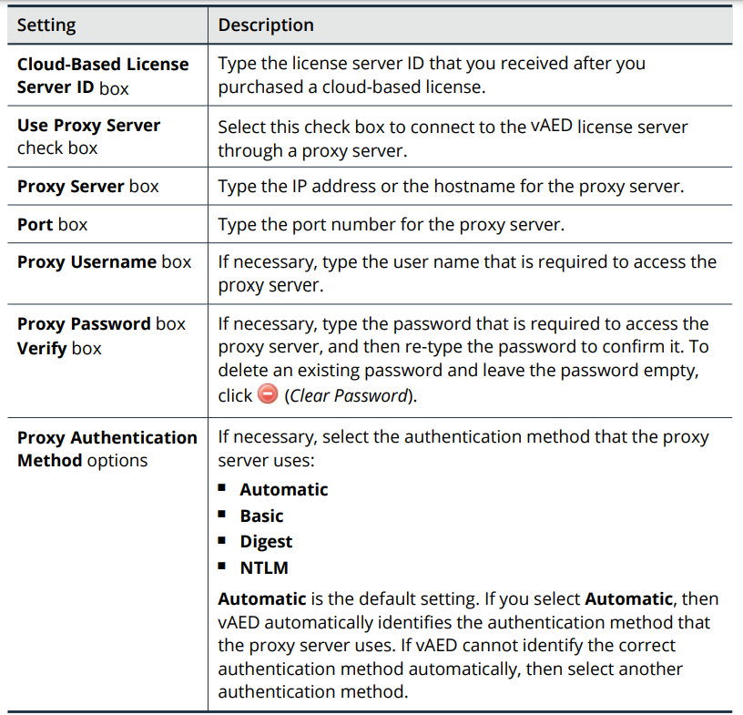

# Section 3: Introduction to vAED

## Table of contents

- [Section 3: Introduction to vAED](#section-3-introduction-to-vaed)
  - [Table of contents](#table-of-contents)
  - [About vAED](#about-vaed)
    - [About vAED installation](#about-vaed-installation)
    - [Licensing vAED](#licensing-vaed)
    - [About software bypass](#about-software-bypass)
    - [Unsupported features and functions](#unsupported-features-and-functions)
    - [Accessing vAED](#accessing-vaed)
  - [About Cloud-Based Licensing for vAED](#about-cloud-based-licensing-for-vaed)
    - [About cloud-based flexible licensing](#about-cloud-based-flexible-licensing)
    - [Communicating with the cloud-based license server](#communicating-with-the-cloud-based-license-server)
    - [How to obtain cloud-based licenses](#how-to-obtain-cloud-based-licenses)
    - [Expiration of cloud-based licenses](#expiration-of-cloud-based-licenses)
  - [Configuring Cloud-Based licenses for vAED](#configuring-cloud-based-licenses-for-vaed)
    - [Process for configuring licenses](#process-for-configuring-licenses)
    - [Process for upgrading the throughput limit](#process-for-upgrading-the-throughput-limit)
    - [Configuring access to the cloud-based license server](#configuring-access-to-the-cloud-based-license-server)
    - [vAED license server settings](#vaed-license-server-settings)
    - [Requesting a throughput limit for vAED](#requesting-a-throughput-limit-for-vaed)
    - [Refreshing local license information](#refreshing-local-license-information)
    - [Releasing local licenses on vAED](#releasing-local-licenses-on-vaed)

## About vAED

- The virtual machine version of AED that runs on a hypervisor
- Contains all of the AED software packages and configurations, and provides a hardware-independent resources => Only need to install and configure its network settings

### About vAED installation

- Read `Virtual Arbor Edge Defense Installation Guide`

### Licensing vAED

- Use Cloud-based licenses
- If vAED does not have a valid license when it is set to layer 3 mode, then the system does not pass traffic or process mitigations

### About software bypass

- Software bypass is enabled by default:
  - When a software failure occurs, traffic bypasses the vAED protection interfaces

### Unsupported features and functions

- NTP on VMware hypervisors
- Shell Access

### Accessing vAED

- `https://IP_address_of_the_vAED`
- `ssh admin@IP_address`

## About Cloud-Based Licensing for vAED

- Use Cloud-based flexible licenses
- Capability:
  - The throughput limit for vAED
  - AIF subscription level

### About cloud-based flexible licensing

- License is managed by a cloud-based license server
- On each vAED, you connect to the license server and request a portion of your total licensed throughput
- AIF subscription level (Standard or Advanced)
- vAED requires contact with the cloud-based license server to function correctly
  - Communicates with the license server every 24 hours to refresh the local license information

### Communicating with the cloud-based license server

- Use standard HTTPS port 443
- If vAED behind a firewall, you should configure a proxy server through which vAED accesses the license server

### How to obtain cloud-based licenses

- Contact your account team
- When you purchase a cloud-based license, you will receive an email message that contains your cloud-based license server ID

### Expiration of cloud-based licenses

- `Licenses` page > `Expiration` fields
  - Display the dates on which the licenses expire on the cloud-based license server
  

## Configuring Cloud-Based licenses for vAED

### Process for configuring licenses

- Steps to configure vAED licenses
  - Configure access to the cloud-based license server
  - Request a local license for a throughput limit
  - (Optional) Refresh the local license information when needed
  
### Process for upgrading the throughput limit

- Steps to upgrade vAED licenses
  - Refresh the local license information
  - Request a new throughput limit

### Configuring access to the cloud-based license server

- Select **Administration > Licenses**
- Specify server settings in **Licenses > Cloud-Based License Server**
- Save

### vAED license server settings

### Requesting a throughput limit for vAED

- `Administration > Licenses > Requested Throughput Limit box`
- Can request from 20 Mbps up to 1 Gbps (depends on the purchase)
- Save

### Refreshing local license information

- Situations:
  - After a network change occurs
  - After add more throughput capacity to the server or update the AIF license level
  - after resolve any issues that may have caused a license refresh to fail

- `Administration > Licenses'
  - Click `Refresh Local Copy of License` to refresh

### Releasing local licenses on vAED

- The licenses expire 10 days after you decommission vAED

- `Administration > Licenses`
  - Enter 0 at 'Requested Throughput Limit` box and Save

