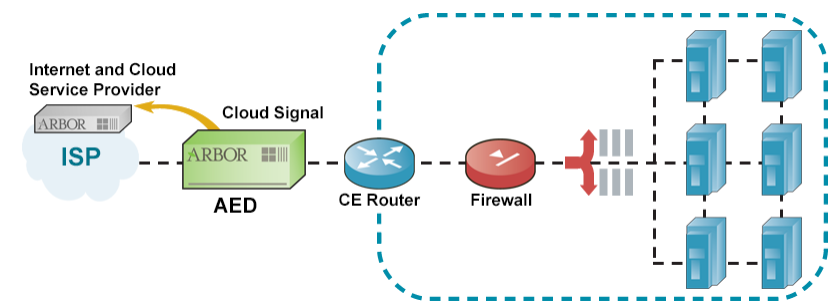

# Section 4: Implementing AED

## Table of contents

- [Section 4: Implementing AED](#section-4-implementing-aed)
  - [Table of contents](#table-of-contents)
  - [Implementing AED for Trial or Monitoring Only](#implementing-aed-for-trial-or-monitoring-only)
    - [About trial implementations](#about-trial-implementations)
    - [Trial of protection groups and the outbound threat filter](#trial-of-protection-groups-and-the-outbound-threat-filter)
    - [Required configurations](#required-configurations)
    - [Work flow](#work-flow)
    - [After the trial period](#after-the-trial-period)
  - [Implementing AED for Active Mitigation](#implementing-aed-for-active-mitigation)
    - [Workflow](#workflow)
  - [About the AED Deployment Models](#about-the-aed-deployment-models)
    - [Types of deployment models](#types-of-deployment-models)
  - [Network Connectivity Models](#network-connectivity-models)
      - [About the Protection interface connections](#about-the-protection-interface-connections)
      - [Connectivity Model: Inline mode](#connectivity-model-inline-mode)
      - [Connectivity model: layer 3 mode (vAED only)](#connectivity-model-layer-3-mode-vaed-only)
      - [Connectivity model: monitor mode](#connectivity-model-monitor-mode)
  - [About the Deployment Modes](#about-the-deployment-modes)
    - [About the inline mode and layer 3 mode](#about-the-inline-mode-and-layer-3-mode)
    - [About the monitor mode](#about-the-monitor-mode)
    - [Viewing the current deployment mode](#viewing-the-current-deployment-mode)
  - [About the Layer 3 Deployment Mode](#about-the-layer-3-deployment-mode)
    - [Changing the deployment mode from inline to layer 3](#changing-the-deployment-mode-from-inline-to-layer-3)
    - [Changing the deployment mode from layer 3 to inline](#changing-the-deployment-mode-from-layer-3-to-inline)
    - [Backing up and restoring data while oin the layer 3 deployment mode](#backing-up-and-restoring-data-while-oin-the-layer-3-deployment-mode)
  - [Setting the Protection Mode (Active or Inactive)](#setting-the-protection-mode-active-or-inactive)
    - [About changing the protection mode for multiple devices](#about-changing-the-protection-mode-for-multiple-devices)
    - [Viewing the current protection mode](#viewing-the-current-protection-mode)
    - [Changing the system-wide protection mode](#changing-the-system-wide-protection-mode)
    - [Changing the protection mode for a protection group](#changing-the-protection-mode-for-a-protection-group)
    - [Changing the protection mode for the outbound threat filter](#changing-the-protection-mode-for-the-outbound-threat-filter)
  - [Network Placement Models](#network-placement-models)
    - [Placement mode: downstream](#placement-mode-downstream)
    - [Placement model: upstream](#placement-model-upstream)
    - [Placement model: multiple service providers](#placement-model-multiple-service-providers)
    - [Deployment for Redundancy](#deployment-for-redundancy)
  - [Cloud Signaling Deployments Models](#cloud-signaling-deployments-models)
    - [About Cloud Signaling](#about-cloud-signaling)
    - [Deployment model: Single ISP with ISP cloud service](#deployment-model-single-isp-with-isp-cloud-service)
    - [Deployment model: Single ISP with ISP cloud service and multiple Cloud Signaling servers](#deployment-model-single-isp-with-isp-cloud-service-and-multiple-cloud-signaling-servers)
    - [Deployment model: Dual ISPs with ISP cloud service](#deployment-model-dual-isps-with-isp-cloud-service)
    - [Deployment model: Single or dual ISPs with MSSP cloud service](#deployment-model-single-or-dual-isps-with-mssp-cloud-service)

## Implementing AED for Trial or Monitoring Only

### About trial implementations

- Should perform a trial implementation before you allow AED to affect your network traffic
- A trial is the same as a monitor-only implementation but it can show you how AED would block traffic, and you can adjust different protection settings to analyze how they affect the suggested mitigations
- Recommend to allow 30 to 60 days for a trial period

### Trial of protection groups and the outbound threat filter

- Situations that you might test an individual protection group after the initial implementation:
  - Introduce a new server within the data center and create a new protection group for that server
  - An existing web site is updated with a new page
  - An AED upgrade introduces new protection categories

### Required configurations

- Monitor deployment mode
- Inline deployment mode with the protection mode set to inactive

### Work flow

- Performing a trial or monitor-only implementation

  
  

### After the trial period

- Use AED in monitor-only mode: no further steps are needed.
- Begin mitigating traffic: Configure for an active implementation

## Implementing AED for Active Mitigation

- AED can mitigate traffic only when the deployment mode is `Inline Bridged` and the protection mode is active

### Workflow

Step 
1. Determine where and how to place AED in your network
2. Install AED by following the instructions in the `AED Installation Guide`
3. Configure the minium settings for using AED
4. Verify the following settings
   - The protection mode: **Active**
   - The protection level: **Low**
5. (Optional) Adjust the protection settings
6. (Optional) Add one or more protection groups
7. (Optional) Add one or more protection groups

## About the AED Deployment Models

### Types of deployment models

  

## Network Connectivity Models

- Ways to connect AED
  - Inline with or without mitigations enabled
  - Out-of-line through a span port or network tap, with no mitigations (monitor mode)

#### About the Protection interface connections

- The protection interfaces: ext, int0, ext1, int1 (ext for external, int for internal)
  
#### Connectivity Model: Inline mode

- AED analyzes the traffic, detects attacks and mitigates the attacks before it sends the traffic to its destination

  

- Can configure AED to fail open (bypass) or fail closed (disconnect) if a power failure, hardware failure, or software failure occurs
- By default, hardware bypass is set to fail open and software bypass is enabled
- Inactive protection mode: AED analyzes traffic and detects attacks without performing mitigations

#### Connectivity model: layer 3 mode (vAED only)

- Configure mitigations routes by specifying IP addresses for the nexthop and the destination host
- vAED inspects all of the traffic that traverses the specified route and mitigates any attacks before it routes the traffic to its destination.

  

#### Connectivity model: monitor mode

- Deployed out-of-line through a span port or network tap
- Analyze traffic, detects possible attacks but not mitigations

  

- Should disable link state propagation if you deploy AED in the monitor mode:  The link state propagation can prevent the corresponding external interface from coming up

## About the Deployment Modes

### About the inline mode and layer 3 mode

- As a physical connection between two end points
- Can configure to block traffic

- The inline deployment mode: **Inline Bridged**
- The layer 3 deployment mode appears: **Inline Routed**
  
- Protection mode:
  - Active: AED mitigates attacks in addition monitoring traffic and detecting attacks
  - Inactive: Not performing mitigations

### About the monitor mode

### Viewing the current deployment mode

In the upper right of the AED window

## About the Layer 3 Deployment Mode

- Only for vAED
- Deployment Mode: **Inline Routed**
- Need a valid license 
- In this mode, vAED will forwards all of the traffic that meets the mitigation rules and has a route configured for the destination network

### Changing the deployment mode from inline to layer 3

- vAED removes any GRE tunneling settings: routes, local IP address, remote IP address, subnet mask length

### Changing the deployment mode from layer 3 to inline

- vAED removes:
  - Any routes that are configured for the protection interfaces
  - Any Ip addrtess that are configured for the protection interfaces
  - Any GRE tunneling settings: local IP addresses, remove IP addresses, subnet mask length

### Backing up and restoring data while oin the layer 3 deployment mode

- The following data is not included in any backup:
  - Any GRE tunneling settings that are configured on the **Interfaces** in the UI 
  - Any routes that are configured for the protection interfaces

## Setting the Protection Mode (Active or Inactive)

- Active: Monitoring traffic, detecting attacks, mitigates attacks
- Inactive: Like active but not have mitigates attacks

### About changing the protection mode for multiple devices

- Can set the protection mode for multiple devices
  - Every device to which a protection group is assigned uses the protection mode that you configure for that protection group
    - Can override the protection group's protection mode of a specific device
  - For outbound traffic, all of the managed devices use the protection mode that is set for the AEM outbound threat filter

### Viewing the current protection mode

- `System-wide`: display in the upper right of the device window
- `Protection group`: 
  - List Protection Groups (Protect > Inbound Protection > Protection Groups)
  - View Protection Group
- `Outbound threat filter`: Protect > Outbound Protection > Outbound Threat Filter

### Changing the system-wide protection mode

- Select at the upper right of the device window

### Changing the protection mode for a protection group

### Changing the protection mode for the outbound threat filter

## Network Placement Models

- The placement, which determines what AED protects, depends on the type of CE router and the design and architecture of your network

### Placement mode: downstream

  

### Placement model: upstream

  

- This configuration queries an Ethernet connection between the CE router and your ISP

### Placement model: multiple service providers

  

- The number of upstream service providers that AED supports depends on the model that you deploy

### Deployment for Redundancy

- Provide failover capabilities and ensure that data center remains available
- Requires that the configurations on all of the AED installation are exactly the same 
- Perform some additional configuration for the AED device which Cloud Signaling is needed.

  

## Cloud Signaling Deployments Models

- `Cloud Signaling`: THe process of requesting and receiving cloud-based mitigations of volumetric attacks in real time from an upstream service provider
  - Describe the options for connecting to a cloud service provider

### About Cloud Signaling

- Purchase the cloud-based protection from an ISP or MSSP (Managed Security Service Provider) that supports Cloud Signaling
- When a qualifying attack occurs
  - AED signals to the service provider that mitigation help is needed
  - The service provider mitigates the attack

- Your Cloud Service Provider Might use GRU tunneling to route the cleaned traffic back to your network

### Deployment model: Single ISP with ISP cloud service 

  

### Deployment model: Single ISP with ISP cloud service and multiple Cloud Signaling servers

- To provide `Cloud Signaling` redundancy, the customer configures up to five `Cloud Signaling` servers
- `Cloud Signaling` is available unless AED loses communication with all of the Cloud Signaling servers

### Deployment model: Dual ISPs with ISP cloud service

  

### Deployment model: Single or dual ISPs with MSSP cloud service

  

