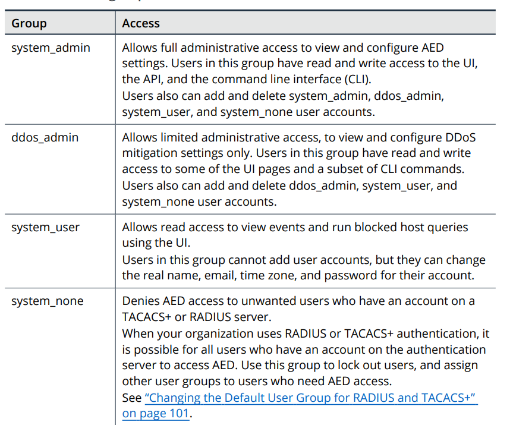
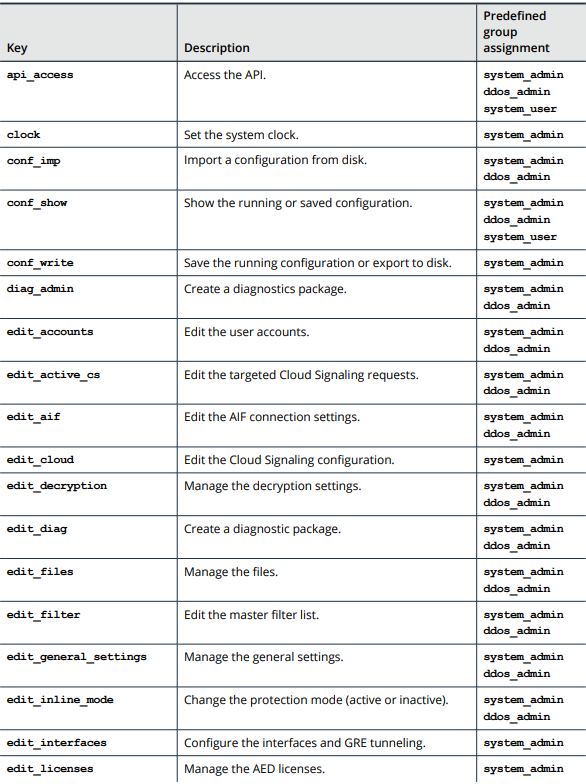
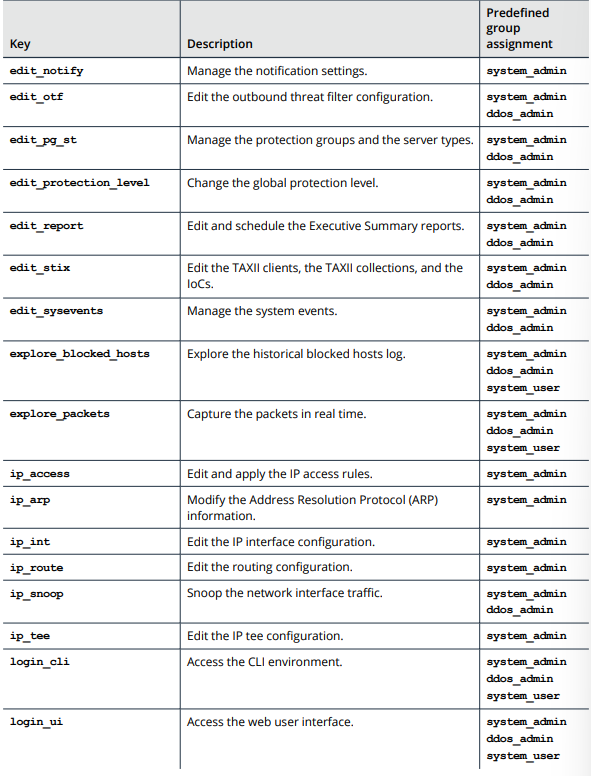
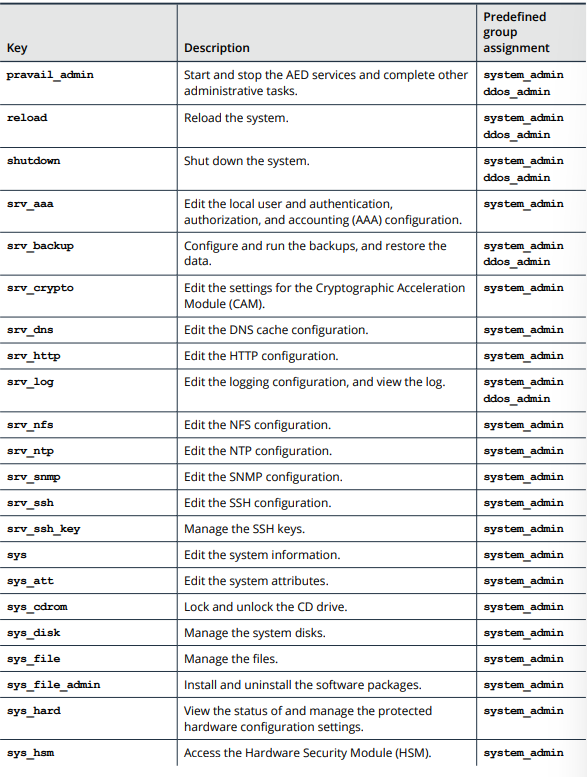
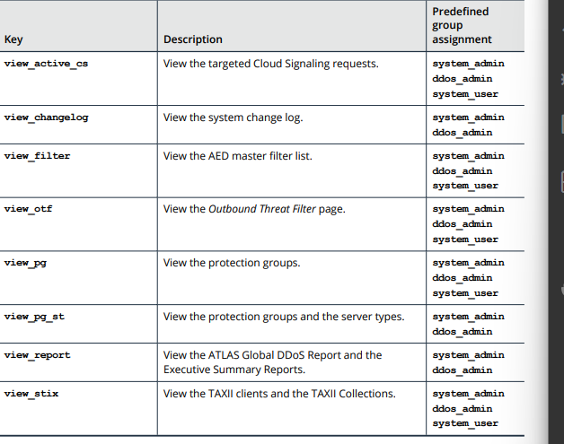

# Section 5: Configuring User Groups and
Authentication

## Table of contents

- [Section 5: Configuring User Groups and](#section-5-configuring-user-groups-and)
  - [Table of contents](#table-of-contents)
  - [About User Authentication](#about-user-authentication)
    - [About local user account](#about-local-user-account)
    - [About access to local user account](#about-access-to-local-user-account)
    - [How authentication works with RADIUS and TACACS+](#how-authentication-works-with-radius-and-tacacs)
    - [About the AED user groups in RADIUS](#about-the-aed-user-groups-in-radius)
    - [Integrating AED with RADIUS or TACACS+](#integrating-aed-with-radius-or-tacacs)
  - [About User Groups](#about-user-groups)
    - [About authorization keys](#about-authorization-keys)
    - [Predefined groups](#predefined-groups)
    - [Custom user groups](#custom-user-groups)
  - [Adding and Deleting User Groups](#adding-and-deleting-user-groups)
    - [Adding a user group](#adding-a-user-group)
    - [Copying a user group](#copying-a-user-group)
    - [Deleting a user group](#deleting-a-user-group)
  - [Assigning Authorization Keys to User Group](#assigning-authorization-keys-to-user-group)
    - [Adding and deleting authorization keys](#adding-and-deleting-authorization-keys)
    - [Viewing the group authorization keys](#viewing-the-group-authorization-keys)
    - [User group authorization keys](#user-group-authorization-keys)
  - [Configuring the User Accounting Level](#configuring-the-user-accounting-level)
    - [Configuring the accounting level](#configuring-the-accounting-level)
  - [Configuring Password Requirements for Local User Accounts](#configuring-password-requirements-for-local-user-accounts)
    - [Before you enable password expiration](#before-you-enable-password-expiration)
    - [Enabling or disabling password expiration](#enabling-or-disabling-password-expiration)
    - [Enabling or disabling the password expiration warning message](#enabling-or-disabling-the-password-expiration-warning-message)
    - [Changing the required password length](#changing-the-required-password-length)
    - [About the complexity mode for password](#about-the-complexity-mode-for-password)
      - [Changing the complexity mode](#changing-the-complexity-mode)
      - [Viewing the password requirement settings](#viewing-the-password-requirement-settings)
  - [Adding and Editing Local User Accounts](#adding-and-editing-local-user-accounts)
    - [Adding accounts for users that manage AED devices on AEM](#adding-accounts-for-users-that-manage-aed-devices-on-aem)

Administrators who have the `srv_aaa authorization key` can complete all of the actions
that are described in this section.

## About User Authentication

- Each unique user account contains:
  - The user's login credentials
  - The levels of access that the user is allowed

- User authentication methods:
  - Local
  - RADIUS (Remote Authentication Dial In User Service)
  - TACACS+ (Terminal Access Controller Access-Control System Plus)

- Provide access to the CLI through SSH and to the user interface (UI) through HTTPS

### About local user account

- Can add, edit, and delete the local user accounts in the UI or the CLI
- The AED installation creates a user account named "admin" in system_admin group

### About access to local user account

- Administrators can creation, modification and deletion of user accounts and groups.
- Non-administrative users only have access to a view of the user account

### How authentication works with RADIUS and TACACS+

- AED can integrate with the RADIUS service or TACACS+ service for centralized user authentication

- When a RADIUS user or TACAS+ user logs in to AED
  - AED connects to the primary authentication server that you designated
  - If the server can authenticate
    - Sends the AED user group 
    - AED logs in the user with the access permissions that are associated with the user group
  - If the server does not respond
    - AED tries to connect to  the backup server
    - if AED cannot reach either of the designated servers
      - AED tries to authenticates the user locally

### About the AED user groups in RADIUS

- Need to define an AED user group on the appropriate authentication server
- Any user who is not assigned to a user group on the authentication server is assigned to the predefined system_user group in AED

### Integrating AED with RADIUS or TACACS+

- Process for integrating AED with RADIUS or TACACS+
  - Step 1: Set the user group for the AED users on the RADIUS/TACACS+ server 
  - Step 2: Change the default AED user group for RADIUS/TACACS+ users 
  - Step 3: Configure AED to access the authentication server and an optional backup server for RADIUS or TACACS+
  - Step 4: Set the authentication method
  - Step 5: (optional) Configure the user accounting level

## About User Groups

- Allow to organize AED users by the different levels of system access that the users are allowed
- The Owner of the account inherits the access levels that are assigned to the user group

### About authorization keys

- Determine the level of sytem access that is granted to the users in the group

### Predefined groups

### Custom user groups

- Administrators can define custom user groups in the CLI

## Adding and Deleting User Groups

### Adding a user group

- with `name` is the group name:
`/ services aaa groups add name`

- Save: `/ config write`

### Copying a user group

- `/ services aaa groups copy existingGroup newGroup`
- Save: `/ config write`

### Deleting a user group

- `/ services aaa groups delete name`
- Enter `y` at the confirmation prompt
- Save: `/ config write`

## Assigning Authorization Keys to User Group

- Determine the level of access
that is granted to the users in that group

### Adding and deleting authorization keys

- `/ services aaa groups key {add | delete} name key`
- Save: `/ config write`

### Viewing the group authorization keys

- ` / services aaa groups show name`

### User group authorization keys

## Configuring the User Accounting Level

- Determines whether AED logs the following user acitvites to the local syslog:
  - software logins
  - configuration changes
  - interactive commands

- This logging applies to activities in the AED CLI only

### Configuring the accounting level

- `/ services aaa {local | radius | tacacs} accounting set level
{none | login | change | commands}`
    - `none` — (default) disables account logging
    - `login` — tracks log ins to AED
    - `change` — (TACACS+ only) tracks configuration changes
    - `commands` — (TACACS+ only) tracks the use of CLI commands
- Save: `/ config write`

## Configuring Password Requirements for Local User Accounts

- The password requirements 
  - Password Expiration
  - Warning messages for password expiration
  - Password length
  - Password complexity

### Before you enable password expiration

- By default, password expiration is not exist
- Should reset the passwords for all user accounts before you enable password expiration

### Enabling or disabling password expiration

- View the current password expiration setting: `/ services aaa local policy expiration`
- Change the password expiration setting: `/ services aaa local policy expiration set days`
  - **days**: a number from 1 to 365
- If you want to disable password expiration:
  - `/ services aaa local policy expiration clear`
  - `/ services aaa local policy expiration set 0`
- Save: `/ config write`

### Enabling or disabling the password expiration warning message

- Can configure AED to display a warning message before a password expires
- View: `/ services aaa local policy expiration warning`
- Set the time frame: `/ services aaa local policy expiration warning set days`
  - **days** is a number from 1 to 30 (number of days before the password expires that the warning message starts to appear)
- (Disable):
  - `/ services aaa local policy expiration warning clear`
  - `/ services aaa local policy expiration warning set 0`
- Save: `/ config write`

### Changing the required password length

- Default: Minium length is 10 and maximum length is 72
- View: `/ services aaa password_length`
- Specify the password length: `r / services aaa password_length {min minValue | max maxValue}`
- Reset to the default minium length and maximum length: `/ services aaa password_length {min | max} reset_default`
- Save: `/ config write`

### About the complexity mode for password

- The character types:
  - uppercase letters
  - lowercase letters
  - numbers
  - symbols

- The character mix requirement
  - Uppercase cannot be at the start
  - Numbers cannot be at the end
  - Symbols cannot be at the ent 

#### Changing the complexity mode

- View: `/ services aaa local policy complexity`
- Change the complexity mode: `/ services aaa local policy complexity {standard | advanced}`
  - **Standard**: Password must contain at least two character types
  - **Advanced**: Password must contain four character types
- Save: `/ config write`

#### Viewing the password requirement settings

- View all the authentication, authorization, and accounting settings: `/ services aaa show`
- View the settings for local user accounts: `/ services aaa local show`

## Adding and Editing Local User Accounts

### Adding accounts for users that manage AED devices on AEM