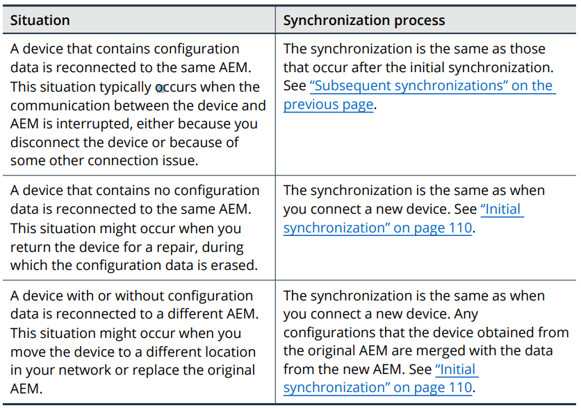

# Section 6: Managing AED from Arbor Enterprise Manager

## Table of contents

- [Section 6: Managing AED from Arbor Enterprise Manager](#section-6-managing-aed-from-arbor-enterprise-manager)
  - [Table of contents](#table-of-contents)
  - [About Managing Devices from AEM](#about-managing-devices-from-aem)
    - [Device management tasks](#device-management-tasks)
    - [Communication between AEM and the devices](#communication-between-aem-and-the-devices)
    - [Single sign-on](#single-sign-on)
  - [About Data Synchronization with AEM](#about-data-synchronization-with-aem)
    - [Viewing the synchronization status](#viewing-the-synchronization-status)
    - [Initial synchronization](#initial-synchronization)
    - [Initial synchronization of duplicate configuration](#initial-synchronization-of-duplicate-configuration)
    - [Consolidating the new configurations](#consolidating-the-new-configurations)
    - [Configuration merges during the initial synchronization](#configuration-merges-during-the-initial-synchronization)
      - [Server type merges](#server-type-merges)
      - [Protection group merges](#protection-group-merges)
      - [Outbound threat filter merge](#outbound-threat-filter-merge)
      - [Deny list merges and allow list merges](#deny-list-merges-and-allow-list-merges)
    - [Subsequent synchronizations](#subsequent-synchronizations)
    - [Synchronization after a device is disconnected from AEM](#synchronization-after-a-device-is-disconnected-from-aem)

## About Managing Devices from AEM

### Device management tasks

- Centrally create, configure, and manage the server types,protection groups, outbound threat filter, deny lists, and allow lists in AEM
- Share common protection groups and server types across multiple devices
- View the traffic and statistics from each device as well as an aggregate of the data from all of the devices
- View active bandwidth alerts and system alerts for all of the devices
- View and respond to the threats that are identified by the ATLAS threat policies
- Respond to availability attacks by changing the protection level, adding hosts to the deny list, or modifying the protection settings globally or per device.
- Navigate to a specific device to view more detailed information about its configuration or traffic.

### Communication between AEM and the devices

- Connect the device to AEM for manage a device from AEM
  - AEM sends request to each device for information (alerts, traffic data)
  - Device checks AEM periodically for configuration changes and obtains the changes that apply to the device

### Single sign-on

- Can navigate to a device from several areas in the AEM UI
- If your user account on the device has the same username as your AEM user account, then the device opens without prompting you to log in. 
  - Can use a different password for each account
- Must have a valid reverse DNS lookup

## About Data Synchronization with AEM

### Viewing the synchronization status

- `Initial synchronization`
- `Preparing configuration`
- `Good`
- `Out of sync`

### Initial synchronization

- Items are copied from AEM to the device:
  - All of the standard server types
  - The outbound threat filter
  - The default protection group
  - The global items in the inbound deny list and inbound allow list
  - All of the items in the outbound deny list and outbound allow list

- If the device contains local configurations
  - If local configurations conflict with any of the configurations that are copied from AEM
    - Those local configurations are duplicated on the device
  - The local configurations are merged with the configurations on AEM

### Initial synchronization of duplicate configuration

- A server type or protection group on the device might conflict with one on AEM
  - The same name:
    - A copy of that server type/protection group is created on the device with the name of the device appended to it
    - The original server type/protection group on the device is updated with the configuration from AEM

### Consolidating the new configurations

- Might review the device for configurations that you can consolidate

### Configuration merges during the initial synchronization

#### Server type merges

- All of the server types on a device are copied to AEM
- Any custom server type settings that do not have values are set to their default values

#### Protection group merges

- The default protection group on on the device is replaced with the one from AEM

- All of the protection groups on the device are copied to AEM and assigned to that device

#### Outbound threat filter merge

- The outbound threat filter on the device is replaced with the one from AEM

#### Deny list merges and allow list merges

- The global items and protection group-specific items on the device that do not match any items on AEM are copied to AEM
- A global item on the device item on the device that matches a global item on AEM is deleted
- A protection group-specific item on the device that matches a global item on AEM is deleted
- If an item from the device causes AEM to exceed its capacity
  - It added to AEM but disabled
  - Recommend that you do not add hosts to the deny lists and allow lists on a device that is managed by AEM

- Any CIDRs on the deny list or allow list on the device that overlap existing items on AEM are copied to AEM but are not merged

### Subsequent synchronizations

- Any configuration changes on AEM are propagated to each device as applicable.
  - Each device obtains only the standard items, the global items, and the items that are specific to the device
  - No items are copied from the device to AEM

- After the initial synchronization:
  - Should not make local changes on a managed device

### Synchronization after a device is disconnected from AEM

