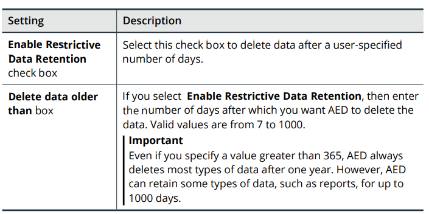

# Section 8: Configuring AED

## Table of contents

- [Section 8: Configuring AED](#section-8-configuring-aed)
  - [Table of contents](#table-of-contents)
  - [About the AED Configuration](#about-the-aed-configuration)
    - [Minium required settings](#minium-required-settings)
    - [Settings for maximizing automatic protection](#settings-for-maximizing-automatic-protection)
    - [User and authentication settings](#user-and-authentication-settings)
    - [Advanced protection settings](#advanced-protection-settings)
    - [About the General Settings](#about-the-general-settings)
  - [Changing the Language of the AED User Interface](#changing-the-language-of-the-aed-user-interface)
    - [Configuring the Time and Date Settings](#configuring-the-time-and-date-settings)
  - [Configuring the SMTP Server Settings](#configuring-the-smtp-server-settings)
    - [Uploading a custom client SSL certificate](#uploading-a-custom-client-ssl-certificate)
    - [Removing the custom SSL certificate](#removing-the-custom-ssl-certificate)
  - [Enabling Restrictive Data Retention](#enabling-restrictive-data-retention)
  - [Configuring a Device for AEM Management](#configuring-a-device-for-aem-management)
    - [Connecting a device to AEM](#connecting-a-device-to-aem)
    - [About the Connection Status box](#about-the-connection-status-box)
    - [Disconnecting a device from AEM](#disconnecting-a-device-from-aem)
  - [Configuring the SNMP Polling Settings](#configuring-the-snmp-polling-settings)
    - [Creating an IP access rule for SNMP polling](#creating-an-ip-access-rule-for-snmp-polling)
    - [Configuring the SNMP polling settings](#configuring-the-snmp-polling-settings-1)
    - [About MIB files](#about-mib-files)
    - [Specifying the DNS servers](#specifying-the-dns-servers)
  - [Configuring an Idle Timeout for the UI and the CL](#configuring-an-idle-timeout-for-the-ui-and-the-cl)
    - [Configuring the idle timeout for the U](#configuring-the-idle-timeout-for-the-u)
    - [Configuring the idle timeout for the CLI](#configuring-the-idle-timeout-for-the-cli)
  - [Configuring a Pre-Login Banner](#configuring-a-pre-login-banner)
  - [Locking and Unlocking Local User Account](#locking-and-unlocking-local-user-account)
    - [Changing the number of login attempts before AED locks a user account](#changing-the-number-of-login-attempts-before-aed-locks-a-user-account)
    - [Determining the status of a user account](#determining-the-status-of-a-user-account)
    - [Manually locking a user account](#manually-locking-a-user-account)
    - [Unlocking a user account](#unlocking-a-user-account)
  - [Configuring the ATLAS Intelligence Feed](#configuring-the-atlas-intelligence-feed)
    - [Accessing the AIF server](#accessing-the-aif-server)
    - [Configuring AIF updates](#configuring-aif-updates)
    - [AIF settings](#aif-settings)
    - [Configuring web crawler support](#configuring-web-crawler-support)
    - [Participating in the data-sharing program](#participating-in-the-data-sharing-program)
  - [About Bandwidth Alerts](#about-bandwidth-alerts)

## About the AED Configuration

- Verify that you have completed all of the installation procedures that are listed in the AED Installation Guide

### Minium required settings

- `General settings`: define the servers that AED interacts with as well as other system preferences
- `User accounts`: All users must have a user account to access AED

### Settings for maximizing automatic protection

### User and authentication settings

- Authentication method (RADIUS, TACACS+)
- Custom SSL certificate
- Custom user group

### Advanced protection settings

- Can refine the protection settings to help increase the range of attacks that AED can detect and mitigate automatically

### About the General Settings

## Changing the Language of the AED User Interface

- `Administrator > General > Configure > Language list`
  
### Configuring the Time and Date Settings

- Can configure the formats in which AED display the time and date for the system clock
- Can specify the NTP servers for AED to use
  - NTP - Network time protocol
  - NTP servers synchronize the time across network

## Configuring the SMTP Server Settings

- For AED to send email

- `Administration > General > SMTP Relay`
  - SMTP Server box 
  - Port box
  - Username box 
  - Password box
  - From Address box 
  - Enable Secure SMTP check box
  - Upload Custom SSL Cert button
  - Clear Custom Cert button 

### Uploading a custom client SSL certificate

- Use when you enable secure SMTP
- The files must be PEM-encoded
- Default: AED uses the SSL certificate that it uses for HTTP authentication
- `Administration > General > SMTP Relay > Upload Custom SSL cert`
  - `UPload Certificate` window:
    - `Choose File` to locate and select the file that contains the client SSL certificate and key
    - `Choose File` to locate and select the associated CA certificate file
    - `Upload`

### Removing the custom SSL certificate

- `Administration > General > SMTP Relay > Clear Custom SSL Cert`

## Enabling Restrictive Data Retention

- AED retains most types of data for up to one year or until your system approaches its capacity
- Change the data retention policy:
  - `Administration > General > Data Retention`

    

## Configuring a Device for AEM Management

- Before you connect a device to AEM:
  - The device is installed and configured as described in the appropriate Installation Guide and in this guide
  - The software version for the device is supported by AEM as shown in the compatibility matrix that is included in the Arbor Enterprise Manager   Release Notes

### Connecting a device to AEM

- `Administration > General`
  - Arbor Enterprise Manager box: Type the IP address or hostname for AEM
  - Shared Secret box:
    - Type the shared secret to use to authenticate communication with AEM
    - Must configure the same secret on all of the devices that AEM manages

### About the Connection Status box

- Provided information about the connection error and contains a **Test Connection** button
  - Use the button after edit the connecting settings or take other steps to fix the error

### Disconnecting a device from AEM

- `Administration > General`
  - delete the text in the `Arbor Enterprise Manager` box and the `Shared Secret` box
  - save

## Configuring the SNMP Polling Settings

- AED supports polling by third-party SNMP monitoring systems (SMNPv2c, SNMPv3)
- Allows you to fit your AED work flow into existing network monitoring tools
  - Get management information (system status, configuration, interface statistic,..)
- Need to create an access rule

### Creating an IP access rule for SNMP polling

- `/ ip access add snmp {mgt0 | mgt1 | all} CIDR`
  - {mgt0 | mgt1 | all} = the name of the management interface on which to apply a service exclusively or apply the rule to all of the interfaces
  - CIDR = the address range from which you want to allow communications to the SNMP service
- `/ ip access commit`
- `/ config write`

- **Caution**: does not use 0.0.0.0/0 or ::/0

### Configuring the SNMP polling settings

- `Administration > General`
- Settings:
  - **Version** button
  - **Community** box (Version 2 only)
  - **Security Level** list (Version 3 only) 
    - **None**: no password
    - **Auth**: password
    - **Auth+priv**: password with the data in SNMP requests and responses is encrypted
  - **Auth Protocol** buttons (Version 3 only) 
  - **Username** box (Version 3 only) 
  - **Password** box (Version 3 only) 
  - **Privacy Protocol** buttons (Version 3 only) 
  - **Privacy Password** box (Version 3 only) 

### About MIB files

- AED can send notification to a network management system as SNMP traps
- On the `Manage Files` page, you can download the MIB files that help you decode the SNMP traps that AED sends for notification

### Specifying the DNS servers

- DNS servers provide domain name service mapping from IP addresses to hostnames in AED (Can add mutiple server)
- `Administration > General > DNS servers box`
  - Enter the IP addresses of your DNS server 
  - `Save`

## Configuring an Idle Timeout for the UI and the CL

- If there is no activity in the UI/CLI during the idle timeout period, then AED logs the user out of the UI/CLI session automatically
  - Default timeout for UI: 120 minutes
  - Default timeout for CLI: 0

### Configuring the idle timeout for the U

- `Administration > General > UI Idle Timeout box`
- Save

### Configuring the idle timeout for the CLI

- `/ system idle set minutes`
  -  minutes (0-999)

## Configuring a Pre-Login Banner

- Pre-Login Banner:
  -  A message banner that user must acknowledge before they can log into AED through the UI
  -  Appears when users start the log in process in the CLI
- `Administration > General > Pre-Login Banner box`
  - Save

## Locking and Unlocking Local User Account

- Manually
- Automatically
  - User can log in with an SSH key

### Changing the number of login attempts before AED locks a user account

- `/ services aaa max_login_failures set {unlimited | number}`

### Determining the status of a user account

- `/ services aaa user_hist`
  - disabled : account is locked
  - ok : account is unlocked

### Manually locking a user account

- `/ services aaa disable_account userName`

### Unlocking a user account

- ` / services aaa enable_account userName`

- Administrator accounts can be lock when AED in FIPS mode
  - If an administrator gets locked out of AED
    - Use a VGA monitor or a serial console to access to the CLI on AED

## Configuring the ATLAS Intelligence Feed

- The ATLAS Intelligence Feed (AIF) settings determine how and when AED receives the AIF
  - **ATLAS Intelligence Feed** section:
    - Allows you to enable or disabler the automatic AIF updaters take place, request updates and opt into the data-sharing program
    - Also can configure for connecting to the AIF server through a proxy server
  - **Manual Import** section:
    - Update the AIF content without using the automatic connection
  - **Web Crawlers** section:
    - Select the web crawlers that can crawl your web site more freely

- The AIF is available by subscription
  - Receive a license key after subscribe

### Accessing the AIF server

- Needs access to a pool of server from which the feed content is pulled
- To ensure a succesful download of AIF updates
  - Configure AED to allow  unrestricted outbound internet access on port 443
  -  Configure AED with a proxy server that has unrestricted outbound access on port 443

- You can obtain the latest AIF files and import the files to AED

- If you do not want to update manually, you can open a case with the Arbor Technical Assistance Center (ATAC)
  -  Web: https://support.arbornetworks.com on the ATAC Customer Support Portal
  - Telephone: +1.877.272.6721 toll free USA or +1.781.362.4301

### Configuring AIF updates

- `Administration > ATLAS Intelligence Feed`
  - Select or clear the `Enable Automated Connection to AIF` check box
  - Select an interval in `AIF Update Interval`
  - (Optional) Configure the proxy server settings to connect the AIF server
  - Save

### AIF settings

### Configuring web crawler support

- The AIF updates include a list of the IP address ranges that the AIF considers to be legitimate search engine web crawlers

- `Administration > ATLAS Intelligence Feed > Web Crawlers section` 
- Enable the `Web Crawler Support` setting
  - `Configure Server Type` page, for inbound traffic
  - `Outbound Threat Filter` page, for outbound traffic

### Participating in the data-sharing program

- Can select to share your organization’s geographic location and industry type.
- NETSCOUT uses this information to perform additional contextual analysis of threats by industry and geographic region to better predict threats that may affect you in the future

- `Administration > ATLAS Intelligence Feed`
  - select the **Yes, I want to opt in to Arbor’s data-sharing program** check box
  - (Optional) View an example of the data that AED shares, click the **View an example** link
  - To share your organization’s geographic location and industry type, click the **geographic location and industry type** link
  - In the **ATLAS Intelligence Feed feedback program** window, select the industry and country in which your organization is located, and then click **Save**
  - In the ATLAS Intelligence Feed section, click **Save**

## About Bandwidth Alerts

- Use bandwidth alerts to inform you about attacks and other traffic anomalies that require your attention