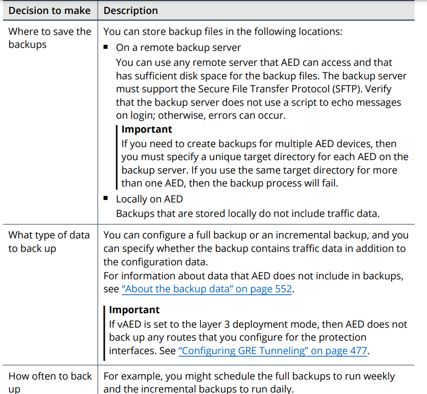
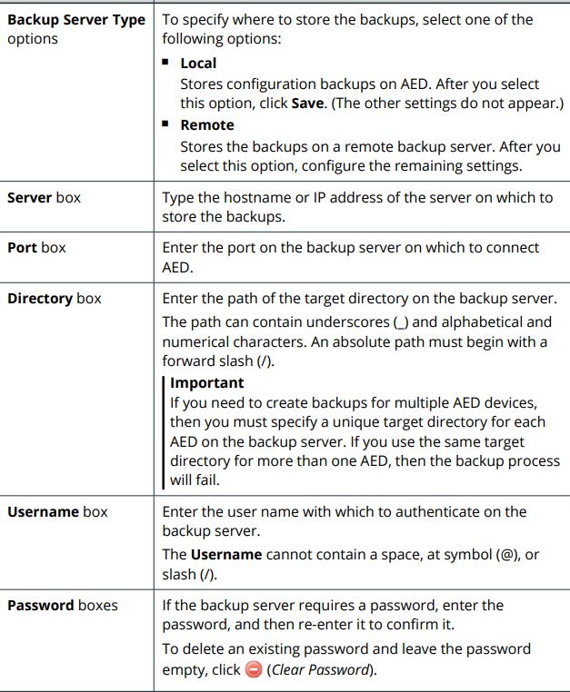

# Section 8: Configuring AED

## Table of contents

- [Section 8: Configuring AED](#section-8-configuring-aed)
  - [Table of contents](#table-of-contents)
  - [About the AED Configuration](#about-the-aed-configuration)
    - [Minium required settings](#minium-required-settings)
    - [Settings for maximizing automatic protection](#settings-for-maximizing-automatic-protection)
    - [User and authentication settings](#user-and-authentication-settings)
    - [Advanced protection settings](#advanced-protection-settings)
    - [About the General Settings](#about-the-general-settings)
  - [Changing the Language of the AED User Interface](#changing-the-language-of-the-aed-user-interface)
    - [Configuring the Time and Date Settings](#configuring-the-time-and-date-settings)
  - [Configuring the SMTP Server Settings](#configuring-the-smtp-server-settings)
    - [Uploading a custom client SSL certificate](#uploading-a-custom-client-ssl-certificate)
    - [Removing the custom SSL certificate](#removing-the-custom-ssl-certificate)
  - [Enabling Restrictive Data Retention](#enabling-restrictive-data-retention)
  - [Configuring a Device for AEM Management](#configuring-a-device-for-aem-management)
    - [Connecting a device to AEM](#connecting-a-device-to-aem)
    - [About the Connection Status box](#about-the-connection-status-box)
    - [Disconnecting a device from AEM](#disconnecting-a-device-from-aem)
  - [Configuring the SNMP Polling Settings](#configuring-the-snmp-polling-settings)
    - [Creating an IP access rule for SNMP polling](#creating-an-ip-access-rule-for-snmp-polling)
    - [Configuring the SNMP polling settings](#configuring-the-snmp-polling-settings-1)
    - [About MIB files](#about-mib-files)
    - [Specifying the DNS servers](#specifying-the-dns-servers)
  - [Configuring an Idle Timeout for the UI and the CL](#configuring-an-idle-timeout-for-the-ui-and-the-cl)
    - [Configuring the idle timeout for the U](#configuring-the-idle-timeout-for-the-u)
    - [Configuring the idle timeout for the CLI](#configuring-the-idle-timeout-for-the-cli)
  - [Configuring a Pre-Login Banner](#configuring-a-pre-login-banner)
  - [Locking and Unlocking Local User Account](#locking-and-unlocking-local-user-account)
    - [Changing the number of login attempts before AED locks a user account](#changing-the-number-of-login-attempts-before-aed-locks-a-user-account)
    - [Determining the status of a user account](#determining-the-status-of-a-user-account)
    - [Manually locking a user account](#manually-locking-a-user-account)
    - [Unlocking a user account](#unlocking-a-user-account)
  - [Configuring the ATLAS Intelligence Feed](#configuring-the-atlas-intelligence-feed)
    - [Accessing the AIF server](#accessing-the-aif-server)
    - [Configuring AIF updates](#configuring-aif-updates)
    - [AIF settings](#aif-settings)
    - [Configuring web crawler support](#configuring-web-crawler-support)
    - [Participating in the data-sharing program](#participating-in-the-data-sharing-program)
  - [About Bandwidth Alerts](#about-bandwidth-alerts)
    - [About the types of bandwidth alerts](#about-the-types-of-bandwidth-alerts)
    - [Configuring global bandwidth alerts](#configuring-global-bandwidth-alerts)
    - [Configuring bandwidth alerts for individual protection groups](#configuring-bandwidth-alerts-for-individual-protection-groups)
    - [Bandwidth alert expiration](#bandwidth-alert-expiration)
    - [Configuring notifications for bandwidth alerts](#configuring-notifications-for-bandwidth-alerts)
  - [Configuring Global Thresholds for Bandwidth Alerts](#configuring-global-thresholds-for-bandwidth-alerts)
    - [Calculating baselines](#calculating-baselines)
    - [About the percentage sliders](#about-the-percentage-sliders)
    - [Configuring global thresholds](#configuring-global-thresholds)
  - [About notifications](#about-notifications)
    - [Alert types](#alert-types)
    - [Notification contents](#notification-contents)
    - [Notification types](#notification-types)
    - [About the blocked host notifications](#about-the-blocked-host-notifications)
    - [About the change log notifications](#about-the-change-log-notifications)
  - [Configuring Notifications](#configuring-notifications)
    - [Configuring a notification destination](#configuring-a-notification-destination)
    - [Changing the interval between blocked host notifications](#changing-the-interval-between-blocked-host-notifications)
    - [Editing notifications](#editing-notifications)
    - [Deleting notifications](#deleting-notifications)
    - [Email notification settings](#email-notification-settings)
    - [SNMP notification settings](#snmp-notification-settings)
    - [Syslog notification settings](#syslog-notification-settings)
  - [Configuring Backup Settings](#configuring-backup-settings)
    - [Planning your backup strategy](#planning-your-backup-strategy)
    - [Configuring backup settings](#configuring-backup-settings-1)
    - [Scheduling the automatic creation of backups](#scheduling-the-automatic-creation-of-backups)
  - [Uploading a Custom SSL Certificate](#uploading-a-custom-ssl-certificate)
    - [Custom SSL certificate requirements](#custom-ssl-certificate-requirements)
    - [Uploading a custom SSL certificate](#uploading-a-custom-ssl-certificate-1)
    - [Reverting to the default AED SSL certificate](#reverting-to-the-default-aed-ssl-certificate)
  - [Installing a Certificate Authority File](#installing-a-certificate-authority-file)
    - [Installation steps](#installation-steps)
    - [Downloading the current CA file](#downloading-the-current-ca-file)
    - [Modifying the CA file](#modifying-the-ca-file)
    - [Uploading the CA file](#uploading-the-ca-file)
    - [Installing the CA file](#installing-the-ca-file)
  - [Configuring a Secure Connection to a Remote Syslog Server](#configuring-a-secure-connection-to-a-remote-syslog-server)
    - [Connecting to a remote syslog server](#connecting-to-a-remote-syslog-server)
  - [Configuring the Protection Interfaces for Layer 3 Mode](#configuring-the-protection-interfaces-for-layer-3-mode)
    - [Specifying IP addresses for protection interfaces on vAED](#specifying-ip-addresses-for-protection-interfaces-on-vaed)
    - [Deleting the IP address for a protection interface](#deleting-the-ip-address-for-a-protection-interface)
    - [Deleting the protection interface settings](#deleting-the-protection-interface-settings)
  - [Renaming the Protection Interfaces](#renaming-the-protection-interfaces)
  - [Configuring Link State Propagation for the Protection Interfaces](#configuring-link-state-propagation-for-the-protection-interfaces)
    - [How link state propagation works](#how-link-state-propagation-works)
    - [About link state propagation timeouts](#about-link-state-propagation-timeouts)
    - [Configuring link state propagation](#configuring-link-state-propagation)
  - [Configuring Static Routes](#configuring-static-routes)
    - [About routes](#about-routes)
    - [Configuring routes](#configuring-routes)
    - [Deleting routes](#deleting-routes)
  - [Adding a Custom Logo to the U](#adding-a-custom-logo-to-the-u)
    - [Custom logo file requirements](#custom-logo-file-requirements)
    - [Uploading and locking a custom logo](#uploading-and-locking-a-custom-logo)
    - [Unlocking a custom logo](#unlocking-a-custom-logo)
    - [Using the AED default logo](#using-the-aed-default-logo)

## About the AED Configuration

- Verify that you have completed all of the installation procedures that are listed in the AED Installation Guide

### Minium required settings

- `General settings`: define the servers that AED interacts with as well as other system preferences
- `User accounts`: All users must have a user account to access AED

### Settings for maximizing automatic protection

### User and authentication settings

- Authentication method (RADIUS, TACACS+)
- Custom SSL certificate
- Custom user group

### Advanced protection settings

- Can refine the protection settings to help increase the range of attacks that AED can detect and mitigate automatically

### About the General Settings

## Changing the Language of the AED User Interface

- `Administrator > General > Configure > Language list`
  
### Configuring the Time and Date Settings

- Can configure the formats in which AED display the time and date for the system clock
- Can specify the NTP servers for AED to use
  - NTP - Network time protocol
  - NTP servers synchronize the time across network

## Configuring the SMTP Server Settings

- For AED to send email

- `Administration > General > SMTP Relay`
  - SMTP Server box 
  - Port box
  - Username box 
  - Password box
  - From Address box 
  - Enable Secure SMTP check box
  - Upload Custom SSL Cert button
  - Clear Custom Cert button 

### Uploading a custom client SSL certificate

- Use when you enable secure SMTP
- The files must be PEM-encoded
- Default: AED uses the SSL certificate that it uses for HTTP authentication
- `Administration > General > SMTP Relay > Upload Custom SSL cert`
  - `UPload Certificate` window:
    - `Choose File` to locate and select the file that contains the client SSL certificate and key
    - `Choose File` to locate and select the associated CA certificate file
    - `Upload`

### Removing the custom SSL certificate

- `Administration > General > SMTP Relay > Clear Custom SSL Cert`

## Enabling Restrictive Data Retention

- AED retains most types of data for up to one year or until your system approaches its capacity
- Change the data retention policy:
  - `Administration > General > Data Retention`

    

## Configuring a Device for AEM Management

- Before you connect a device to AEM:
  - The device is installed and configured as described in the appropriate Installation Guide and in this guide
  - The software version for the device is supported by AEM as shown in the compatibility matrix that is included in the Arbor Enterprise Manager   Release Notes

### Connecting a device to AEM

- `Administration > General`
  - Arbor Enterprise Manager box: Type the IP address or hostname for AEM
  - Shared Secret box:
    - Type the shared secret to use to authenticate communication with AEM
    - Must configure the same secret on all of the devices that AEM manages

### About the Connection Status box

- Provided information about the connection error and contains a **Test Connection** button
  - Use the button after edit the connecting settings or take other steps to fix the error

### Disconnecting a device from AEM

- `Administration > General`
  - delete the text in the `Arbor Enterprise Manager` box and the `Shared Secret` box
  - save

## Configuring the SNMP Polling Settings

- AED supports polling by third-party SNMP monitoring systems (SMNPv2c, SNMPv3)
- Allows you to fit your AED work flow into existing network monitoring tools
  - Get management information (system status, configuration, interface statistic,..)
- Need to create an access rule

### Creating an IP access rule for SNMP polling

- `/ ip access add snmp {mgt0 | mgt1 | all} CIDR`
  - {mgt0 | mgt1 | all} = the name of the management interface on which to apply a service exclusively or apply the rule to all of the interfaces
  - CIDR = the address range from which you want to allow communications to the SNMP service
- `/ ip access commit`
- `/ config write`

- **Caution**: does not use 0.0.0.0/0 or ::/0

### Configuring the SNMP polling settings

- `Administration > General`
- Settings:
  - **Version** button
  - **Community** box (Version 2 only)
  - **Security Level** list (Version 3 only) 
    - **None**: no password
    - **Auth**: password
    - **Auth+priv**: password with the data in SNMP requests and responses is encrypted
  - **Auth Protocol** buttons (Version 3 only) 
  - **Username** box (Version 3 only) 
  - **Password** box (Version 3 only) 
  - **Privacy Protocol** buttons (Version 3 only) 
  - **Privacy Password** box (Version 3 only) 

### About MIB files

- AED can send notification to a network management system as SNMP traps
- On the `Manage Files` page, you can download the MIB files that help you decode the SNMP traps that AED sends for notification

### Specifying the DNS servers

- DNS servers provide domain name service mapping from IP addresses to hostnames in AED (Can add mutiple server)
- `Administration > General > DNS servers box`
  - Enter the IP addresses of your DNS server 
  - `Save`

## Configuring an Idle Timeout for the UI and the CL

- If there is no activity in the UI/CLI during the idle timeout period, then AED logs the user out of the UI/CLI session automatically
  - Default timeout for UI: 120 minutes
  - Default timeout for CLI: 0

### Configuring the idle timeout for the U

- `Administration > General > UI Idle Timeout box`
- Save

### Configuring the idle timeout for the CLI

- `/ system idle set minutes`
  -  minutes (0-999)

## Configuring a Pre-Login Banner

- Pre-Login Banner:
  -  A message banner that user must acknowledge before they can log into AED through the UI
  -  Appears when users start the log in process in the CLI
- `Administration > General > Pre-Login Banner box`
  - Save

## Locking and Unlocking Local User Account

- Manually
- Automatically
  - User can log in with an SSH key

### Changing the number of login attempts before AED locks a user account

- `/ services aaa max_login_failures set {unlimited | number}`

### Determining the status of a user account

- `/ services aaa user_hist`
  - disabled : account is locked
  - ok : account is unlocked

### Manually locking a user account

- `/ services aaa disable_account userName`

### Unlocking a user account

- ` / services aaa enable_account userName`

- Administrator accounts can be lock when AED in FIPS mode
  - If an administrator gets locked out of AED
    - Use a VGA monitor or a serial console to access to the CLI on AED

## Configuring the ATLAS Intelligence Feed

- The ATLAS Intelligence Feed (AIF) settings determine how and when AED receives the AIF
  - **ATLAS Intelligence Feed** section:
    - Allows you to enable or disabler the automatic AIF updaters take place, request updates and opt into the data-sharing program
    - Also can configure for connecting to the AIF server through a proxy server
  - **Manual Import** section:
    - Update the AIF content without using the automatic connection
  - **Web Crawlers** section:
    - Select the web crawlers that can crawl your web site more freely

- The AIF is available by subscription
  - Receive a license key after subscribe

### Accessing the AIF server

- Needs access to a pool of server from which the feed content is pulled
- To ensure a succesful download of AIF updates
  - Configure AED to allow  unrestricted outbound internet access on port 443
  -  Configure AED with a proxy server that has unrestricted outbound access on port 443

- You can obtain the latest AIF files and import the files to AED

- If you do not want to update manually, you can open a case with the Arbor Technical Assistance Center (ATAC)
  -  Web: https://support.arbornetworks.com on the ATAC Customer Support Portal
  - Telephone: +1.877.272.6721 toll free USA or +1.781.362.4301

### Configuring AIF updates

- `Administration > ATLAS Intelligence Feed`
  - Select or clear the `Enable Automated Connection to AIF` check box
  - Select an interval in `AIF Update Interval`
  - (Optional) Configure the proxy server settings to connect the AIF server
  - Save

### AIF settings

### Configuring web crawler support

- The AIF updates include a list of the IP address ranges that the AIF considers to be legitimate search engine web crawlers

- `Administration > ATLAS Intelligence Feed > Web Crawlers section` 
- Enable the `Web Crawler Support` setting
  - `Configure Server Type` page, for inbound traffic
  - `Outbound Threat Filter` page, for outbound traffic

### Participating in the data-sharing program

- Can select to share your organization’s geographic location and industry type.
- NETSCOUT uses this information to perform additional contextual analysis of threats by industry and geographic region to better predict threats that may affect you in the future

- `Administration > ATLAS Intelligence Feed`
  - select the **Yes, I want to opt in to Arbor’s data-sharing program** check box
  - (Optional) View an example of the data that AED shares, click the **View an example** link
  - To share your organization’s geographic location and industry type, click the **geographic location and industry type** link
  - In the **ATLAS Intelligence Feed feedback program** window, select the industry and country in which your organization is located, and then click **Save**
  - In the ATLAS Intelligence Feed section, click **Save**

## About Bandwidth Alerts

- Use bandwidth alerts to inform you about attacks and other traffic anomalies that require your attention
- The alert includes
  - The protection group name
  - the level of traffic that triggered the alert
  - AED creates a bandwidth alert when the traffic for a protection group exceeds threshold

- Can configure bandwidth alert thresholds globally or for individual protection groups

### About the types of bandwidth alerts

### Configuring global bandwidth alerts

- Configure on the `System Alerts` page in AED
- The global thresholds are enabled by default.
- A global bandwidth alert threshold include:
  - A baseline threshold: a percentage of this traffic above the base line for the corresponding traffic type
  - A minium threshold: A traffic rate (bps or pps)

### Configuring bandwidth alerts for individual protection groups

- Can configure when you edit a protection group in AED
  - Can use the global thresholds or specify traffic thresholds for the protection group

### Bandwidth alert expiration

- Remain active for one hour after it is created
- The longer that a bandwidth alert condition continue, the more the alerts's expiration time is extended
- The expiration time is never more then 24 hours after the alert condition disappears
- An alerts instantly in the following situations:
  - When you disable that type of alert in the configuration
  - when you change the type of threshold (global threshold or specified traffic threshold)
  - when you configure a protection group's alert threshold to a level that is higher than the level that triggered the alert
  - (botnet alerts only) when the protection level is change4d to be greater than or equal to the level triggered the alert

### Configuring notifications for bandwidth alerts

## Configuring Global Thresholds for Bandwidth Alerts

- AED generates bandwidth alerts when a protection group;'s total traffic, blocked traffic, or botnet traffic exceeds a specified baseline threshold for the corresponding traffic type

### Calculating baselines

- Based on a protection group's traffic for the past week
- After the A#ED calculates the initial baselines, it recalculates them every hour

### About the percentage sliders

- Can configure a baseline threshold as a percentage of traffic above a protection group's baseline for the corresponding traffic type
  
### Configuring global thresholds

- `Administration > System Alerts > Settings tab`

- Save

## About notifications

- Can configure AED to send notification messages to specified destinations to communicate certain alerts
  
### Alert types

### Notification contents

- A typical notification contains the alert type and a message, a link to the host that generated the alert

### Notification types

### About the blocked host notifications

- Notification interval:
  - AED allows some time to pass between blocked host notifications for a given host, even if the host is blocked again within that time
  - Default : 60 minutes
  - Can change the interval to any amount from 1 - 60 minutes

- Notification limit
  - To prevent overwhelming the network or the receiving system, only 1000 blocked hosts per minute are identified for notifications
  - Recommend to use SNMP or syslog for blocked host notifications

### About the change log notifications

- Use the **Change Log** alert type to configure notifications for change log entries
  - Provide an external trail of all the changes to your AED system

- The change log contains entries for other types of alerts (Cloud, Protection, Deployment)

## Configuring Notifications

### Configuring a notification destination

- `Administration > Notifications > Add Destination`
  - Select a notification type from the pop-up menu
  - Configure the settings for the specified destination type
    - Email
    - SNMP
    - syslog
  - Save

### Changing the interval between blocked host notifications

- `Administration > Notifications > Settings tab`
  - Move the **Notification Interval** slider to specify the amount of time to wait between blocked host notifications for a specific host
  - Save

### Editing notifications

- `Administration > Notifications`
  - Click on an item in the `Destination` column
  - Change any of the settings for the specified destination types
  - Save

### Deleting notifications

- `Administration > Notifications`
  - Select the check box for each notifications that you want to delete
  - Select the check box in the table heading row to delete all of the notifications
  - Click **Delete** > **OK**

### Email notification settings

- Must configure an SMTP server on the `Configure General Settings` page for AED to send email messages
- Settings:
  - `From` box
  - `To` box
  - `Alert type` box

### SNMP notification settings

### Syslog notification settings

## Configuring Backup Settings

- Configure the location for storing backup and schedule the automatic creation of backups

### Planning your backup strategy

### Configuring backup settings

- `Administration > Backup and Restore > Server Settings section > Edit`

### Scheduling the automatic creation of backups

- `Administration > Backup and Restore > Schedule section > Edit`

## Uploading a Custom SSL Certificate

### Custom SSL certificate requirements

- Requirements:
  - The SSL file and CA file must be PEM-encoded (Privacy Enhanced Mail)
  - The SSL file must contain the certificate and the key that was used to create the certificate
  - The SSl file and CA file cannot be password protected

### Uploading a custom SSL certificate

- `Administration > Files > SSL Certificate section > Upload SSL cert`
  - `Choose file` to locate and select the custom SSL certificate file
  - `Choose file` to locate and select the custom CA certificate file
  - `Upload`
  - `OK`
- Log out of AED and restart your browser

### Reverting to the default AED SSL certificate

- `Administration > Files > SSL Certificate section > Use default cert > OK`
- Log out of AED and restart your browser

## Installing a Certificate Authority File

- A certificate authority (CA) file is necessary to validate an SSL certificate
- Might configure AED to use a secure remote server with an SSL certificate that is trusted by a non-public CA
  - Must install a CA file for that certificate

### Installation steps

- if you install a custom SSL certificate and CA file for UI access
  - download and modify the CA file to include the server's CA certificate
  - After you modify the CA file, you can reinstall the CA file

### Downloading the current CA file

- `Administration > Files > System Files section > CA Certificate`
- Save the file according to your browser options

### Modifying the CA file

- Open the current CA file in a text editor
- Append the CA certificate information for the remote servers
- Save the file in a .pem extension

### Uploading the CA file

- `Administration > Files > Upload File > Choose File`
  - Locate the file and select it
  - `Upload`
  - `Close`

### Installing the CA file

- Log in to the CLI with administrator account
- `services http certificate import ca_only disk:caFileName.pem`

## Configuring a Secure Connection to a Remote Syslog Server

- Can configure AED to send syslog (audit) data to a remote syslog server
- AED must trust that a CA signed the certificate for the remote syslog server

### Connecting to a remote syslog server

- `/ services logging remote set host {tcp | udp} port secure`

## Configuring the Protection Interfaces for Layer 3 Mode

- Need to configure static routes for the traffic

### Specifying IP addresses for protection interfaces on vAED

- (Optional) To get a list of the protection interfaces on your appliance
  - `services aed mitigation interface ?`
  
- `/services aed mitigation interface interfaceName network`
- To verify that any static routes that you previously configured are still valid, enter `/ services aed mitigation route show`

### Deleting the IP address for a protection interface

- Can delete the IP address for a protection interface without deleting the configured routes
- `/ services aed mitigation interface interfaceName delete`

### Deleting the protection interface settings

- ` / services aed mitigation clear`

## Renaming the Protection Interfaces

- `Administration > Interfaces > Edit`
  - Type a descriptive name for each interface
- Save

## Configuring Link State Propagation for the Protection Interfaces

- `Link State Propagation` enable on each protection interface pair when AED is set to the inline deployment
  - The default timeouts: five seconds each (How long AED waits after one interface in a part goes down or comes back up before it disconnects or reconnects the other interface)

### How link state propagation works

- if one interface in a pair goes down, then AED disconnects the other interface
- if the original interface that went down reconnects, then AED restores the other interface

- if you force hardware bypass open or closed, link state propagation does not take effect

### About link state propagation timeouts

- `Interface Down`
- `Interface Up`

- Default value: 5 seconds each timeouts
  - Can select timeouts (0-5 seconds)

### Configuring link state propagation

- `Administration > Interfaces`
- Click **Edit** to the right of the interface pair

- Click **Edit** in the `Link State propagation Timeouts` section
  - Change timeouts with **Interface Down** and **Interface Up** slider
- Save

## Configuring Static Routes

- Need to configure static routes when
  - You deploy vAED in the layer 3 mode
  - You configure GRE tunneling for Cloud Signaling on AED
    - AED uses this route to forward any traffic whose destination does not match the subnet of a tunnel destination of one of the other configured route

### About routes

- Not associated with a specific interface pair
- Not Required
- The IP address for the next hop must be on the same subnet as one of the AED tunnel destinations

- Recommend that you configure at least one route 
  - To 0.0.0.0/0 in the inline deployment mode
  - To the subnet that vAED can access in t he layer 3 deployment mode

### Configuring routes

- `Administration > Interfaces > Routes section > Edit`

- Save

### Deleting routes

- `Administration > Interfaces > Routes section > Edit`
  - Click to icon of **Delete Route** to the right of the **Nexthop** box for the route you want to delete
- Save

## Adding a Custom Logo to the U

### Custom logo file requirements

- File formats: GIF, JPG, and PNG
- Image width: 100 pixels minimum, 300 pixels maximum
- Image height: 20 pixels recommended
  - Images that are more than 20 pixels high are cropped to 20 pixels.

### Uploading and locking a custom logo

- `Administration > Files > Upload Custom Files section > Upload Logo`
  - Click **Browse** to select and image file and click **Upload**
  - Refresh your browser
  - Use `Lock Custom Logo` if your want it cannot changed
  - OK

### Unlocking a custom logo

- `/ services aed stop`
- `/ services aed data init`
- `/ services aed start`

### Using the AED default logo

- `Administration > Files > Upload Custom Files section > Use Default Logo > OK`

