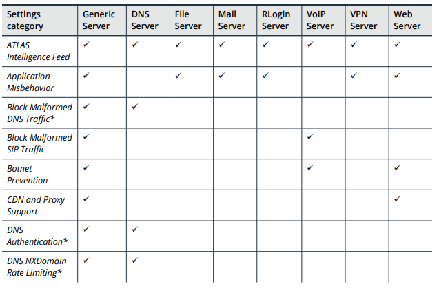

# Section 9: Managing Server Types

## Table of contents

- [Section 9: Managing Server Types](#section-9-managing-server-types)
  - [Table of contents](#table-of-contents)
  - [About the Server Types](#about-the-server-types)
    - [Navigating to the Server Types page](#navigating-to-the-server-types-page)
    - [About managing the server types from AEM](#about-managing-the-server-types-from-aem)
    - [About the standard server types](#about-the-standard-server-types)
    - [About the custom server types](#about-the-custom-server-types)
    - [Available protection settings for IPv4 standard server types](#available-protection-settings-for-ipv4-standard-server-types)
  - [Adding and Deleting Custom Server Types](#adding-and-deleting-custom-server-types)
    - [Using AEM](#using-aem)
    - [Adding custom server types when you add a protection group](#adding-custom-server-types-when-you-add-a-protection-group)
    - [Adding a custom server type](#adding-a-custom-server-type)
    - [Duplicating an existing server type](#duplicating-an-existing-server-type)
    - [Deleting a custom server type](#deleting-a-custom-server-type)
  - [Changing the Protection Settings for Server Types](#changing-the-protection-settings-for-server-types)
    - [Using AEM to manage protection settings](#using-aem-to-manage-protection-settings)
    - [Navigating to the protection settings](#navigating-to-the-protection-settings)
    - [How changes affect the protection groups](#how-changes-affect-the-protection-groups)
    - [About capturing traffic profiles](#about-capturing-traffic-profiles)
    - [Configuring the protection setting](#configuring-the-protection-setting)
  - [About Traffic Profiling for Protection Configuration](#about-traffic-profiling-for-protection-configuration)
    - [Workflow for capturing traffic profiles](#workflow-for-capturing-traffic-profiles)
    - [Rate-based protection settings that AED uses for profiling](#rate-based-protection-settings-that-aed-uses-for-profiling)
  - [Capturing Traffic Profiles](#capturing-traffic-profiles)
    - [About the rate-based protection settings](#about-the-rate-based-protection-settings)
    - [Capturing traffic profiles for multiple server types](#capturing-traffic-profiles-for-multiple-server-types)
    - [Capturing traffic profiles for one server type](#capturing-traffic-profiles-for-one-server-type)
    - [Stopping a profile capture](#stopping-a-profile-capture)
    - [Viewing the status of profile captures](#viewing-the-status-of-profile-captures)
  - [Viewing and Tuning the Profile Capture Results for Server Types](#viewing-and-tuning-the-profile-capture-results-for-server-types)
    - [Tuning all of the protection settings for a server type](#tuning-all-of-the-protection-settings-for-a-server-type)
    - [Information in the Tuning window](#information-in-the-tuning-window)
    - [Tuning individual protection settings for a server type](#tuning-individual-protection-settings-for-a-server-type)
    - [Information in the profile window](#information-in-the-profile-window)
  - [Restoring the Default Protection Settings](#restoring-the-default-protection-settings)
    - [Restoring the default protection settings](#restoring-the-default-protection-settings-1)

## About the Server Types

- A class of hosts that a specific protection group protects
- Determine which protection settings are available for a protection group and which application-specific data AED collects and displays for that group
- Each protection groups can be associated with the same server type
- AED provides multiple predefined, standard server types for IPv4 hosts and one standard server type for IPv6 host
- Can add a maximum of 100 custom server types on an AED

### Navigating to the Server Types page

- `Protect > Inbound Protection > Server Type Configuration`

### About managing the server types from AEM

- Can configure server types in AEM and propagate the configuration to each managed AED
- When you first connect AED to AEM, the server types on AEM are merged with any existing server types on AED

### About the standard server types

- Generic Server
  - Contains all of the protection settings and is associated with the default protection group
- Web Server
- DNS Server
- Mail Server
- VoIP Server
- VPN Server
- RLogin Server (remote login)
- File Server
- Generic IPv6 Server

### About the custom server types

- Add a new protection group
  - Select a server type from a list of the standard server types
  - Save the protection group => AED creates a custom server type that is based on the selected server type, with the same name as the protection group
  - Can modify the settings for these custom server type

### Available protection settings for IPv4 standard server types

- Certain protection settings are available for all of the IPv4 standard server types

## Adding and Deleting Custom Server Types

### Using AEM

### Adding custom server types when you add a protection group

- Add a new protection group
  - Select a server type from a list of the standard server types
  - Save the protection group => AED creates a custom server type that is based on the selected server type, with the same name as the protection group
  - Can modify the settings for these custom server type

- AED adds this server type to the list of **Custom Server Types** on the `Configure Server Type` pages

### Adding a custom server type

- `Protect > Inbound Protection > Server Type Configuration > Custom Server Types > Add Server Type`

- Click **Add Server Type**
- Save

### Duplicating an existing server type

- `Protect > Inbound Protection > Server Type Configuration > Custom Server Types`
  - Select the server type to duplicate 
  - Click **Options**, select **Duplicate**
  - type a name to identify the server type in the **Server Type Name**
  - Save

### Deleting a custom server type

- When you delete a server type, AED deletes all of the protection groups that are associated with that server type
  - Any IPv4 prefixes that the deleted protection group protected are assigned to the default protection group

- `Protect > Inbound Protection > Server Type Configuration > Custom Server Types`
  - Select the server type to delete 
  - Click **Options**, select **Delete**
  - Save

## Changing the Protection Settings for Server Types

- YPu can customize the settings of server type to provide more directed protection for specific server types, both standard and custom
  
### Using AEM to manage protection settings

- Can configure server types in AEM and propagate the configurations to each managed AED

### Navigating to the protection settings

- The `Configure Server Type` page allows you to change the protection settings for each of the protected server types
  - Access to the `Configure Server Type` page 
    - `Protect > Inbound Protection > Server Type Configuration`
    - From the View Protection Group page, click the server type name link in the page header

### How changes affect the protection groups

- The change applies to all of the protection groups that have the same server type

### About capturing traffic profiles

- AED profile your network by capturing statistical data about certain types of traffic
  - use to estimate how much traffic would be passed at different thresholds and protection levels
  - Includes:
    - Passed traffic
    - Blocked traffic
- Can manage the profile captures for multiple AED devices from AEM

### Configuring the protection setting

- `Protect > Inbound Protection > Server Type Configuration`
  - Select `Standard Server Types` or `Custom Server Types`
  - Select the specify server type for which to configure settings
  - Filter the list of server
  - Edit the protection settings
    - Can use **View profile** icon to simplify the configuration 
  - Save

## About Traffic Profiling for Protection Configuration

### Workflow for capturing traffic profiles 

### Rate-based protection settings that AED uses for profiling

- AED gather profile data for a server type's rate-based protection settings.
- When you start a profile capture, AED applies the appropriate maximum values for these rate-based protection settings to obtain accurate results

## Capturing Traffic Profiles

### About the rate-based protection settings

### Capturing traffic profiles for multiple server types

- `Protect > Inbound Protection > Protection Groups`
  - Select the check boxes for individual protection groups
  - Select the check box in the table heading row to select all of the protection groups
- Click **Profile**
  - If a profile capture is in progress for a server type that is associated with a selected protection group, then the **Profile** button is unavailable
  - Deselect any protection groups with active profile captures
- Click **Start**
  
### Capturing traffic profiles for one server type

- `Protect > Inbound Protection > Protection Groups`
  - Select a server type
  - Click **Options** and select **Profile Capture**
- Move the **Length of capture** slider to specify the duration of the cation (1 - 14 days)
- Click **Start**

### Stopping a profile capture

- `Protect > Inbound Protection > Server Type Configuration`
  - Select a server type
  - Click **Options** and select **Profile Capture**
- Stop the capture
  - Click **Stop Profile Capture**
  - Or `Options > Profile Capture > Stop`

### Viewing the status of profile captures

- `Protect > Inbound Protection > Server Type Configuration`
  - On the `Configure Server Type` page, click icon **Profile Capture Status** on the menubar
    - **Last Capture** column
  - On the `List Protection Groups` page, icon **capture in progress** appears in the **Mode** column for a protection group
    - Hover the mouse pointer over the icon to view the status information about the profile capture

## Viewing and Tuning the Profile Capture Results for Server Types

- Can view the data that AED measured during the most recent traffic profile capture
  - Use this profile data to help you configure the protection settings that are appropriate for your network
    - Estimate how much traffic would be passed
    - Estimate how much traffic would be blocked

### Tuning all of the protection settings for a server type

- `Protect > Inbound Protection > Server Type Configuration`
  - Click icon **Profile Capture Status** on the menu bar to check the status
  - In the `Profile Status Capture` window, click on the name for a server whose profile capture is completed
  - Click **Tune Profiled Settings** in the `Profile Capture: Completed` message 

- In the `Tuning` window, use the following ways to configure the protection settings
  - Click **Save** to accept the settings generated by the profile capture
  - To change the threshold values and view how they might affect the amount of passed traffic, drag the icon markers to different points in a histogram 
  - Type different values in the `Suggested Settings` fields
- Click **Revert** to revert any changes in a specific protection category
  - **Revert All**

### Information in the Tuning window

### Tuning individual protection settings for a server type

- `Protect > Inbound Protection > Server Type Configuration`
  - Select a server type
  - Click **View Profile** icon next toe the settings that you want to configure
  - Ways to configure with the profile data:
    - To set the thresholds for this protection setting to the values that AED recommends, click **Auto**
    - Drag the icon markers to different points on the histogram
    - Type different values and view the profile discover how those values might affect the amount of passed traffic

### Information in the profile window

## Restoring the Default Protection Settings

- Affect to the server type:
  - Restore the protection settings for a standard server type
    - The settings for any related custom server types are not affected
  - Restore the protection settings for a custom server type
    - The settings of the custom server returned to the default settings of the base server type
    - Any changes on the base server type's settings are not applied to it

### Restoring the default protection settings

- `Protect > Inbound Protection > Server Type Configuration`
  - Select a server type for which to restore settings
  - Click **Options** and **Restore Default**
  - **OK**