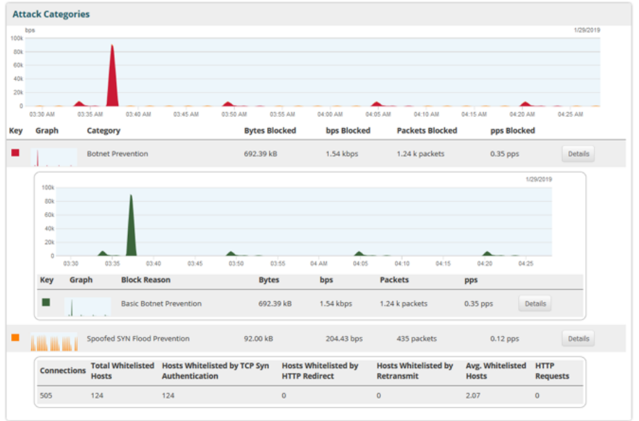
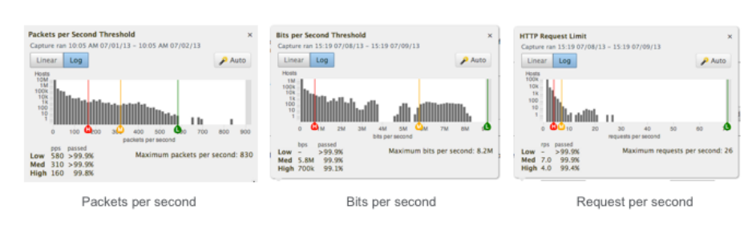

# Unit 2: Config

## Table of contents

- [Unit 2: Config](#unit-2-config)
  - [Table of contents](#table-of-contents)
  - [Understanding the protection group page](#understanding-the-protection-group-page)
  - [Tuning Protection Settings using traffic Profiles](#tuning-protection-settings-using-traffic-profiles)
    - [Applying the Profile Capture](#applying-the-profile-capture)

## Understanding the protection group page

- Protection Group Page
  - Extensive traffic details
    - Group details
    - Group Cloud Signaling Status
    - Overview
    - Traffic Details
    - Attack Categories
    - Top Temporary Blocked Sources
    - Web Traffic by URL
    - Web Traffic by Domain
    - Web Crawlers
    - IP location
    - Top Protocols
    - Top Services

- Protection Group Page Details

- Reporting Options

    .png)

- Protection Group Overview
  - Single-glance overview of protection group performance

- Traffic Details
  - Show relative amounts of traffic being passed and blocked

- Blocked Sources 

- Attack Categories
  - Shows which Protections have been triggered 

- Attack Categories - Details Data

    

- Protection Detail Breakdowns

- Protection Details - AIF Data Breakdown
  - AIF (ATLAS Intelligence Feed (AIF))
  - AIF Botnet Signatures offer same breakdown  format as Basic Botnet Prevention
  - Details include stats for low, medium, and high matching 

- Attack Categories - Blocked Hosts

- Web Traffic by ... URL or Domain
  - Breakdowns by embedded URL and domain part of URL
  - Blacklist buttons available for these URLs

- IP Location - Where the Attack is Coming From

- Protocols - How the Attack is Hitting
  - Breakdown of the top protocols
  - If a protocol needs to be blocked, enter it in the filter list for the protected service

- Services - What the Attack is Hitting

## Tuning Protection Settings using traffic Profiles 

### Applying the Profile Capture

- Identifying Profile Capture Status

- Viewing Profile Data
  - Icon appears next to each protection setting that has available data

- Profile Histograms
    - Display observed traffic volumes for a protection setting
    - In alignment with the Protection traffic data captured
        
        

- Profile Histograms Actions
  - Set the thresholds for this Protection setting to values that AED recommends
  - Drag the markers to different points on the histogram to change the threshold values and view how they might affect affect the amount of passed traffic
  - Change setting values in the Protection setting field and view information in the Profile window to discover how those values would affect traffic
  
- Auto - Action Details
  - Sets the thresholds for the protection setting to values that should work well for most circumstances
    - Low: maximum seen * 2
    - Medium: 99.9 percentile
    - High: 99.0 percentile

- Profile 