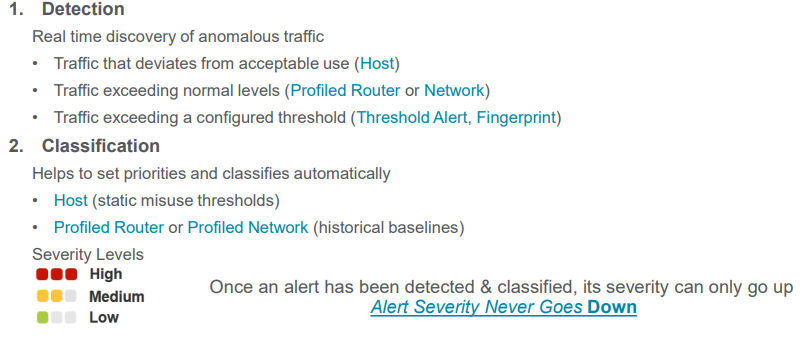
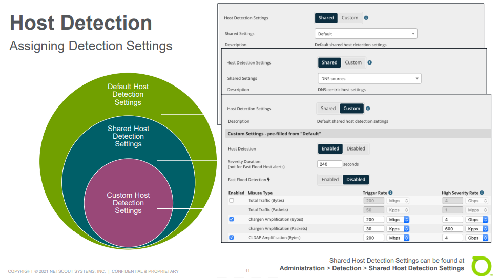
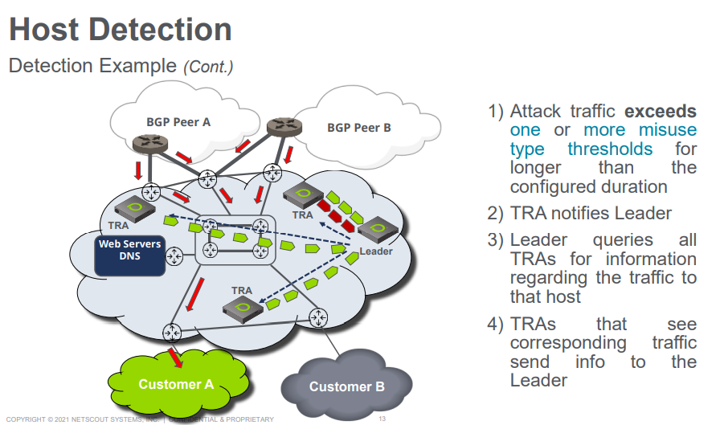
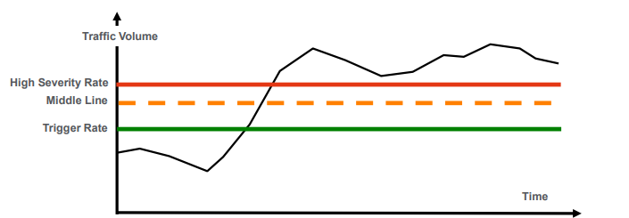
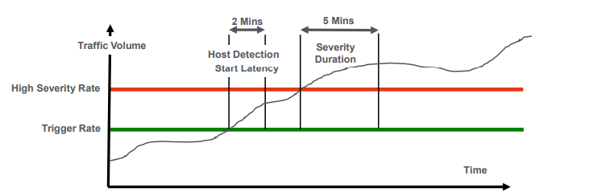
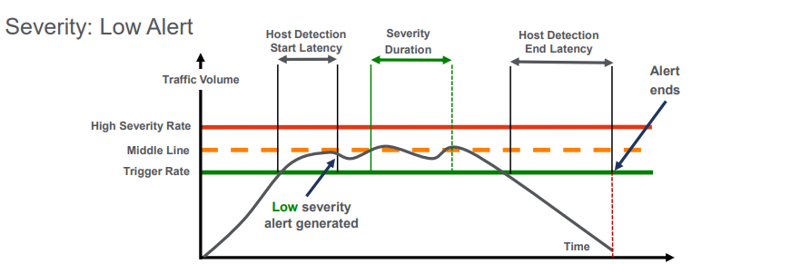
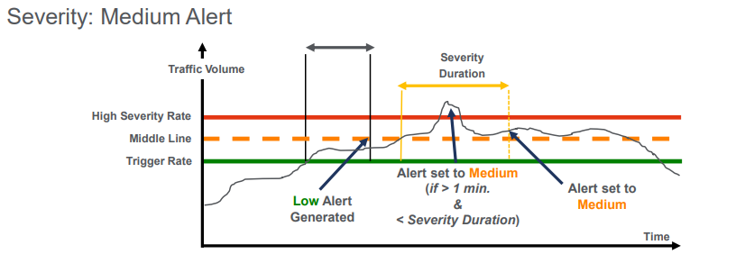
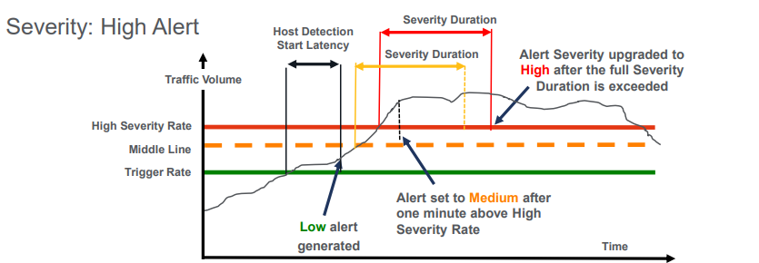
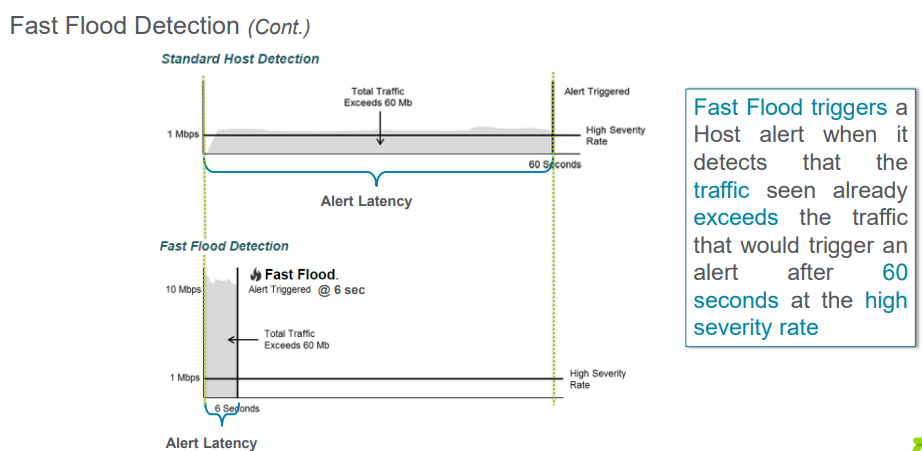

# Unit 3: Host Anomaly Detection

## Table of contents

- [Unit 3: Host Anomaly Detection](#unit-3-host-anomaly-detection)
  - [Table of contents](#table-of-contents)
  - [Anomaly Detection \& Classification](#anomaly-detection--classification)
    - [Infrastructure Security](#infrastructure-security)
    - [Anomaly types](#anomaly-types)
    - [Anomaly Detection Setup](#anomaly-detection-setup)
    - [Alert Generation - Two Step Process](#alert-generation---two-step-process)
  - [Host Detection](#host-detection)
    - [Characteristics](#characteristics)
    - [Misuse Types:](#misuse-types)
    - [Assigning Detection Settings:](#assigning-detection-settings)
    - [Anomaly Classification](#anomaly-classification)
    - [Start Latency and Severity Duration](#start-latency-and-severity-duration)
    - [Severity](#severity)
      - [Low Alert](#low-alert)
      - [Medium Alert](#medium-alert)
      - [High Alert](#high-alert)
    - [Fast Flood Detection:](#fast-flood-detection)
    - [Alert Directionality](#alert-directionality)

## Anomaly Detection & Classification

### Infrastructure Security

- Sightline functions as a network-wide anomaly detection system
- `Anomaly` definition: A statistical abnormality when compared to typical traffic patterns 
  - Cause: DDoS attack, Flash Crowd, topology change, new customer,..

### Anomaly types

       

### Anomaly Detection Setup

  

### Alert Generation - Two Step Process

  

## Host Detection

### Characteristics

- Concept: Measure traffic that matches a Misuse Type towards an individual /32 or /128 host
- Direction: Towards the victim host
- MO (mode of operation)
- Default
- Detection: Static thresholds, measured in bps, and/or pps
- Exclusion:
  - With >= 9.3, can exclude source or destination IP addresses from alert detection
  - With>= 9.35, can specify either all routers or only boundary routers to be used for host alerting
- Alerting: Traffic on router for a host exceeds Misuse Type Threshold for a specified amount of time
- Fast Flood: Trigger when traffic exceeds high alert threshold within the first minute of detection 

### Misuse Types:

- Chargen Amplification: UDP and source port 19
- DNS Amplification: UDP and source port 53
- MS SQL RS Amplification: UDP and source port 1434
- NTP Amplification: UDP with source port 123 and large (invalid) packet sizes
- SNMP Amplification: UDP with source port 161 and/or 162
- SSDP Amplification: UDP with source port 1900
- L2TP: UDP with source port 1701 and packet size 500-65535 bytes
- mDNS: UDP with source port 5353
- NetBIOS: UDP with source port 137 or 138
- RIP v1: UDP and source port 520
- rpcbind: UDP with source port 111

### Assigning Detection Settings:

  

- TRA - Traffic Response Agent

- Example:
        

  - Final, the leader classifies the alert severity and inserts it in the alert database

### Anomaly Classification

- Detected based on static thresholds
  - `Trigger Rate`
  - `Middle Line`: 75% of High Severity Rate
  - `High Severity Rate`
  
    

### Start Latency and Severity Duration

  - Host Detection Start Latency
  - Host Detection End Latency
  - Severity duration
  - Fast Flood Detection
        

### Severity

#### Low Alert

  - Above Trigger Rate for longer than Host Detection Start Latency
  - Not stay above Middle Line for the Severity Duration
  - Not reach High Severity Rate
  
      

#### Medium Alert

  

#### High Alert

  - Above Trigger Rate for longer tha Host Detection Start Latency
  - Exceed High Severity Rate
  - Above High Severity Rate for the Severity Duration

      

### Fast Flood Detection:

  - Alert quickly when a host initially receives very high volume
    - Fast Flood evaluation occurs every second 
    - Start Latency is ignored when misuse traffic exceeds the High Severity Rate
    - Alert starts as soon as traffic is sufficient for high severity detection
    - Can shorten the triggering of auto-mitigation
    - Start Latency still applies for lower misuse traffic levels
    - Disabled by default
  
      

### Alert Directionality

  - Incoming: Customer or Profiled managed Object
  - Outgoing: Peer managed Object