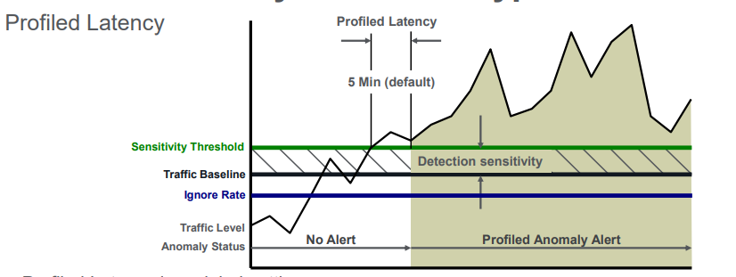
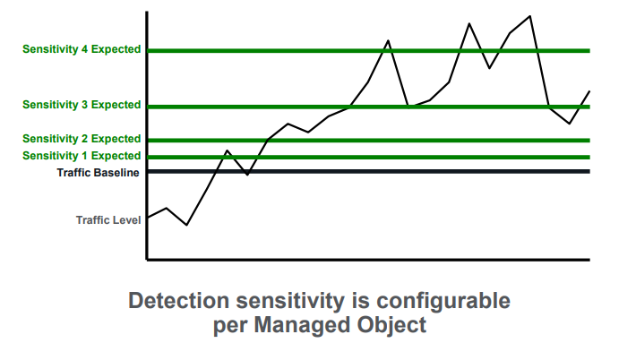
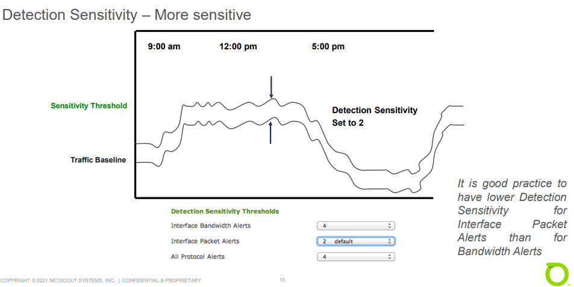
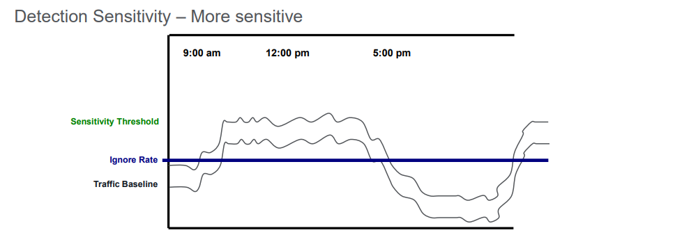
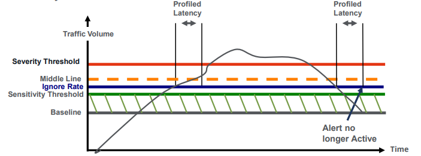
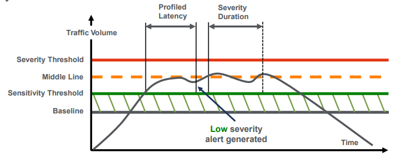
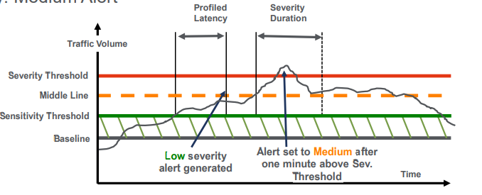
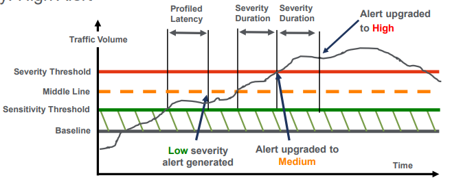

# Unit 4: Profiled Anomaly Detection

## Table of contents

- [Unit 4: Profiled Anomaly Detection](#unit-4-profiled-anomaly-detection)
  - [Table of contents](#table-of-contents)
  - [Profiled Anomaly Detection Types](#profiled-anomaly-detection-types)
    - [Router versus Network](#router-versus-network)
    - [Profiled Latency:](#profiled-latency)
    - [Profiled anomalies have a two-step process:](#profiled-anomalies-have-a-two-step-process)
    - [Detection terminology:](#detection-terminology)
    - [Detection Directionality:](#detection-directionality)
    - [Alert Classification:](#alert-classification)
  - [Profiled Router Detection:](#profiled-router-detection)
    - [Baselines](#baselines)
    - [Sensitivity Settings](#sensitivity-settings)
    - [Detection Sensitivity:](#detection-sensitivity)
    - [Profiled Latency](#profiled-latency-1)
    - [Severity](#severity)
      - [Low Alert](#low-alert)
      - [Medium Alert](#medium-alert)
      - [High Alert](#high-alert)
    - [Configuration](#configuration)
    - [Recommendations](#recommendations)
  - [Profiled Network Detection](#profiled-network-detection)
    - [Overview](#overview)
    - [Configuration](#configuration-1)

## Profiled Anomaly Detection Types

### Router versus Network 

- Router:
  - Deviations from normal (expected) traffic levels for a MO on a per-router basis
  - Alert: Counts traffic through a single router per MO; matches the traffic level against standard deviation above baselines
  - Fast Flood: High alert only

- Network:
  - Deviations from normal (expected) traffic levels at the MO boundary. 
  - Alert: Counts traffic at the MO boundary and matches the traffic levels against a percentage above baselines
  - Fast Flood: Not available

### Profiled Latency:

- Allows varying burst tolerance
- Default = 5 min
    

### Profiled anomalies have a two-step process:

  - Detection
  - Classification

### Detection terminology:

  - `Traffic Baseline` – The expected rate of traffic
  - `Sensitivity Threshold` – The rate above the baseline that traffic must be before it is considered anomalous
  - `Profiled Latency` – Length of time the traffic has to remain above the Sensitivity Threshold before an anomaly is generated
  - `Ignore Rate` – Used to suppress anomalies that are too small to care about, even if statistically significant. An anomaly must exceed either bps or pps Ignore Rate before an anomaly alert is generated and statistics kept 
  - `Severity Threshold` – traffic rate that needs to be exceeded for a High level alert to be generated

### Detection Directionality:

  - Incoming: based on traffic destined
  - Outgoing: based on traffic sourced

### Alert Classification:

  - Determines anomaly type, severity and size
  - Classification is performed by the Leader
  - Classification only takes place after anomaly is detected by a Collector

## Profiled Router Detection:

### Baselines

- `Total traffic`
  - bps & pps, in & out, per interface, per MO
- `Traffic per IP protocol`
- `Baseline data point` = average of 30 minutes
- `Current Baseline Validation`
- Two types:
  - Protocol: bps and pps baselines per router (for ICMP, TCP, UDP, GRE, AH, ESP, and "other")
  - Bandwidth: bps and pps baselines per interface, not per router

      

### Sensitivity Settings

   

### Detection Sensitivity:

- Determines the difference between the Traffic Baseline and the Sensitivity Threshold
  
    

    

    

### Profiled Latency
  
    

### Severity

#### Low Alert

  - Above **Ignore Rate** and **Sensitivity Threshold** for longer than profiled router latency period
  - May go above the Middle Line but does not stay there for Severity Duration Period
  - Never goes above Severity Threshold

      

#### Medium Alert

  - Above Ignore Rate and Sensitivity Threshold and stays above for longer than profiled latency period
  - Above Middle Line staying there for the Severity Duration period
  - Above the Severity Threshold but does not stay above Severity Threshold for the Severity Duration period
  
    

#### High Alert

  - Above Ignore Rate and Sensitivity Threshold and stays above for longer than Profiled Latency period
  - Crosses Severity Threshold and stays above for the Severity Duration period

      

### Configuration

### Recommendations

  - Use Auto Rate Calculation when possible
  - Set Sensitivity settings high (less sensitive) while baselines are being built (first week)
  - Manually configuring profiles require on-going maintenance
  - Fast Flood Detection can be resource intensive 
  - Get high level infrastructure coverage using network aggregates

## Profiled Network Detection

### Overview

- Identifies excessive rates of traffic that cross a managed object boundary or service boundary
- Monitors all traffic that crosses boundary
- Baselines are updated every thirty minutes at 15 and 45 minutes past the hour

### Configuration

- Administration > Detection > DDoS
- Administration > Detection > Global Detection Settings

- `Enable Profile Country Detection`
- `Incoming/Outgoing Detection Percent`
- `Incoming/Outgoing Severity Percent`
- `Incoming/Outgoing Ignore Rates`