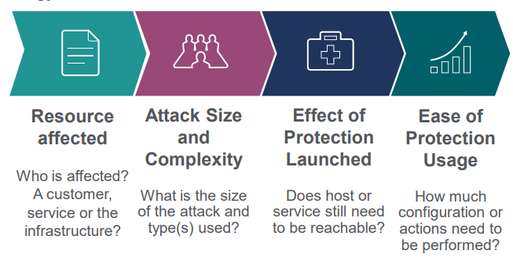
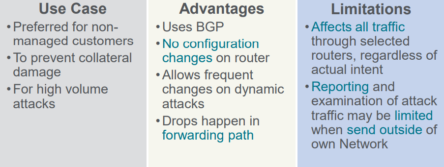
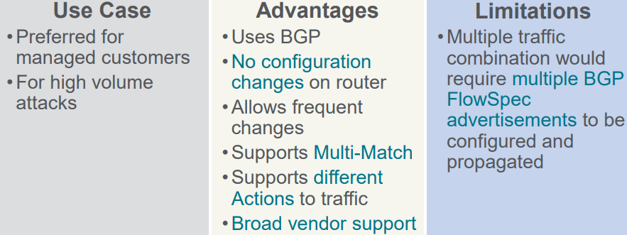
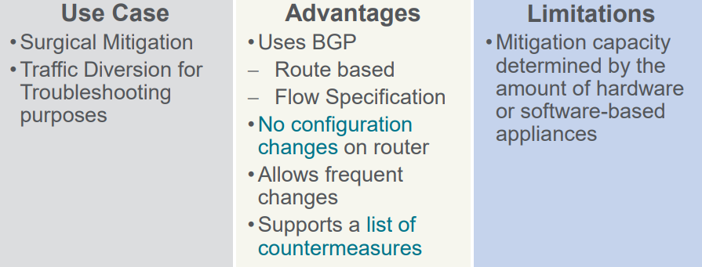
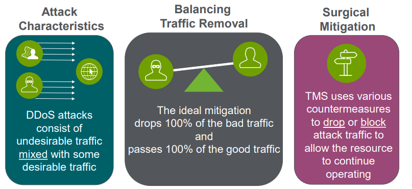

# Unit 6: Anomaly Mitigation

## Table of contents

- [Unit 6: Anomaly Mitigation](#unit-6-anomaly-mitigation)
  - [Table of contents](#table-of-contents)
  - [Mitigation Methods](#mitigation-methods)
    - [Select Strategy](#select-strategy)
    - [Comparison](#comparison)
  - [Sightline Triggered Blackhole Mitigation](#sightline-triggered-blackhole-mitigation)
    - [Overview](#overview)
    - [On the Router](#on-the-router)
    - [Upstream Signaling](#upstream-signaling)
    - [Conclusion](#conclusion)
    - [Configuration](#configuration)
  - [Sightline Triggered Flow Specification](#sightline-triggered-flow-specification)
    - [Overview:](#overview-1)
    - [On the Router](#on-the-router-1)
    - [Conclusion](#conclusion-1)
    - [Configuration](#configuration-1)
  - [Sightline TMS Mitigation](#sightline-tms-mitigation)
    - [Overview](#overview-2)
    - [Conclusion](#conclusion-2)
    - [Attack Processing](#attack-processing)
    - [Configuration](#configuration-2)

## Mitigation Methods

### Select Strategy

- Goal is **Stop** or **Reduce** the Impact of the **attack**

    

### Comparison

- `Generate Filter`: Use contents of alert Scratchpad to define an ACL to be applied to a router. (Can use if the results of the attack are not critical to your network operations)
- `Black Hole`: Use BGP (Border Gateway Protocol) announcement with new next hop to drop traffic
- `Flow Specification`: Use BGP announcement to instruct routers to mark, drop of rate limit traffic that matches a filter.
- `Threat Management`: Divert Traffic to TMS to protect critical resources using configurable counter-measures.

## Sightline Triggered Blackhole Mitigation

### Overview

- Sightline announces BGP route to black hole traffic
  - Surgically select the routes from list
  - Use BGP Community to influence where traffic will be blackholed

### On the Router

- Sightline announces a BGP route with the victim  IP address and a next-hop that points to 'trash'..

### Upstream Signaling

- Sightline announces BGP route to black hole traffic

### Conclusion

  

### Configuration 

- `Alert > Mitigate Alert > Blackhole`

## Sightline Triggered Flow Specification

### Overview:

- Sightline Announces a 'policy' via BGP about how to handle certain traffic
  - Use network elements to police or drop certain traffic
  - Use multi-match criteria to clearly identify malicious traffic

### On the Router
- Sightline announces a BGP policy with all the configured parameters

### Conclusion

  

### Configuration 

- `Alert > Mitigate > Flow > Specification`

## Sightline TMS Mitigation

### Overview

- Sightline announces BGP route or Flow Spec to divert the traffic
  - All traffic through 'poisoned' routers towards destination will now be diverted
  - Surgical separate valid from malicious traffic by using a combination of TMS countermeasures
  
### Conclusion

  

### Attack Processing

  

### Configuration 

- `Alert > Mitigation Alert > Threat Management`

