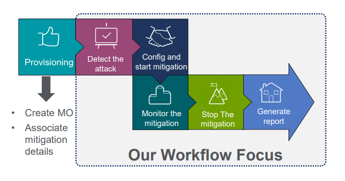
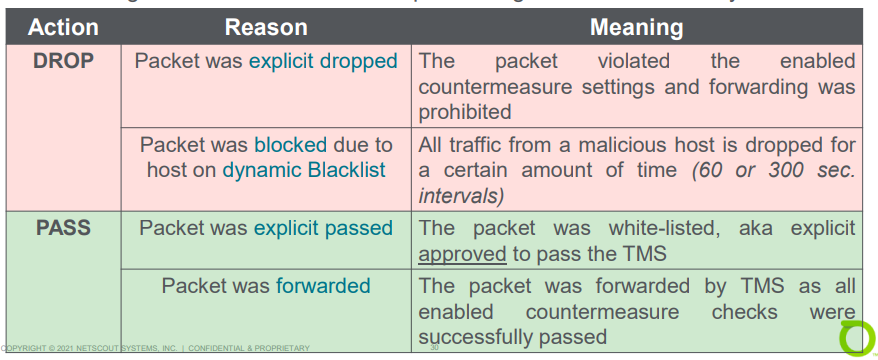
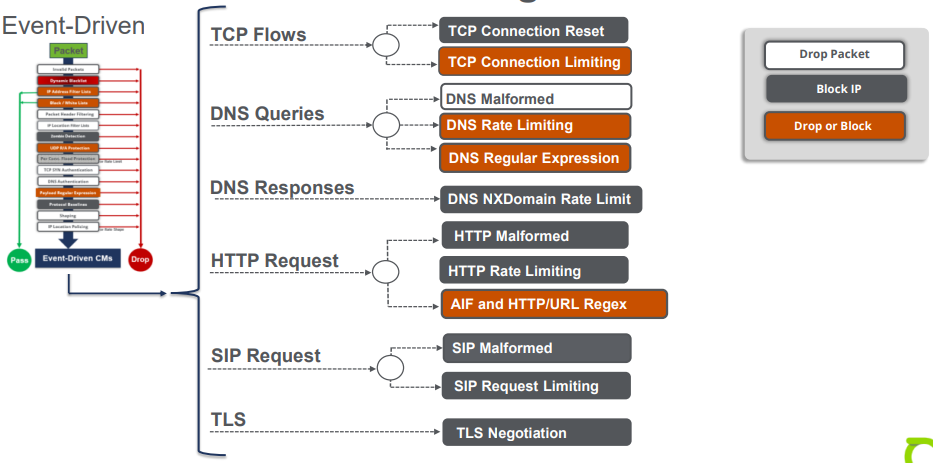

# Unit 7: TMS Mitigation Workflow

## Table of contents

- [Unit 7: TMS Mitigation Workflow](#unit-7-tms-mitigation-workflow)
  - [Table of contents](#table-of-contents)
  - [TMS Mitigation Workflow](#tms-mitigation-workflow)
    - [Process Overview](#process-overview)
    - [Detect the Attack](#detect-the-attack)
    - [Mitigating IPv6](#mitigating-ipv6)
    - [Configuration](#configuration)
    - [Real Time Mitigation Status Page](#real-time-mitigation-status-page)
    - [Sample Packets](#sample-packets)
    - [Mitigation Summary Report](#mitigation-summary-report)
    - [Mitigation  dropped Traffic Level in the DOS Alert](#mitigation--dropped-traffic-level-in-the-dos-alert)
  - [Block versus Drop](#block-versus-drop)
    - [TMS Traffic Actions](#tms-traffic-actions)
    - [Dynamic Blacklist (Host Blocking)](#dynamic-blacklist-host-blocking)
    - [Dynamic Blacklist Countermeasures](#dynamic-blacklist-countermeasures)
  - [Countermeasure Processing Order](#countermeasure-processing-order)
    - [Concept](#concept)
    - [Processing Types](#processing-types)
  - [Mitigation Issues](#mitigation-issues)
    - [TMS Fate Sharing Options:](#tms-fate-sharing-options)
    - [TMS Fate Failure Process](#tms-fate-failure-process)
    - [TMS Fate Sharing Options](#tms-fate-sharing-options-1)
    - [TMS Fault Considerations](#tms-fault-considerations)

## TMS Mitigation Workflow

### Process Overview
        
  

### Detect the Attack

  - Detection, Classification and Alerting happens simultaneously
  - Analyze the details of the alert to determine if a mitigation is necessary

### Mitigating IPv6

  

### Configuration

- Name: 
  - Taken from the DoS Alert
  - Unique name
- Template
  - Associated with the MMO within the DOS Alert
- Managed Object
  - MO associated with this mitigation, used for reports and MSSP Access
- Allow Scoped User Access
- Protection Prefixes
- Use Less Specific Diversion Prefixes
- Timeout
- Flow Specification Filter
- TMS Group
- Announce Route

### Real Time Mitigation Status Page

- Display detailed statistics about a mitigation and allows you to edit the countermeasures being applied
- Summary Tab
- Traffic Graph
- Countermeasures Tab
- Units (bps and pps)
- Time Period
  - Summary
  - Last 30 minute
  - Last 5 minute
  - Type of Traffic
    - Per countermeasure
    - Per TMS Appliance
    - Total
  
### Sample Packets

- One of the best tools for performing analysis of packets during mitigation 
  -  `Explore > Packet` or `Real Time Mitigation Status Page`
  -  Runs on a single TMS
  -  Identify effects of the mitigation countermeasures

### Mitigation Summary Report

### Mitigation  dropped Traffic Level in the DOS Alert

- When the mitigation starts, the Alert traffic graphs will reflect dropped traffic due to the mitigation actions

## Block versus Drop

### TMS Traffic Actions
  
  

### Dynamic Blacklist (Host Blocking)

- Blacklisting countermeasure identifies source host that violate appropriate behavior
  - Offending Host added to dynamic blacklist
    - 1 minute (first offense)
    - 5 minute (repeat offenses)
  - After blocking time
    - The host is removed from the dynamic blacklist
    - Traffic is processed again
    - If the host continues to offend it will be blacklisted again

### Dynamic Blacklist Countermeasures
  
  

## Countermeasure Processing Order

### Concept

- Countermeasure are defense mechanisms that you can use to target and remove attack traffic, it act primarily using one or more of four enforcement types:
  - Pass packets
  - Drop packets
  - Block Source IP address or flow
  - Rate limit/ shape

### Processing Types

  - Per-Packet

    

  - Event-Driven: divided into the following groups:
    - Application-specific stream-based
    - Time-based

    

  
## Mitigation Issues

### TMS Fate Sharing Options:

- Mitigation will be stopped in case of failure
  - Component Failures (CPU, processes, interface, power supply)
  - Group Membership Failures
  - Diversion Failure
    - Interface down
    - Next-hop unavailable
    - GRE tunnel down
    - BGP session down
  - TMS Isolation

### TMS Fate Failure Process

- Fault Process
  - TMS detects one or more Fate Sharing relevant issues
  - Sightline leader is notified about issues
  - TMS Group setting may take the complete group offline

### TMS Fate Sharing Options

- If a TMS detects an issue, the TMS or the complete TMS group will suspend (out-of-service) the running mitigation
- The event will be logged in the **Annotation** section

### TMS Fault Considerations

- Mitigation Preconditions can be overridden
- One TMS will take the entire group offline
- A TMS failure should not overwhelm the remaining TMS Appliances in a group
- Mitigations must be manually restarted once the issues is repaired
- Power-supply Failures do not take the TMS offline

