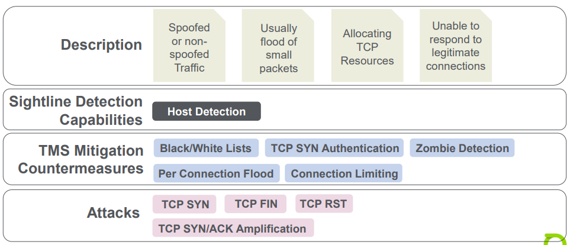
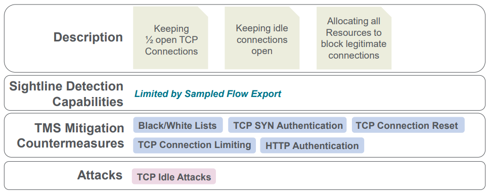
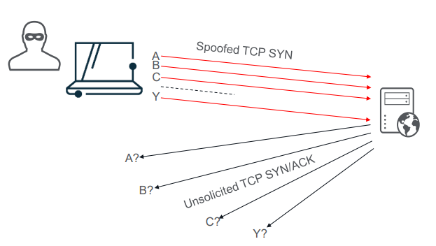
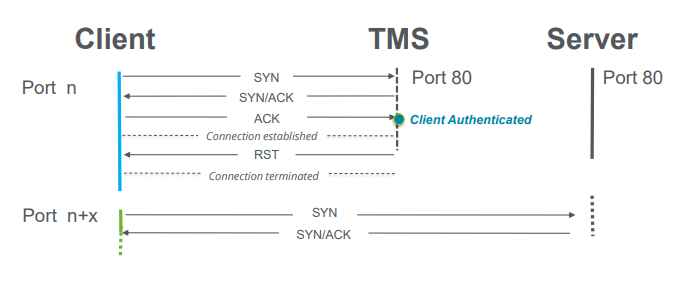
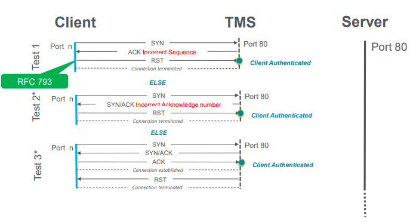
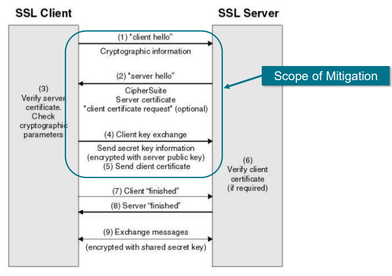

# Unit 9: State Attacks
## Table of content

- [Unit 9: State Attacks](#unit-9-state-attacks)
  - [Table of content](#table-of-content)
  - [Layer 4 Attacks](#layer-4-attacks)
    - [Stack Flood Attack](#stack-flood-attack)
    - [Connection Attack](#connection-attack)
  - [TCP SYN Authentication](#tcp-syn-authentication)
    - [Overview](#overview)
    - [Configuration](#configuration)
    - [Connection Reset Validation](#connection-reset-validation)
    - [Default Behavior](#default-behavior)
    - [Caveats](#caveats)
    - [Out-of-Sequence Authentication](#out-of-sequence-authentication)
    - [Out-of-Sequence Validation](#out-of-sequence-validation)
    - [Options](#options)
    - [Spoofed Flood Protection](#spoofed-flood-protection)
    - [Spoofed Flood Protection Validation](#spoofed-flood-protection-validation)
    - [Automation](#automation)
  - [TCP Connecting Limiting](#tcp-connecting-limiting)
    - [Configuration](#configuration-1)
    - [Advanced Settings](#advanced-settings)
  - [TCP Connection Reset](#tcp-connection-reset)
    - [Overview](#overview-1)
    - [Configuration](#configuration-2)
    - [Slow Attack](#slow-attack)
    - [Configuration - Slow Attacks](#configuration---slow-attacks)
  - [TLS Attack Prevention](#tls-attack-prevention)
    - [Overview](#overview-2)
    - [Attack Operation](#attack-operation)
    - [Threads](#threads)
    - [Configuration](#configuration-3)
    - [TLS Support](#tls-support)
    - [Mitigation Status](#mitigation-status)

## Layer 4 Attacks

### Stack Flood Attack

### Connection Attack

- Overview
  

- TCP Half-Open Connection
  - `Transmission Control Block` (TCB) use to maintained each TCP connection separately
    - Contains two socket number that identify it and pointers to buffers where incoming and outgoing data are held
    - Each device maintains its own TCB for the connection

## TCP SYN Authentication

### Overview

- Prevents SYN attacks from spoofed source IP addresses and packet-generators
- TCP 3-way handshake is expensive to setup and maintain
- Number of TCP connections has a finite limit
- The device must maintain the corresponding connection
- No Blacklisting with this countermeasure

### Configuration

- `Ignore Source / Destination Ports` 
- `TCP SYN Authentication Idle timeout`: Length of time before client must re-authenticate

### Connection Reset Validation

### Default Behavior

In addition to TCP SYN packets,, any other type of TCP packet is automatically dropped
- Source host is authenticated if it resends the dropped packet
- Any TCP packet received from authenticated host

### Caveats

- Some services or TCP stacks may not handle the TCP RST and restart well
  - SSL/HTTPS
  - SSH
  - SSL/IMAPS/POP3S
  - SMTP

### Out-of-Sequence Authentication

- Reset TCP connections via
a seamlessly transparent method
- Avoid Transaction errors and retries for SSL or non-HTTP TCP protocols
  - TMS imitates a pre-existing half-open connection
  - TCP client should perform a reset of the half-open session and retry

### Out-of-Sequence Validation

### Options

- `Enable Outbound Out-of-sequence Authentication`
  - Prevent connections coming from the protected hosts to be dropped
  - Has to be enabled with `Spoofed Flood Protection`

- `Enable Spoofed Flood Protection`
  - Mitigation of inbound spoofed ACK and SYN/ACK floods
-  Existing "retransmit" authenticated connections are revoked and will need to re-authenticate

### Spoofed Flood Protection

- Blocks SYN-ACK response in outbound TCP Connections unless `Outgoing Out-Of-Sequence` is enabled
- Prevent retransmit-auth
- Drops all existing TCP connections
- All source hosts must authenticate via SYN or Out-of-Sequence method
- Idle TCP connections are dropped after authentication idle timeout

### Spoofed Flood Protection Validation

Challenge:
1. Intercepts initial SYN-ACK packet from source host
2. Responds with ACK packet that has invalid sequence number
3. Proper host behavior is to send RST
4. TMS notes RST and authenticates source host
5. Client should resend initial SYN to restart TCP handshake

###  Automation 

- `Automate TCP SYN Authentication based on Host Detection`:
  - Enables `TCP SYN Authentication` when DOS host alert has TCP SYN misuse type detected
- `Automate Spoofed Flood Protection based on Host Detection`:
  - Enables `Spoofed Flood Protection` and `Outbound OoS Authentication` when DOS Host alert has TCP SYN/ACK Amplification or TCP ACK misuse misuse type detected

## TCP Connecting Limiting

### Configuration 

Limit the number of simultaneous open TCP connections from a single source host

### Advanced Settings

Choose whether to ignore connections that are idle longer than a setting
  - Default is longer than 60s

## TCP Connection Reset

### Overview

- Handles TCP connections after SYN Authentication
- Keeps hosts from eating up server connection table
- Modes:
  - Monitor new TCP connections, ensure host source host sends at leasts required payload data within initial timeout
  - Ensure source host sends a TCP packet more frequently than the idle timeout
- Connection found idle > timeout is closed by sending TCP reset to the protected host and not to the attacker
- Ports: 80, 443, 25

### Configuration

- Initial Timeout Required Data
- Consecutive idles before Blacklisting

- Timeout:
  - TCP Connection Idle Timeout
  - Track Connection After Initial State

### Slow Attack

- **Problem**: Attacks on HTTP more prevalent, more sophisticated
- **Solution**: Countermeasure for Slowloris and other slow
request attacks. Stricter malformed header checks defeat
LOIC and similar attacks
- **Value**: Service Availability

- Application Slow Request Attack Prevention
  - Configured under TCP Connection Reset
  - Detects and resets connections with low sustained bandwidth
    - Idle connection no longer required for reset
  - Intended to prevent attacks such as Slowloris / Pyloris

### Configuration - Slow Attacks

- Minium Request Bit Rate
- Time Period for Computing the Minium Rate
- Minium Time to Allow for Header Transmission

## TLS Attack Prevention

### Overview

- **Problem**: Attacks on TLS based services are growing
- **Solution**: Suite of detection and countermeasures to stop attacks specifically targeting HTTPS, POP3S, SMTPS servers
- **Value**: Service availability -> prevents malformed or malicious TLS signaling and negotiation from reaching the server

### Attack Operation

### Threads

- Mitigates attacks that target TLS negotiation
  - Malformed TLS Attacks
  - SSL Resource Exhaustion Attacks
  - TCP connection exhaustion on TLS ports

### Configuration

- Protects secured application services from attacks that target TLS signaling protocols
  - Recommended not to change Advanced Settings
  - Any host that exceeds the thresholds is blacklisted

- Advanced Settings
  - `Maximum cipher suites`
  - `Maximum client extensions`
  - `Maximum open uncompleted connections`
  - `Maximum seconds before application data`

### TLS Support

TLS (Version 1.0, 1.1,1.2 and 1.3)

### Mitigation Status

- Usual TMS statistics
  - Traffic dropped by bps/pps
  - Hosts blocked
  - Download blocked hosts List