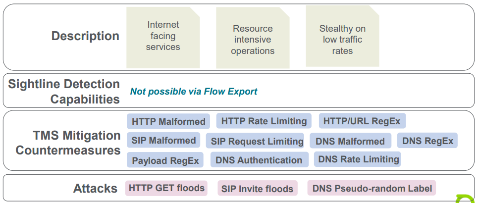
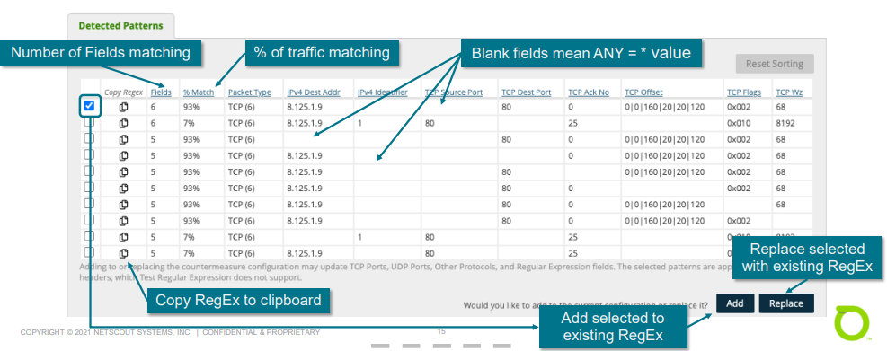
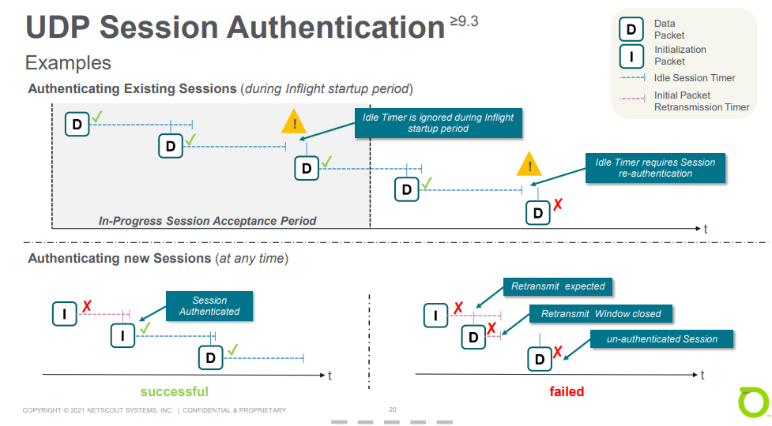

# Unit 10: Application Layer Attacks

## Table of content
- [Unit 10: Application Layer Attacks](#unit-10-application-layer-attacks)
  - [Table of content](#table-of-content)
  - [Application Layer Attacks](#application-layer-attacks)
    - [Overview](#overview)
  - [Payload Regular Expression](#payload-regular-expression)
    - [Overview](#overview-1)
    - [Configuration](#configuration)
    - [Use Cases](#use-cases)
    - [Workflow](#workflow)
      - [Identify possible match](#identify-possible-match)
      - [Test possible match](#test-possible-match)
      - [Configure Filter](#configure-filter)
      - [Filter Validation](#filter-validation)
    - [UI RegEx Generation](#ui-regex-generation)
  - [UDP Session Authentication](#udp-session-authentication)
    - [Overview](#overview-2)
    - [Configuration](#configuration-1)
  - [HTTP Malformed](#http-malformed)
    - [Overview](#overview-3)
    - [Protection Levels](#protection-levels)
  - [HTTP Authentication](#http-authentication)
    - [Overview](#overview-4)
    - [Configuration](#configuration-2)
    - [Application Reset](#application-reset)
    - [HTTP Authentication](#http-authentication-1)
    - [HTTP Authentication + JavaScript](#http-authentication--javascript)
    - [Caveats](#caveats)
  - [HTTP Limiting](#http-limiting)
    - [Overview Request Limiting](#overview-request-limiting)

## Application Layer Attacks

### Overview

- Designed to overwhelm components of specific applications
- Similar to flood attacks but targeted at a particular  software rather than entire hosts.
- Cause to disruption to the service with expensive or well-crafted request
  - DNS
    - Dictionary attack
    - Web
      - Expensive setup -> TLS encryption
      - Database query -> get long listing instead of just a few at a time
      - Large download -> flood the interface return path
      - Flash traffic -> Coupons posted to Twitter

## Payload Regular Expression

### Overview

- RegEx countermeasures look for expression match against packet data
  - Block content-identifiable attack vectors
  - Actions can be drop or dynamically blacklist source
  - Type of RegEx
    - Payload RegEx
    - HTTP RegEx
    - DNS RegEx

### Configuration

- `Payload Regular expression` match is only applied to packets from the specified ports
- `Apply Regular Expression to Payload Header`: The RegEx is applied to the layer 3/4 packet header. Allows to block attacks based on specific patterns in the packet header
- `Action to Apply to Offending Hosts`
  - Blacklist hosts (default): offending source hosts are dynamically blacklisted and dropped traffics from them
  - Drop traffic: only dropped traffics.
- `Apply Action to`
  - Matched Traffic
  - Unmatched Traffic

### Use Cases

- Drop packets from attacker that utilize a common payload
- Drop packets for a traffic based on data inside the payload
- Drop packets poorly crafted and always include the same Timestamp

### Workflow 

#### Identify possible match

- Obtain the payload data from `Sample Packets Window`

#### Test possible match

- RegEx filters can use hex format for matching (add \x between each byte)

#### Configure Filter

- Input the hex formatted string with \x operator in front of every byte

#### Filter Validation

- Check dropped traffic with `Sample Packets`

### UI RegEx Generation 

- The selected TMS can generates a table of traffic pattern from the traffic seen

- Overview of `Detected Pattern`

  

- Configuration auto generated from selection
  - TCP, UDP ports or IP Protocol
  - Port Direction
  - Regular Expression
  - Apply to Packet Header

## UDP Session Authentication

### Overview

- UDP sessions not complete a retransmission check will be drop
  - Mainly intended for Gaming environments
  - Application must use initialization packet for each new session that is reliable identifiable by a RegEx
  - Valid Client retransmit lost initialization packet
  - `In-Progress Session Acceptance Period` learns existing session and are considered authenticated. Period starts on
    - Enabling countermeasure
    - Change of `Destination Port`
    - Change of `In-Progress Session Acceptance Period` value setting

### Configuration

- `Inflight start-up period`: avoid disrupting sessions on countermeasure start
- `Session Idle Timer`: triggering re-authentication

## HTTP Malformed

### Overview

- Blocks attacks that send invalid or black HTTP request to a server to exhaust resources or to exploit vulnerabilities
  - HTTP headers checked for compliance to RFC 2626 Section 2.2 "Basic Rules"
  - Protection levels medium/high add progressively stricter checks
  - Violating messages are dropped and source host is blacklisted

### Protection Levels

- HTTP header field rules by level
  - Low
    - HTTP 1.1 requests must have Host:
  - Medium
    - HTTP 1.1 requests must have Host:
    - All requests must have User-Agent:
  - High
    - HTTP 1.1 requests must have Host:
    - All requests must have User-Agent:
    - All requests must have Connection:

## HTTP Authentication

### Overview

- `TCP SYN Authentication`: New HTTP connection undergoes additional checks for proper HTTP behavior
- `TCP SYN Authentication` options:
  - Enable `Application Reset`
  - `HTTP Authentication`
  - Require `JavaScript for HTTP Authentication`

- HTTP extensions are mutually exclusive
  - `HTTP Authentication` takes priority over `Application Reset`
  - `JavaScript for HTTP Authentication` takes priority

### Configuration

- Modes
  - Applications Reset
  - HTTP Authentication
  - HTTP Authentication with JavaScript

- HTTP Ports
  - Used by all HTTP authentication options
  - Defines TCP ports being used by HTTP

### Application Reset

- Avoid sending a TCP RST from the TMS, get the client to tear down the TCP connection instead

### HTTP Authentication

- Add additional security by using the HTTP protocol to validate the client and test its protocol awareness…

### HTTP Authentication + JavaScript

- Add additional security by using the HTTP protocol to validate the client and test its protocol awareness and JS support...
- Stop curl and similar tools that can respond to 302 redirect status codes.
- Slight obfuscation that prevents the redirection URI from being parsed trivially out of the response HTTP packet.
- Dynamic JavaScript challenge to make guessing and probing by botnet components more difficult.
-  Use elements not normally found in JavaScript tools

### Caveats

- Only works with HTTP traffic (not HTTPS)
- Default ports (80 and 8080) can be changed per mitigation or global
- All sessions must be persistent to a single TMS

## HTTP Limiting

### Overview Request Limiting

- HTTP Request Limiting blacklists clients that exceed a given rate of
HTTP requests
