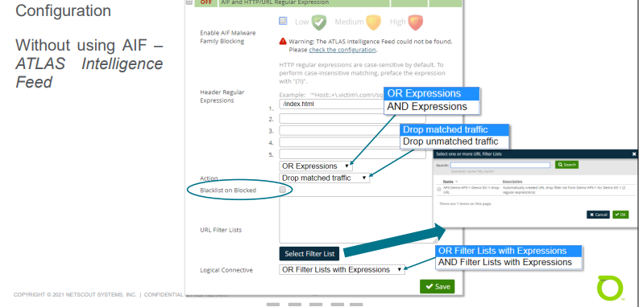
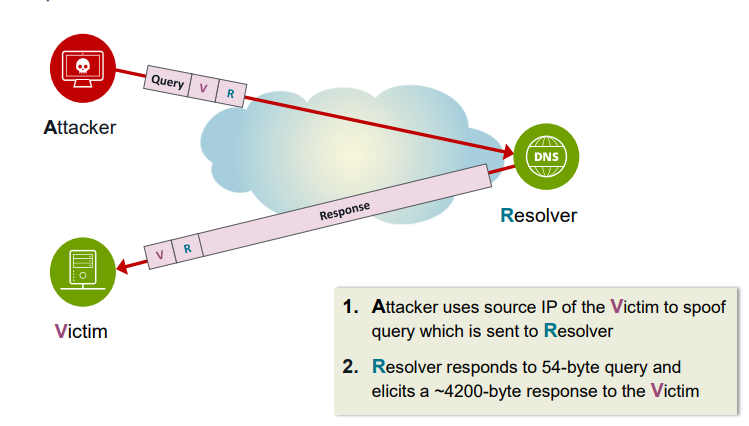
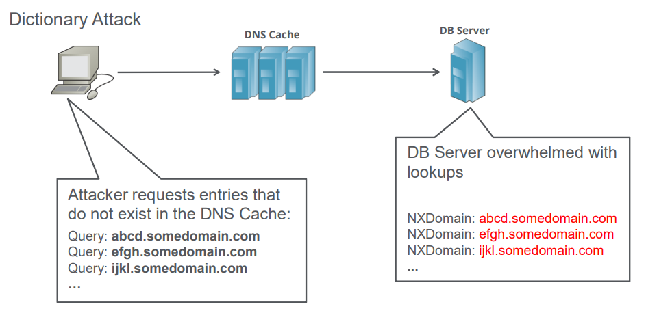
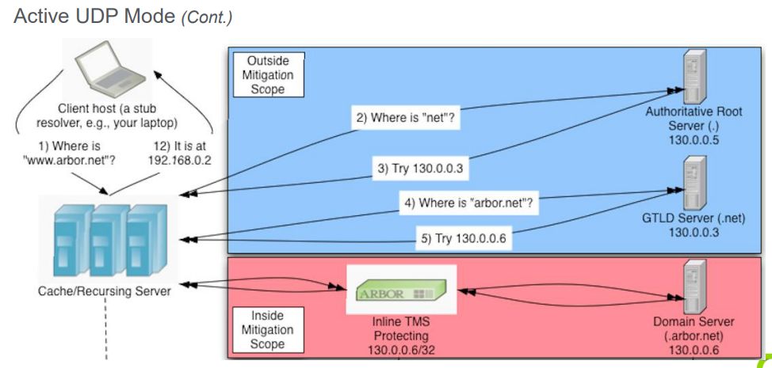
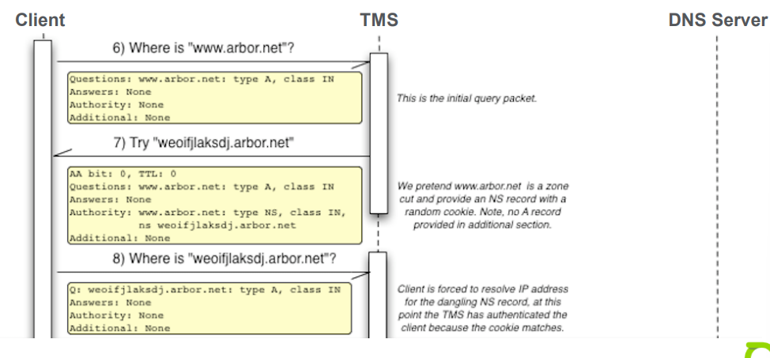
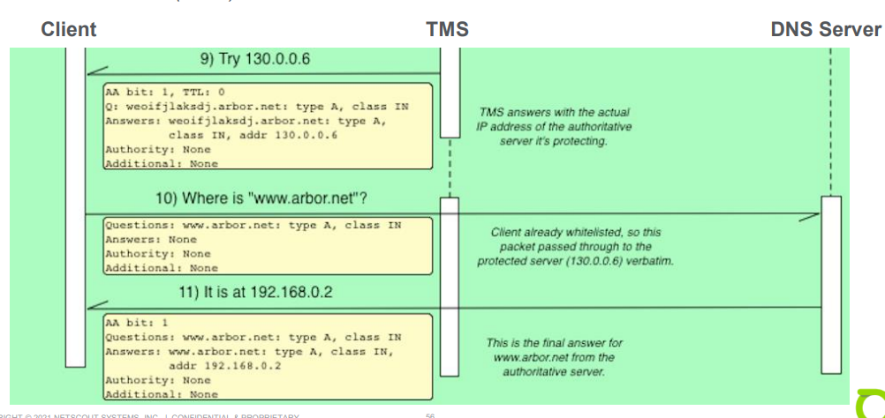
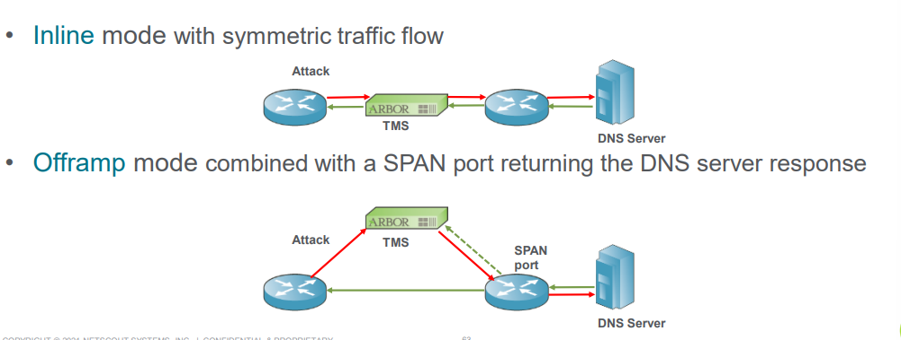

# Unit 10: Application Layer Attacks

## Table of content
- [Unit 10: Application Layer Attacks](#unit-10-application-layer-attacks)
  - [Table of content](#table-of-content)
  - [Application Layer Attacks](#application-layer-attacks)
    - [Overview](#overview)
  - [Payload Regular Expression](#payload-regular-expression)
    - [Overview](#overview-1)
    - [Configuration](#configuration)
    - [Use Cases](#use-cases)
    - [Workflow](#workflow)
      - [Identify possible match](#identify-possible-match)
      - [Test possible match](#test-possible-match)
      - [Configure Filter](#configure-filter)
      - [Filter Validation](#filter-validation)
    - [UI RegEx Generation](#ui-regex-generation)
  - [UDP Session Authentication](#udp-session-authentication)
    - [Overview](#overview-2)
    - [Configuration](#configuration-1)
  - [HTTP Malformed](#http-malformed)
    - [Overview](#overview-3)
    - [Protection Levels](#protection-levels)
  - [HTTP Authentication](#http-authentication)
    - [Overview](#overview-4)
    - [Configuration](#configuration-2)
    - [Application Reset](#application-reset)
    - [HTTP Authentication](#http-authentication-1)
    - [HTTP Authentication + JavaScript](#http-authentication--javascript)
    - [Caveats](#caveats)
  - [HTTP Limiting](#http-limiting)
    - [Overview Request Limiting](#overview-request-limiting)
    - [Overview Object Limiting](#overview-object-limiting)
  - [HTTP Regular Expression](#http-regular-expression)
    - [Overview](#overview-5)
    - [Configuration](#configuration-3)
    - [Use Cases](#use-cases-1)
    - [Mitigation Status](#mitigation-status)
    - [Sample Packet](#sample-packet)
    - [Workflow](#workflow-1)
  - [DNS Malformed](#dns-malformed)
    - [Overview](#overview-6)
  - [DNS Authentication](#dns-authentication)
    - [Reflection and Amplification Attack](#reflection-and-amplification-attack)
    - [Dictionary Attack](#dictionary-attack)
    - [Overview](#overview-7)
    - [Configuration](#configuration-4)
    - [Passive Mode](#passive-mode)
    - [Active UDP Mode](#active-udp-mode)
    - [Active TCP Mode](#active-tcp-mode)
    - [Recommendation](#recommendation)
  - [DNS Rate Limiting Options](#dns-rate-limiting-options)
    - [Overview](#overview-8)
    - [NXDOMAIN Limit](#nxdomain-limit)
      - [Overview](#overview-9)
      - [TMS Design](#tms-design)
  - [DNS Regular Expression](#dns-regular-expression)
    - [Overview](#overview-10)
    - [Configuration](#configuration-5)
    - [Use Case](#use-case)
    - [Sample Packets](#sample-packets)

## Application Layer Attacks

### Overview

- Designed to overwhelm components of specific applications
- Similar to flood attacks but targeted at a particular  software rather than entire hosts.
- Cause to disruption to the service with expensive or well-crafted request
  - DNS
    - Dictionary attack
    - Web
      - Expensive setup -> TLS encryption
      - Database query -> get long listing instead of just a few at a time
      - Large download -> flood the interface return path
      - Flash traffic -> Coupons posted to Twitter

## Payload Regular Expression

### Overview

- RegEx countermeasures look for expression match against packet data
  - Block content-identifiable attack vectors
  - Actions can be drop or dynamically blacklist source
  - Type of RegEx
    - Payload RegEx
    - HTTP RegEx
    - DNS RegEx

### Configuration

- `Payload Regular expression` match is only applied to packets from the specified ports
- `Apply Regular Expression to Payload Header`: The RegEx is applied to the layer 3/4 packet header. Allows to block attacks based on specific patterns in the packet header
- `Action to Apply to Offending Hosts`
  - Blacklist hosts (default): offending source hosts are dynamically blacklisted and dropped traffics from them
  - Drop traffic: only dropped traffics.
- `Apply Action to`
  - Matched Traffic
  - Unmatched Traffic

### Use Cases

- Drop packets from attacker that utilize a common payload
- Drop packets for a traffic based on data inside the payload
- Drop packets poorly crafted and always include the same Timestamp

### Workflow 

#### Identify possible match

- Obtain the payload data from `Sample Packets Window`

#### Test possible match

- RegEx filters can use hex format for matching (add \x between each byte)

#### Configure Filter

- Input the hex formatted string with \x operator in front of every byte

#### Filter Validation

- Check dropped traffic with `Sample Packets`

### UI RegEx Generation 

- The selected TMS can generates a table of traffic pattern from the traffic seen

- Overview of `Detected Pattern`

  

- Configuration auto generated from selection
  - TCP, UDP ports or IP Protocol
  - Port Direction
  - Regular Expression
  - Apply to Packet Header

## UDP Session Authentication

### Overview

- UDP sessions not complete a retransmission check will be drop
  - Mainly intended for Gaming environments
  - Application must use initialization packet for each new session that is reliable identifiable by a RegEx
  - Valid Client retransmit lost initialization packet
  - `In-Progress Session Acceptance Period` learns existing session and are considered authenticated. Period starts on
    - Enabling countermeasure
    - Change of `Destination Port`
    - Change of `In-Progress Session Acceptance Period` value setting

### Configuration

- `Inflight start-up period`: avoid disrupting sessions on countermeasure start
- `Session Idle Timer`: triggering re-authentication

## HTTP Malformed

### Overview

- Blocks attacks that send invalid or black HTTP request to a server to exhaust resources or to exploit vulnerabilities
  - HTTP headers checked for compliance to RFC 2626 Section 2.2 "Basic Rules"
  - Protection levels medium/high add progressively stricter checks
  - Violating messages are dropped and source host is blacklisted

### Protection Levels

- HTTP header field rules by level
  - Low
    - HTTP 1.1 requests must have Host:
  - Medium
    - HTTP 1.1 requests must have Host:
    - All requests must have User-Agent:
  - High
    - HTTP 1.1 requests must have Host:
    - All requests must have User-Agent:
    - All requests must have Connection:

## HTTP Authentication

### Overview

- `TCP SYN Authentication`: New HTTP connection undergoes additional checks for proper HTTP behavior
- `TCP SYN Authentication` options:
  - Enable `Application Reset`
  - `HTTP Authentication`
  - Require `JavaScript for HTTP Authentication`

- HTTP extensions are mutually exclusive
  - `HTTP Authentication` takes priority over `Application Reset`
  - `JavaScript for HTTP Authentication` takes priority

### Configuration

- Modes
  - Applications Reset
  - HTTP Authentication
  - HTTP Authentication with JavaScript

- HTTP Ports
  - Used by all HTTP authentication options
  - Defines TCP ports being used by HTTP

### Application Reset

- Avoid sending a TCP RST from the TMS, get the client to tear down the TCP connection instead

### HTTP Authentication

- Add additional security by using the HTTP protocol to validate the client and test its protocol awareness…

### HTTP Authentication + JavaScript

- Add additional security by using the HTTP protocol to validate the client and test its protocol awareness and JS support...
- Stop curl and similar tools that can respond to 302 redirect status codes.
- Slight obfuscation that prevents the redirection URI from being parsed trivially out of the response HTTP packet.
- Dynamic JavaScript challenge to make guessing and probing by botnet components more difficult.
-  Use elements not normally found in JavaScript tools

### Caveats

- Only works with HTTP traffic (not HTTPS)
- Default ports (80 and 8080) can be changed per mitigation or global
- All sessions must be persistent to a single TMS

## HTTP Limiting

### Overview Request Limiting

- HTTP Request Limiting blacklists clients that exceed a given rate of
HTTP requests

### Overview Object Limiting 

- HTTP Object Limiting blacklists clients that exceed a give rate of HTTP request ro a single object

## HTTP Regular Expression

### Overview

- AIF and HTTP Regular Expressions
provide a mechanism to block specific
HTTP requests that impact a server or
service

### Configuration

- Without using AIF-ATLAS Intelligence Feed 

  

- `AIF Malware Family Blocking`:
  - `Header Regular Expressions` and `URL Filter Lists` can only block matching traffic
  
### Use Cases

- Drop traffic to a particular site hosted on a server
- Drop traffic to the attacked URI and move the service
- Drop traffic from external sites that moved their DNS to your site!
- Drop traffic from Referred sites
- Drop invalid HTTP headers

### Mitigation Status

- Graph can be total of subset for each enforcement AIF level

### Sample Packet

- Sample Packet can use `HTTP RegEx` to filter the result
  
### Workflow

  1. Examine Sample Attack Packets
  2. Create RegEx Filter
  3. Monitor Result

## DNS Malformed

### Overview

- Block attacks that send invalid or black DNS messages to a server to exhaust resources or to exploit vulnerabilities
  - Validates DNS Messages
  - Packet is dropped but sources hosts are note blacklisted
  - DNS Z Flag is no longer validated with Release >= 9.3

## DNS Authentication

### Reflection and Amplification Attack

### Dictionary Attack

### Overview

- Types of protection mode:
  - Passive
    - Caching/Recursive Server
    - Authoritative Serve
  - Active UDP
    - Authoritative Servers
  - Active TCP
    - Caching/Recursive Server
    - Authoritative Serve

- `DNS Authentication Timeout` is number of seconds after which DNS request is considered to have failed authentication

### Configuration

- DNS Malformed
- DNS Authentication
- DNS Rate Limiting
- DNS NXDomain Rate Limiting

### Passive Mode

- Drops the first DNS request (UDP/53) from a client
  - Src address is whitelisted it client retransmits DNS request within DNS Authentication Timeout
  - Retry and subsequent request are passed to destination

- Only works well  for randomly spoofed address attacks where each packet is a unique source IP

### Active UDP Mode

- Useful for protecting Internet-facing DNS server that only respond to queries for which they have authoritative answers
  - Protects the Authoritative Servers for the zone
  - Only recursive/caching DNS servers can authenticate
    - Traffic from unauthenticated clients is dropped
    - DNS Client (recursive servers) are re-directed using a NS record response (TMS)
    - DNS Client follows challenge and is authenticated for 60 seconds

- Key: The TMS does not give the A record for the server in the redirect as a normal DNS server =>  The recurser is forced to do a look up for the name (our cookie) => it will authenticating it self
- Default Idle timeout: 60s

### Active TCP Mode

- Uses the "Truncate" feature  of the DNS Protocol as a form of DNS redirection during authentication
  - Client usually handles DNS Truncate in IP stack
  - Seamless transition is invisible to client applications 
  - Effective regardless of whether the protected server is authoritative or not for the queried domain name

- TCP DNS query intercepted between client and DNS Server when client is authenticated the TCP DNS query is forwarded
  - First DNS query (UDP/53) from client intercepted and spoofed reply from TMS with Truncate bit set returned
  - Second DNS query (TCP/53) from client to server passed by TMS

### Recommendation

- NETSCOUT currently suggest TCP Active Mode as the default protection for DNS Servers
- Use `Active UDP` mode, if servers do not support TCP DNS request, and the servers are authoritative for all legitimate desirable DNS requests
- `Passive Mode` is generally recommend only when:
  - A high-traffic DNS attack is using random IP source 
  - Neither Active mode can be used due to DNS server configuration constraints

## DNS Rate Limiting Options

### Overview

- Protects against attacks from legitimate hosts
- Track queries per second by authenticated source address
  - If all DNS queries exceed DNS Query Rate Limit, the source is blacklisted
  - If unique DNS queries exceed DNS Query Object Limiting, the source is dropped or blacklisted

- `DNS Query Rate Limit` : A reasonable maximum value for user clients of the nameserver infrastructure

### NXDOMAIN Limit

#### Overview

- Limits the rate at which clients may send DNS queries for non-exsitent domains (NXDomain responses)
  - Queries per second are based on source/destination pair
  - Failed queries exceeding DNS NXDomain Rate Limit -> the source is blacklisted

#### TMS Design

- TMS must see DNS NXDOMAIN response from the server

## DNS Regular Expression

### Overview

- DNS domain filtering is designed to block attacks that contain unique DNS domain nam information
- Types of filtering:
  - DNS Regex Expression
  - DNS Filter Lists
- Processing of `DNS Filter Lists` is more efficient than `DNS Regular Expressions`, but filtering is more flexible with DNS Regular Expressions
- DNS Requests are typically decoded using string-based, instead of hex-based, matches

### Configuration 

- Drop matched traffic or unmatched traffic
- Choose record type from dropdown 
- Up to 5 regular expressions

- Match regular expressions to inbound requests, inbound responses, or both
- Source host can be blacklisted instead of a single packet drop
- Match multiple regular expression s
- Choose DNS resource record types to match
  

### Use Case

- Drop all DNS queries for a certain domain
- Pass all queries for certain domains or FQDNs public resolvable
  
### Sample Packets

- Can configure a Arbor TMS countermeasure to look for specific values in the header of DNS request packet
  - A packet-by-packet analysis
  - Can place the source on a blacklist
  - Supports up to five expressions evaluated simultaneously per mitigation
  - If request either match or do not match (depending on  the settings) the expressions, Arbor TMS dynamically drops the offending traffic coming from the source host

