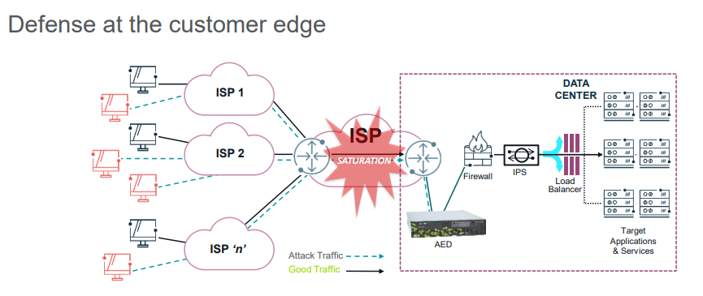

# Unit 11: Enhancing Mitigations

## Table of content
- [Unit 11: Enhancing Mitigations](#unit-11-enhancing-mitigations)
  - [Table of content](#table-of-content)
  - [Scoping Countermeasure](#scoping-countermeasure)
    - [Overview](#overview)
  - [CDN Proxy](#cdn-proxy)
    - [Overview](#overview-1)
    - [Modified Countermeasures](#modified-countermeasures)
    - [Configuration](#configuration)
  - [Cloud Signaling](#cloud-signaling)
    - [Overview](#overview-2)
    - [Configuration](#configuration-1)
    - [Filter lists](#filter-lists)
  - [Mitigation Templates](#mitigation-templates)
    - [Overview](#overview-3)
    - [Defaults](#defaults)
    - [Example: Resource Based - Web Server Farm](#example-resource-based---web-server-farm)
  - [Auto Mitigation](#auto-mitigation)
    - [Overview](#overview-4)
    - [Profile Alerts](#profile-alerts)
    - [Alert Triggered](#alert-triggered)
  - [Learning Mitigation](#learning-mitigation)
    - [Overview](#overview-5)
    - [Configuration](#configuration-2)
    - [Results](#results)
    - [Running Mitigation](#running-mitigation)

## Scoping Countermeasure

### Overview

- DNS or HTTP countermeasure to be applied more specifically to:
  - Specific virtual servers or NAT/ load-shared servers share an IP address with other servers.
  - A portion of domains handled by the same servers
  - Many related domains on many servers with many IP addresses
  - Domains with server IP addresses that are variable or unknown
  - Domains being used by attacks on servers that don’t serve for that domain
  - Make best use of TMS countermeasure capacity

- Scoping allows you focus which traffic should be evaluated by the DNS or HTTP countermeasures
  - DNS or HTTP each separately support
    - Upp to 5 specific domain regular expressions
    - Selector for whether countermeasures act on traffic matched/ not matched

- Supported to be preconfigured through mitigation templates

## CDN Proxy

### Overview

- Problem -> Source IP of attack appears to be the CDN proxy server
- Solution -> Recognize when traffic is from a proxy server and adjust countermeasures to block traffic based on flow rather than source IP
- When `CDN Proxy Support` is enabled
  - TMS looks for the following fields in the HTTP header
    - X-Forwarder-for
    - True-Client-IP
  - If detected and the packet or flow is violating one of the enabled countermeasures, it will only drop the packet or flow
  - Source IP of the packet will never be blacklisted

### Modified Countermeasures

- Modified to drop
  - HTTP Malformed
  - SIP Malformed
  - SSL Negotiation
  - DNS Regular Expression
  - HTTP Regular EXpressions

- Checks exempted
  - DNS NXDomain Rate Limiting
  - DNS Rate Limiting
  - HTTP Rate Limiting
  - SIP Request Limiting
  - TCP Connection Limiting
  - TCP Connection Reset
  - Zombie Detection

### Configuration

- Prevents blacklisting of a CDN (HTTP) proxy
  - Select during mitigation creation
  - Option in mitigation template

## Cloud Signaling

### Overview

- Handshake (TCP 443)
  - AED establishes the connection to each configured Sightline server in the Cloud
  - Negotiates heartbeat parameters
  - Determines if group mitigation is supported
- Heartbeat (UDP 7550)
  - Asynchronous UDP
  - AED sends message every minute to each configured Sightline
  - Signals whether cloud mitigation is wanted
  - Each configured Sightline sends message every minute to AED
  - Signals mitigation state and mitigation statistics

### Configuration

- Administration > Monitoring > Managed Objects

  

  

### Filter lists

- AED filter lists automatically used by Cloud Signaling mitigations
  - Whenever mitigation is created from Cloud Signaling and manual mitigations
  - Applies to both auto-mitigations and manual mitigations
  - Automatically removed when Cloud Signaling alert ends
    - Allows Cloud Signaling auto-mitigation reuse with different APS

- SP (Security Provider)
- AED filter lists updates
  - Sent by AED to SP over normal Cloud Signaling messages
  - AED sends an update when a blacklist or whitelist changes on AED
  - AED sends a refresh of all four lists every 12 hours

- AED filter lists on SP become empty when disabled on AED
  - AED sends updates for all four lists with no filters
  - Filter lists are not deleted but have no effect

- AED can update filter lists on SP while Use Filter Lists in Mitigations is disabled in SP settings
  - SP setting applies only to automatic use in mitigations

- APS filter lists cannot be deleted through the SP user interface
  - Use CLI command to delete
    > / services sp mitigation filters delete filtername

## Mitigation Templates

### Overview

- Mitigation templates combine global mitigation configurations parameters with a pre-set group of IPv4 or IPv6 prevent an attack

### Defaults

### Example: Resource Based - Web Server Farm

- Enter Black/White Lists to drop everything not web related
  - Drop all ICMP, UDP* and other protocols
  - Drop all traffic from private and IANA reserved space
  - Drop all fragments
  - Drop all TCP traffic other than those ports served by the servers

- Enable countermeasures that protect web servers
  - Zombie Detection
  - TCP SYN Authentication (including HTTP Authentication)
  - TCP Connection Reset
  - Application Slow Request Attack Prevention
  - HTTP Malformed
  - HTTP Rate Limiting

## Auto Mitigation

### Overview

- Auto-Mitigation allows for a mitigation to be started automatically without human intervention
  - Customer Managed Object
  - Configured on a per-MO basis
  - Types
    - Alert Triggered
      - Only Host Detection
      - Only Profiled Detection 
      - Both
    - Traffic Triggered

### Profile Alerts

- Auto-mitigations can be disabled for `Profiled` and `Profiled Network DoS` alerts
  - Setting is both global and per managed object
  - Choose to perform auto-mitigation for host alerts and use profiled detection for alerting only
    - Host alerts often reflect legitimate attacks
    - Profiled detection is much more likely to alert on traffic that may or may not be an attack

### Alert Triggered

- When enabled, a mitigation is intiated when the following is true;

  

## Learning Mitigation

### Overview

- Aid for setting rate-based countermeasure settings
  - Gain usable threshold values
    - Learn typical traffic rates for a set of rate-based countermeasures
    - Learning mitigations is a real mitigations that passes all traffic
      - Can prevent another mitigation due to protection prefix overlap
  - `Learned dataset` provides snapshot of normal traffic rates

### Configuration 

- Learning Mitigations count against the limit of running mitigations allowed per TMS

### Results

- `Learned dataset` shows a snapshot of seen traffic rates for a several different rate-based countermeasures
- Zombie Detection
- TCP Connection Reset
- HTTP Rate Limiting
- DNS Rate Limiting
- DNS NXDomain Rate Limiting
- SIP Request Limiting

### Running Mitigation

- The learned dataset will provide context to aid in selecting appropriate countermeasure settings

