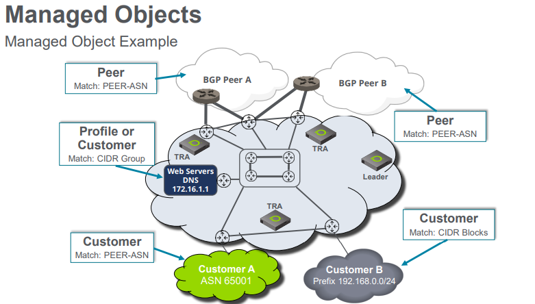

# Unit 2: DDoS Overview

## Table of contents

- [Unit 2: DDoS Overview](#unit-2-ddos-overview)
  - [Table of contents](#table-of-contents)
  - [Impact of DDoS](#impact-of-ddos)
  - [DOS Alert Activity](#dos-alert-activity)
  - [Managed Object](#managed-object)

## Impact of DDoS

- DDoS Attacks is more complex:
  - DDoS attacks are often multivector attacks
  - DDoS attacks often change during the attack
  - Attacker keeps an eye on the victim’s resource’s availability

- Business impact:
    
  - `Operational Costs` : Increased transit cost, Increased network cost, supply chain disruption, Clean up costs, Personnel turnover
  - `Revenue Impact` : Loss of on-line sales, Inability to process transactions, Customer attrition, Opportunity cost due to loss of communications
  - `Corporate Image` : Reputation loss, Stock value reduction
  - `Service Level Agreement Penalty`

- Common DDoS attacks types:
    
  Example:
    - Volumetric Attack – DNS Amplification
        
    - State Exhaustion Attack – TCP SYN Flood
        
    - Application Attack – HTTP SlowLoris / PyLoris
        

- DDoS Attack surface:
  - General Infrastructure (routers, switches, load balancers, etc.)
  - Application specific infrastructure
  - Control Plane / Management Network (if not isolated)
  - Network Links
  - Hosts/Servers
  - IP Protocols (TCP, UDP, ICMP, etc.)
  - Applications (DNS, Web, VoIP, etc.)

## DOS Alert Activity

- Use the Search bar to search for active or recent alerts
  - Keyword based
      
  - Wizard based
    - Flexible filtering
    - Quickly locate multiple specific criteria's
    - Not offering all available search criteria’s
    - Generates a search string
  - Sort result by any heading

- DOS Alert Summaries
      

- Multiple host Misuse Types: Same targeted IP of a Managed Object will be aggregated into a single alert

## Managed Object

- Concept
      

- Definition
  - Defines a `subset` of the network traffic
  - Can be `internal` or `external` to the network
  - Each managed object belongs to a `family type`
    - `Family Types`
      - Customer
      - Peer
      - Profile
      - VPN

- Example
      