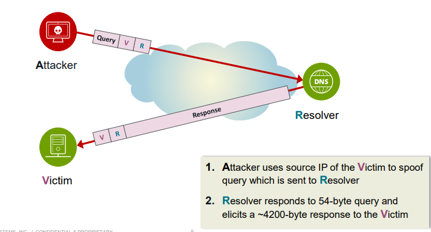

# Unit 2: DDoS Overview

## Table of contents

- [Unit 2: DDoS Overview](#unit-2-ddos-overview)
  - [Table of contents](#table-of-contents)
  - [Impact of DDoS](#impact-of-ddos)

## Impact of DDoS

- DDoS Attacks is more complex:
  - DDoS attacks are often multivector attacks
  - DDoS attacks often change during the attack
  - Attacker keeps an eye on the victim’s resource’s availability

- Business impact:
    
  - `Operational Costs` : SLA infractions, Engineering resources, Increased transit cost, Increased network cost, supply chain disruption, Clean up costs, Personnel turnover
  - `Revenue Impact` : Loss of on-line sales, Inability to process transactions, Customer attrition, Opportunity cost due to loss of communications
  - `Corporate Image` : Reputation loss, Stock value reduction
  - `Service Level Agreement Penalty`

- Common DDoS attacks types:
    
  Example:
    - Volumetric Attack – DNS Amplification
        
    - State Exhaustion Attack – TCP SYN Flood
        