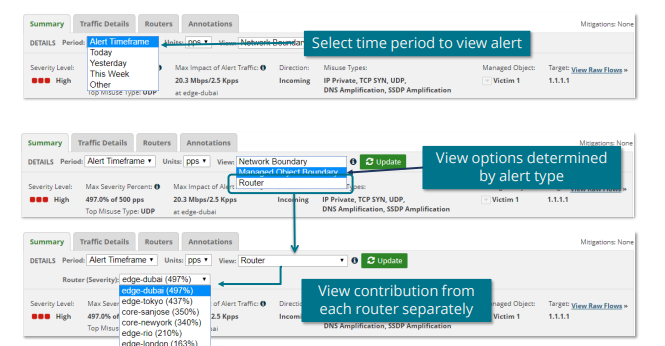
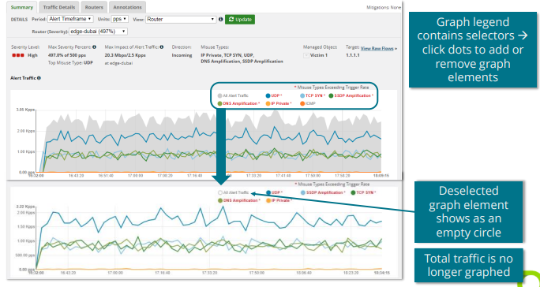
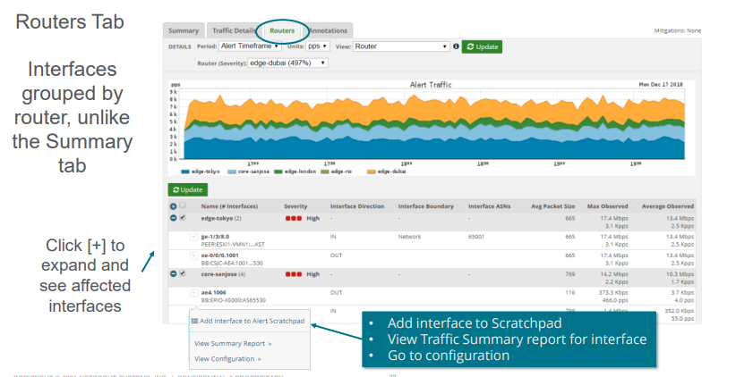
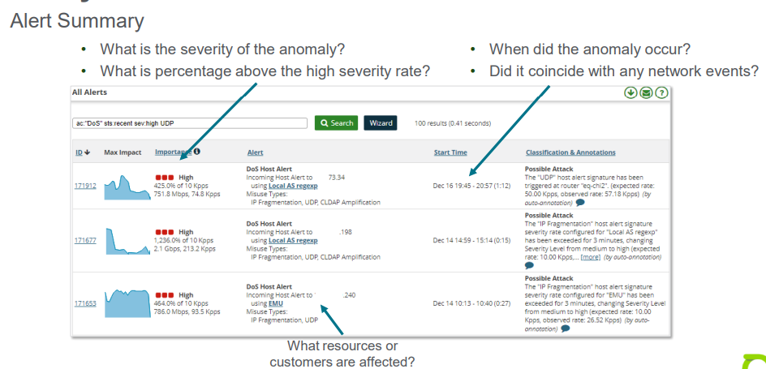
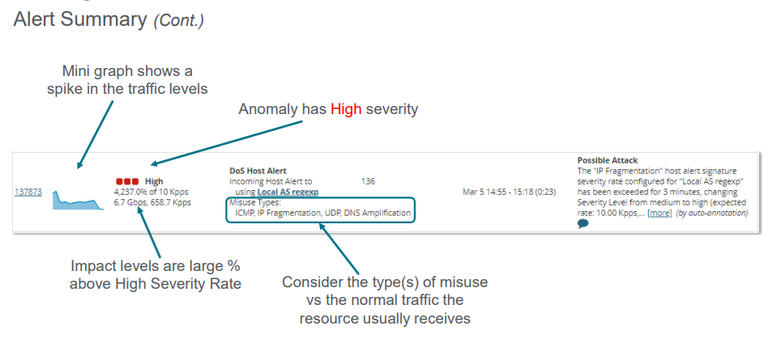

# Unit 5: Interpreting Anomaly Alerts

## Table of contents

- [Unit 5: Interpreting Anomaly Alerts](#unit-5-interpreting-anomaly-alerts)
  - [Table of contents](#table-of-contents)
  - [Alert Details](#alert-details)
    - [Overview](#overview)
    - [DOS Alert Summary Tab](#dos-alert-summary-tab)
    - [Graphs and Legends](#graphs-and-legends)
    - [Top Traffic Pattern](#top-traffic-pattern)
    - [Drop Down Menu](#drop-down-menu)
    - [Alert Characterization](#alert-characterization)
    - [Packet Size Distribution](#packet-size-distribution)
    - [Top Interfaces](#top-interfaces)
    - [Annotations](#annotations)
    - [Raw Flows](#raw-flows)
    - [Traffic Details Tab](#traffic-details-tab)
    - [Aggregated Data](#aggregated-data)
    - [Routers Tab](#routers-tab)
    - [Annotations Tab](#annotations-tab)
  - [Analyze Anomalies](#analyze-anomalies)
    - [Recommended Practices:](#recommended-practices)
    - [Eagle View](#eagle-view)
    - [Alert Summary](#alert-summary)
    - [Signs of Traffic](#signs-of-traffic)
    - [Signs of Normal Usage Spikes](#signs-of-normal-usage-spikes)
  - [DOS Alert Statistics](#dos-alert-statistics)
    - [Alert \> Summary](#alert--summary)
    - [Alert \> Activity Reports](#alert--activity-reports)

## Alert Details 

### Overview

- `Summary Tab`
  - What are the major components of the anomaly
  - What resources, routers, and interfaces, are involved
  - Top traffic patterns
- `Traffic Details Tab`
- `Routers Tab`

### DOS Alert Summary Tab

  

### Graphs and Legends

  

### Top Traffic Pattern

- Found directly below the Alert Traffic graph
- Top Traffic Patterns show traffic contributions by combinations of traffic details
- Patterns are derived from 5-tuple
  - Ip addresses
  - IP Protocol
  - TCP/ UDP Ports
- Traffic Patterns that exceed 10% of alert are combined → Top Traffic Patterns

### Drop Down Menu

- Hidden dropdowns appear when hovering near almost any element of a top traffic pattern

### Alert Characterization

- Each element listed contributed at least 25% of the traffic for the alert
- Pull downs for Scrathpad:   
  - Scrathpad is a electronic pad that helps to centrally note important information and identified attack elements
  
### Packet Size Distribution

### Top Interfaces

- Up to 5 of the top affected interfaces are tracked

### Annotations

- Only recent annotations are on `Summary tab`

### Raw Flows

- Explore > Forensics
- Obvious when raw flows query has results
- Query fingerprint is automatic but not constrained to alert traffic

### Traffic Details Tab
  - Source and Destination IP Addresses
  - Source and Destination TCP Ports
  - Source and Destination UDP Ports
  - Source Countries
  - Source ASNs
  - Protocols
  - TCP Flags
  - ICMP Types
  - Misuse types

### Aggregated Data

- Up to 100 items may be recorded in each category
- Aggregates IP addresses and port ranges into
significant percentages

### Routers Tab

  

###  Annotations Tab

- Displays a list of all annotations that have been made for the  alert, whether manually or automatically by the system

## Analyze Anomalies

### Recommended Practices: 

If there are a lot of Alerts, check for the following:
  - MO may have manually configured detection settings
    - Thresholds for misuse are too low -> raise them
  - Auto-rates default settings may be too low
    - Consider a higher percentile for Ignore Rate (~60 or more)    
    - A handful of managed objects make up 90% of all alerts
      - May be small resources that have very spiky traffic.    
      - Turn off profiled alerting for these or manually set the rates at a higher level

- Unless the network is constantly under attack, aim at getting no more than ~100
DOS alerts and no more than ~10 high alerts per day on the system

- When trying to identify a malicious attack, look at Host first!
  
### Eagle View

- Anomaly summary
  - Is a given anomaly something worth looking into?
  - How severe is it?
  - What is it impacting?
- Traffic characterization
  - Do the traffic patterns look malicious?
  - How far above the expected is it?
- Interface/Router traffic details
  - What are the packet sizes involved?
- Is the data consistent with normal Internet traffic patterns?

### Alert Summary
  
  

  

### Signs of Traffic

  - Several Misuse Types ware detected
  - Traffic levels reported for the misuse types indicate an abnormal behavior
  - Destination ports not matching the service on the affected host
  - Inspect the Top Traffic Patterns
  - Check common services of Managed Object from Report Data
  - Check normal Top Country Distribution with Report Data
  - Examine the Traffic Details from the router or boundary with the highest volume of traffic, looking for:
    - Not normal source distribution
    - Non-standard port distribution
    - Unexpected source countries
  - A subnet as source with source ports entire range
  - A small number of OP destinations with varied destination ports
  - The anomaly ends with a sharp drop off in traffic
  - Service not offered by this Destination
  - Look at bytes/packet and PPS for the anomaly

### Signs of Normal Usage Spikes

- Profiled Anomaly

## DOS Alert Statistics

### Alert > Summary 

All Alerts and Alert Classes display the number of alerts in the system
  - Ongoing
  - Recent
  - Last 24 Hours

### Alert > Activity Reports

- Show activity of Host and Profiled alerts over time

