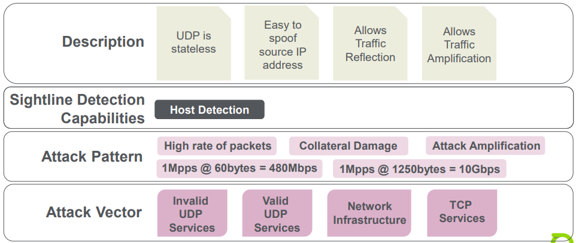
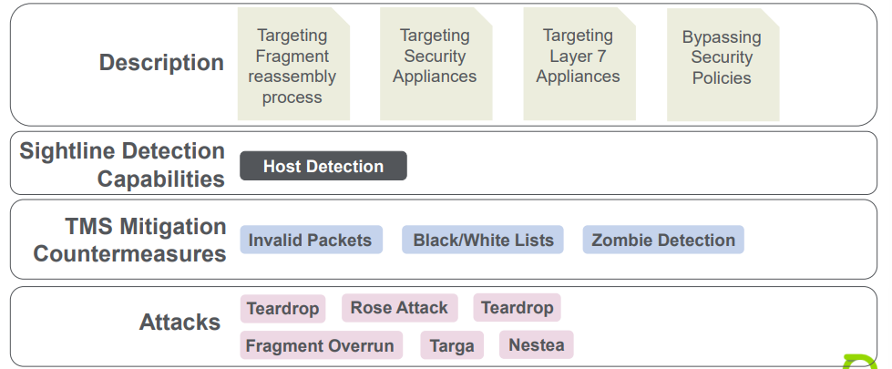
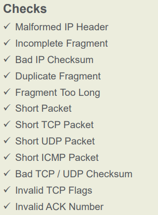
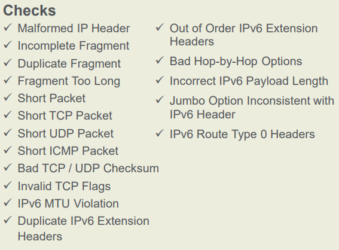
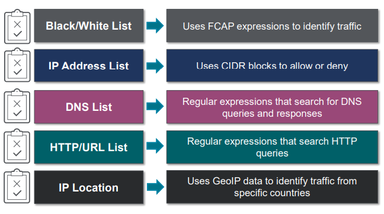
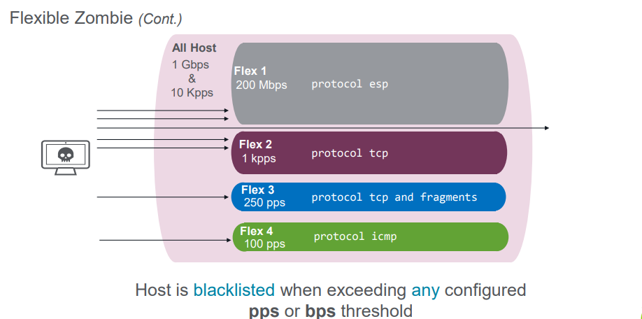

# Unit 8: Volumetric Attacks

## Table of content

- [Unit 8: Volumetric Attacks](#unit-8-volumetric-attacks)
  - [Table of content](#table-of-content)
  - [Flooding Attacks](#flooding-attacks)
    - [Overview](#overview)
    - [UDP Floods](#udp-floods)
    - [Fragmentation Attacks](#fragmentation-attacks)
  - [Invalid Packets](#invalid-packets)
  - [Filter Lists](#filter-lists)
    - [Overview](#overview-1)
    - [Use Cases](#use-cases)
    - [Types](#types)
    - [IP Address Filter](#ip-address-filter)
    - [IPv4 Black/ White Filter List](#ipv4-black-white-filter-list)
    - [FCAP format to explicitly DROP or PASS traffic](#fcap-format-to-explicitly-drop-or-pass-traffic)
    - [IP Location Filter](#ip-location-filter)
  - [UDP Reflection and Amplification](#udp-reflection-and-amplification)
    - [Overview](#overview-2)
    - [Configuration](#configuration)
    - [Additional Match Criteria](#additional-match-criteria)
  - [Zombie Detection](#zombie-detection)
    - [Overview](#overview-3)
    - [Goal](#goal)
    - [Flexible Zombie](#flexible-zombie)
    - [Configuration:](#configuration-1)
    - [Monitoring:](#monitoring)
  - [Proxy List Threshold Exemption](#proxy-list-threshold-exemption)
    - [Overview](#overview-4)
    - [Configuration](#configuration-2)
  - [Per Connection Flood Protection](#per-connection-flood-protection)
    - [Overview](#overview-5)
    - [Configuration](#configuration-3)
    - [Options](#options)
  - [Traffic Shaping](#traffic-shaping)
    - [Overview](#overview-6)
    - [Configuration](#configuration-4)
    - [Monitoring](#monitoring-1)
  - [IP Location Policing](#ip-location-policing)
    - [Overview](#overview-7)
    - [IP location Policing Rate Suggestion](#ip-location-policing-rate-suggestion)
    - [Mitigation Template](#mitigation-template)
    - [Adding a Country](#adding-a-country)
    - [Updating a country](#updating-a-country)

## Flooding Attacks

### Overview
  - Description:
    - Traffic to one or more protocols or ports
    - Spoofed or non-spoofed Traffic
    - Looks like normal Traffic
    - Reflection Attacks
  - Sightline Detection Capabilities:
    - Host Detection
    - Profiled Detection
  - TMS Mitigation CountermeasuresL
    - Zombie Detection
    - UDP Reflection/ Amplification
    - Per Connection Flood
    - Black/ White lists
    - HTTP/ DNS Rate Limiting 
    - Payload RegEX Filtering
  - Attacks: 
    - UDP Floods
    - Reflection Attacks
    - Black Energy
    - Mirai Botnet Variants
    - Memcached

### UDP Floods

  

### Fragmentation Attacks

  

## Invalid Packets

- Invalid Packets is a per packet countermeasure that ensures that all incoming frames are valid IP packets and that basic IP header requirement are fulfilled

- IPv4:
  - Invalid packet checks apply to every mitigation

      

- IPv6:
  - Invalid packet checks apply to every mitigation 

      

## Filter Lists

### Overview

- Filter Lists can reduce the processing load on the TMS
    - Limiting the amount of traffic that needs to go through all countermeasures
    - If a packet matches, no further processing will be done
- Sightline can automatically import Filter Lists from external
    - Filter Lists are configured globally 
    - Filter Lists can be pre-assigned via template or added on the fly
    - Multiple filters can be selected simultaneously
    - Multiple filters can be selected simultaneously
  - Filter lists are often compared to ACLs

### Use Cases

  - Pass lists
    - Known partner network
    - Approved remote workers
    - Know secure clients
  - Block lists
    - Security group infected subscriber lists
    - Third-party tool bot and infected host lists
    - Networks or countries without legitimate use case

### Types
  
  

### IP Address Filter

  - User-defined lists of IP addresses/CIDR blocks
    - Towards the top of the processing order, immediately after the the Blocked Host List
    - IP address sources that are known in advance can be processed immediately

### IPv4 Black/ White Filter List
  - Inline Filters
    - Freeform FCAP filter
    - Configured before or during Mitigation
  - Black/ White Filter Lists
  - Blacklist Fingerprints

### FCAP format to explicitly DROP or PASS traffic
  - Known sources to PASS
  - Known sources to DROP
  - Invalid/ Unwanted port and protocols

### IP Location Filter
  - IP Location filter lists are selected IP location country codes.
  - IP location Country codes use large lists of associated IP address prefixes to match traffic
  - IP Location filter lists are globally configured or uploaded
  - Mitigations can use any IP Location filter list to match traffic

## UDP Reflection and Amplification

### Overview

  - It comes later in the packet processing order
    - Useful if you need to pass some legitimate traffic before applying this countermeasure
    - It provides detailed individual drop statistics
    - Can be automated through the Alert Misuse types detected

### Configuration

  - Built to handle most common UDP DDoS attack vectors
  - Can be configured to either drop or blacklist offending external hosts
  - Uses predefined FCAP filters
  
### Additional Match Criteria

-  Expand any of the filters to add additional FCAP match criteria

## Zombie Detection

### Overview

  - A per-packet countermeasure against flood, TCP SYN and protocol attacks
  - It monitors overall bps, pps and traffic rate from each source host. Once every minute, the zombie countermeasure checks bps, pps and traffic rate from each source host during the previous minute
  
### Goal

  - Original design goal is block  traffic from bot-infected "zombie" hosts that send traffic flood attack packets at a constant rate with no regard to return traffic

- Zombie thresholds should be set at rates higher than any legitimate host would be expected to send on a sustained basis

### Flexible Zombie

  - Flexible Zombie requires FCAP filters to monitor specific traffic for abusive amounts
    - Allows handling very specific attacks
    - Applied early in the processing order
  - Up to 5 Flexible Zombies can be defined per mitigation in addition to global All Hosts Zombie
    - Works with or without All Hosts Zombie
    - No Learned Dataset support for Flexible Zombies
  - Traffic scoping allows a more precise evaluation and detection of malicious traffic
  - Effective mitigation without the need for more complex countermeasures
  
    

### Configuration:
  - Configure when creating or editing a mitigation or mitigation template from `TMS Mitigation Status` page
  

### Monitoring:

  - `All Hosts` : show threshold for the global Zombie operation
  - `Flexible 1 -> 5` : show threshold for a single Flexible Zombie Configuration and its statistic

## Proxy List Threshold Exemption

### Overview

- Sources transmit at high rates, need to increased `Rate based countermeasure thresholds`
  - Typical sources
    - Host aggregators
    - High traffic, special-use hosts
  - Solution:
    - Single rate multiplier + proxy list per mitigation
  - Affected countermeasures
    - Zombie Detection, DNS Rate Limiting, HTTP Rate Limiting and SIP Rate Limiting

### Configuration

- Multiplies the countermeasure threshold rates: `Scaling Factor` for the listed `Proxy Source CIDRs`

## Per Connection Flood Protection

### Overview

- Monitors IPv4 traffic on a per-connection traffic (5-tuple)
- Mitigates traffic that exceeds by blocked or limit the rate

### Configuration

- Limit the amount of traffic that can be send through a single connection
  `5-tuple = src IP + dst IP + Protocol + src Port + dst Port`

### Options

- Rate limit protection on a connection 5-tuple
- Enabled for all, multiple, or specific TCP and UDP port
- Can block or rate limit offending connection
- Intended where Zombie Detection by source host is impractical

## Traffic Shaping

### Overview

- Limit Attack traffic to a level that allows protected hosts to function
  - Use when all other countermeasure are not removing enough
  - Shaping is done before traffic is sent to application decoders

### Configuration

- Using `FCAP Filter` to scope the shaping to a specific traffic stream
- Up to 10 queues
- Each use a `FCAP Filter Expression` and maximum `Traffic Levels` settings in bps and pps

### Monitoring

- Shaping status graphs of dropped traffic are color-coded by enabled shaping queue

## IP Location Policing

### Overview

- Mitigate traffic from ether `specified` or `unspecified`
- May block some legitimate traffic:
  - Geographic inaccuracy and flux
  - IP space can span broad geographic expanses
  - Normal users present in unexpected geographic region due to travel or migration

- Rate suggestion possible per configured `Managed Object`
  - Must be enabled ahead of time
  - Can establish pre-attack level country based rates

### IP location Policing Rate Suggestion

- Supported only for Ipv4-based `Managed Object`
- Collect per-country rate statistics by `Generate IP Location Policing Rate Suggestions`
- Rate Suggestions used in the IP Location Policing countermeasure

### Mitigation Template

- Load All Countries and Rates on Mitigation Start
- Can do in `Mitigation Status` page

### Adding a Country

- `Load All Countries` adds all of the countries's traffic for which Arbor Sightline has data
- `Load Rates` loads the generates rates for all countries whose configured actions are "rate shape"
- `Add Country` is used to specify a country whose traffic should be policed

### Updating a country