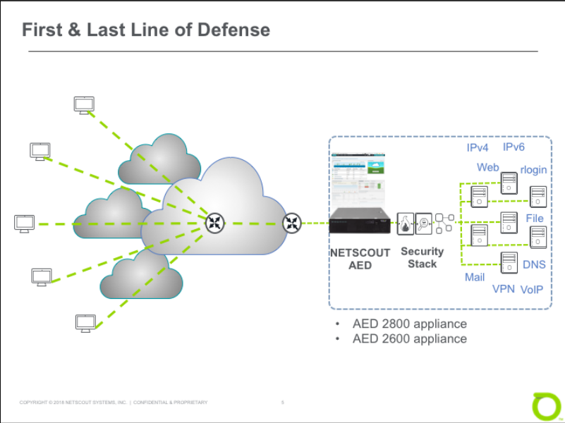

# Unit 1: NETSCOUT AED Overview

## AED architectural and functional

### AED Platform

- Arbor Edge Defense (AED) platform:
  - A single, stand-alone device
  - Deploy at ingress point to detect, block, and report on DDoS attacks.

- `First & Last Line of Defense`
  - First line of defense:
    - Deployed at the network perimeter
    - Using stateless technology and armed with millions of IoCs => Can detect and block inbound commodity cyber threats 
    - Taking pressure off of stateful devices such as Next Gen Firewalls
  - Last line of defense:
    - Can detect and block outbound communication to known bad IP addresses, domains, URLs, geographies 
    - Helping stop the further proliferation of malware within an organization and avoid a data breach.

  

  - Deployment guidelines:
    - Deploy the appliance at the data center’s premises, on the internet edge of the data center’s network.
    - AED is external to all of the additional security devices => Protects these devices from attacks
    - Inline deployment without an IP address with either the inbound interface or the outbound interface.

- `Support for Virtual & Hybird-Cloud Environments`

- `"Out-of-the-box" Protection`

- `Outbound Threat Filter`

- `ATLAS Intelligence Feed (AIF)`

- `Block Threats using STIX/TAXII 2.0 Support`

- `Cloud Signaling`

- `Protecting SSL Encrypted Traffic`

- `Central Management`

- `Executive Summary and ATLAS Global DDoS Reports`

### AED Interfaces

- AED Management Interfaces

- AED Protection Interfaces

- Interface Pairing
  
- Protection Interfaces: Bypass

- Bypass Subcommands:

## Establish UI familiarity and workflow

