# Unit 1: NETSCOUT AED Overview

## Table of contents

- [Unit 1: NETSCOUT AED Overview](#unit-1-netscout-aed-overview)
  - [Table of contents](#table-of-contents)
  - [AED architectural and functional](#aed-architectural-and-functional)
    - [AED Platform](#aed-platform)
    - [AED Interfaces](#aed-interfaces)
  - [Establish UI familiarity and workflow](#establish-ui-familiarity-and-workflow)
    - [Accessing the Web User Interface (UI)](#accessing-the-web-user-interface-ui)
    - [AED Administration Workflows](#aed-administration-workflows)
  - [Current AED Operational status](#current-aed-operational-status)
  - [Establish perspective by identifying current traffic characteristics](#establish-perspective-by-identifying-current-traffic-characteristics)
    - [Improving Visibility with Protection Groups](#improving-visibility-with-protection-groups)
    - [Turning Protection Setting using Traffic Profiles](#turning-protection-setting-using-traffic-profiles)

## AED architectural and functional

### AED Platform

- Arbor Edge Defense (AED) platform:
  - A single, stand-alone device
  - Deploy at ingress point to detect, block, and report on DDoS attacks.

- `First & Last Line of Defense`
  - First line of defense:
    - Deployed at the network perimeter
    - Using stateless technology and armed with millions of IoCs => Can detect and block inbound commodity cyber threats 
    - Taking pressure off of stateful devices such as Next Gen Firewalls
  - Last line of defense:
    - Can detect and block outbound communication to known bad IP addresses, domains, URLs, geographies 
    - Helping stop the further proliferation of malware within an organization and avoid a data breach.

  

  - Deployment guidelines:
    - Deploy the appliance at the data center’s premises, on the internet edge of the data center’s network.
    - AED is external to all of the additional security devices => Protects these devices from attacks
    - Inline deployment without an IP address with either the inbound interface or the outbound interface.

- `Support for Virtual & Hybird-Cloud Environments`: vAED (virtual machine version of ADE)
  - Run on a hypervisor or in the cloud
  - Contains all of the AED software packages and configurations
  - Only need to install the virtual machine and configure

- `"Out-of-the-box" Protection`: By defaults of active protection mode, AED protect all of the host in the enterprise 

- `Outbound Threat Filter`:
  - Prevent malicious traffic from leaving your network
  - Protect all of the outbound IPv4 traffic that passes through AED

- `ATLAS Intelligence Feed (AIF)`:
  - A global, subscription-based service of the NETSCOUT Security Engineering and Response Team (ASERT)
  - AIF Botnet are HTTP header signatures that used to identify known botnets by their traffic patterns.
  - More information about [ASERT](https://www.arbornetworks.com/research/security-intelligence)
  - ATLAS threat categories are collections of the rules and actions that define threats.
  - AIF Specific Intelligence:
    - The threat policies are organized into threat catagories
      - Can enable threat blocking and view traffic statistic by threat category
    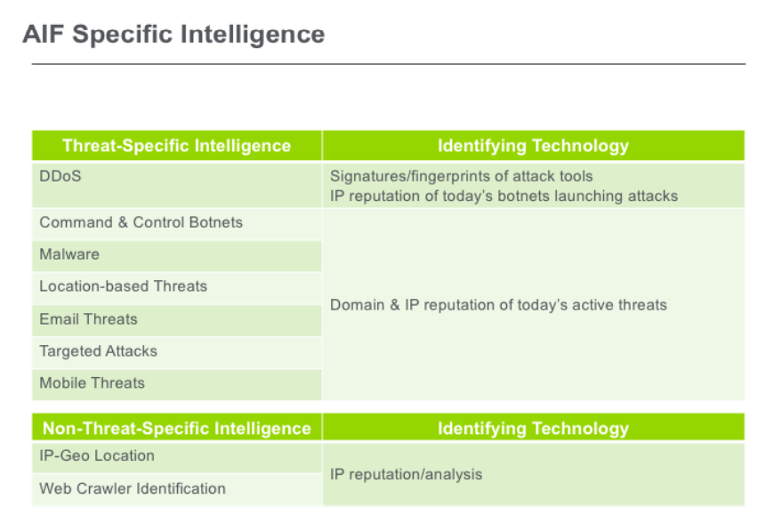  

- `Block Threats using STIX/TAXII 2.0 Support`:
  - AED use IOCs (the indicators of compromise) in STIX 2.0 (Structured Threat Information  eXpression) to identify and block threats
  - `Trusted Automated Exchange of Intelligence INformation 2.0` (TAXII): used to authorize on AED
    

- `Cloud Signaling`: The process of requesting and receiving cloud-based mitigation of volumetric attacks in real time from an upstream service provider.

  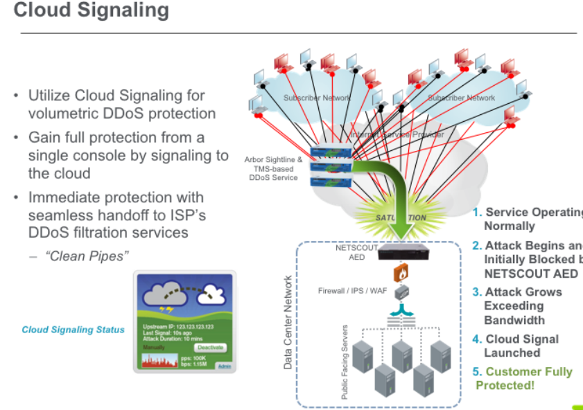

- `Protecting SSL Encrypted Traffic`: Deploy with Hardware Security Module (HSM) with AED to protect the availability of online applications that rely on SSL and TLS
    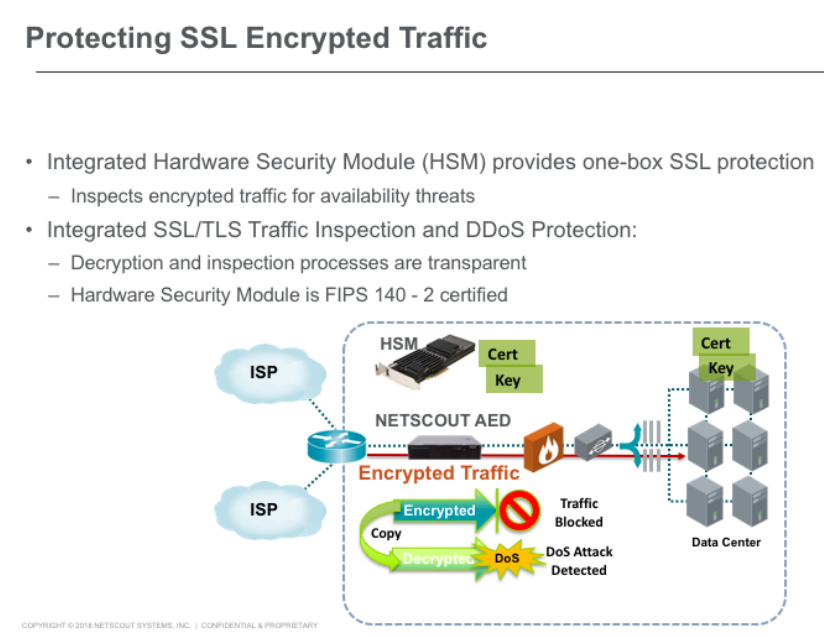

- `Central Management`: 
  - APS console provides manage up to 50 AED devices which allows you to monitor and respond to attacks across your network from a single interface 
    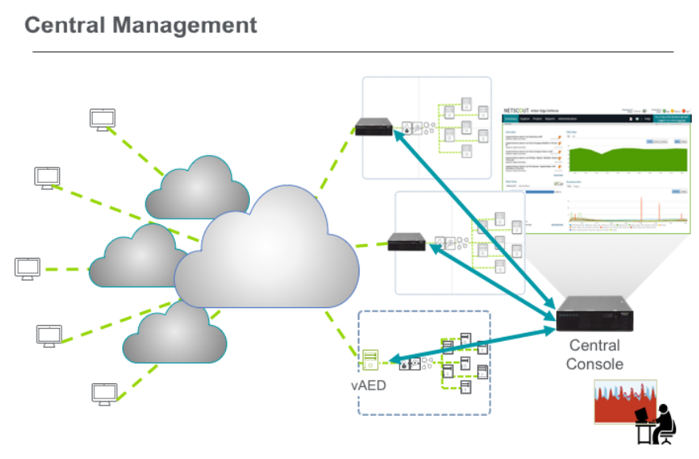
- `Executive Summary and ATLAS Global DDoS Reports`
  - The predefined Executive Summary Report provides information about the high-level traffic trends, the attacks thats AED detected on your network.
  - If you participate in Arbor's data-sharing program, you can give access to the ATLAS Global DDoS Report from ASERT, which helps to show the scope of internal threats to your network in the context of other networks and the internet.

### AED Interfaces

- AED Management Interfaces:
  - Access the Command Line Interface (CLI)
  - Web User Interface (via HTTPS)
  - Other management via SOAP APIs and a Web Services API
      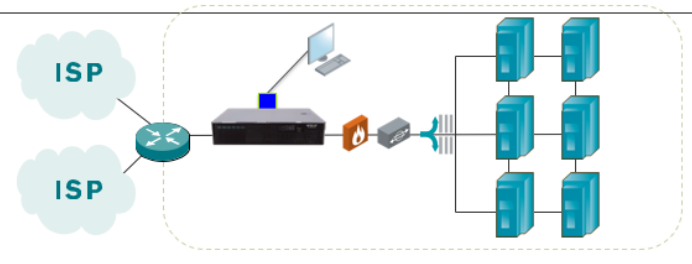

- AED Protection Interfaces:
  - Configured as predefined port pairs
  - An external (ext) interface is specifically paired with internal (int) interface
  - Forwards traffic in both directions:
    - The AED appliance is bypass capable when failure (hardware, software, power) occur:
      - fail open (bypass)
      - fail closed (disconnect) 

      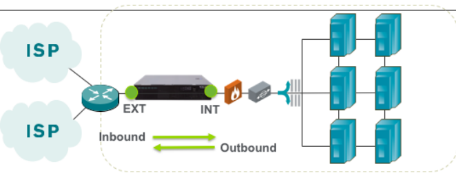

- Interface Pairing
  
- Protection Interfaces

- Bypass Subcommands

## Establish UI familiarity and workflow

### Accessing the Web User Interface (UI)

- Instructor-led Demonstration of Web UI
    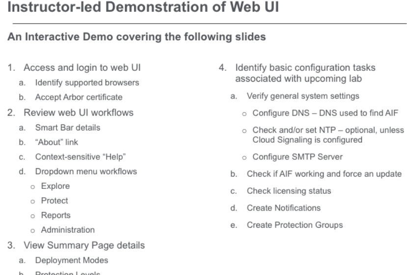

### AED Administration Workflows

- Status Bar - Deployment Mode: Set via CLI during initial installation
  - Monitor
  - Inline - bridged
  - Inline - routed (layer 3 for vAED only)

- `Monitor Deployment Mode`: Does not forward traffic or analyze outbound traffic
  - Deployed through a span port or network tap
  - Don't block traffic
  - Use to know how it affects your network traffic

    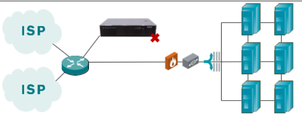

- `Inline Deployment Mode`: the AED monitors and mitigates the traffic.
  - Active: 
    - Mitigates, monitoring traffic, detecting attacks.
    - Blocking malicious traffic according to protection group and protection levels settings.
  - Inactive:
    - Monitoring traffic and detecting attacks, same as the monitor mode
    - Reports malicious traffic according to protection group and protection levels settings.

- `Protection levels`:
    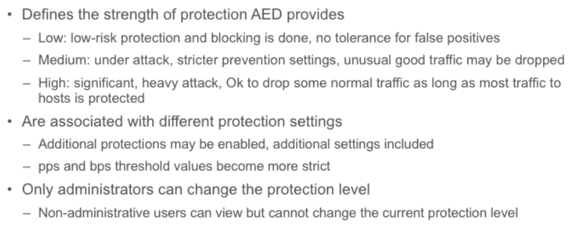

- `Menu Tabs`:
    

## Current AED Operational status

- Summary Page Overview
    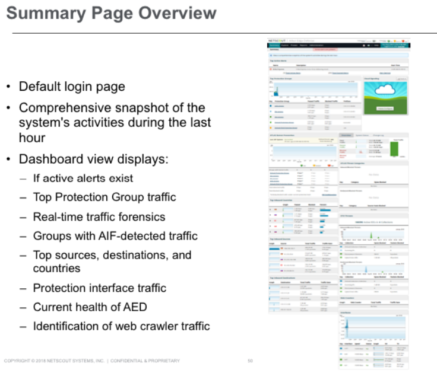

- `Top Protection Groups`:
  - Shows traffic per Protection Group (color coded)
  - Out-of-the-box, AED starts with the Default Protection Group tracking all traffic

- `Overview`: Show Total Traffic, Passed Traffic, Blocked Traffic, Blocked Host

- `Top Countries`: Geographical distribution of incoming traffic

- `Top Inbound Sources & Destinations`:
  - Display The IP addresses that sent/ received the most traffic during the last hour
  - Allows you to blacklist any of the IP address
  - Display the Blocked Hosts Log page for a specific IP address
  - Display Packet Capture page for specific Ip address

- `ATLAS Botnet Prevention`:
  - AIF update status 
  - How AIF Prevention is seeing the traffic for each Protection Group and level

- `Web Crawlers`: Show traffic rates for different Web Crawlers

- Viewing Protections Interfaces: 
  - Activity on the protection interfaces during the last hour
  - Used to determine whether te protection interfaces are up or down
  - Determine if any of the interfaces are overload

## Establish perspective by identifying current traffic characteristics

### Improving Visibility with Protection Groups 

- `Protection Groups (PGs)`: Protect and provide extensive traffic analysis for a defined group of host, defined by a combination of:
  - A list of protected internal hosts: host ip, subnet, domain name
  - A server type: A global object that provides prevention settings to this protection group
  

- `Default Protection Group`: is configured out-of-the-box:
  - Catch all -> reports all traffic seen to any IPv4 host
  - Use protection settings defined by NETSCOUT
  - Cannot delete

- Supported Protection Groups Limits:
  - Only AED 2600/2800 appliances support a maxium of 100 PGs
  - vAED suport a maxium of 50 PGs
  - Minimally configured vAED supports a maxium of 10 PGs:
    - 2 cores, 100GB disk space, 6GB ram

- Server types:
  - Every Protection Group is associated with a Server Type
  - The AED has two classes of Server Types
    - Standard Server Types
    - Custom Server Types
  - Custom Server Types are derived from Standard Server Types

- Server Types and Attack Protections:
  - Attack Protection settings are defined for each Server Type's configuration
  - Each Server Type has a set of pre-defined Protections

- Protections per Standard Server type
    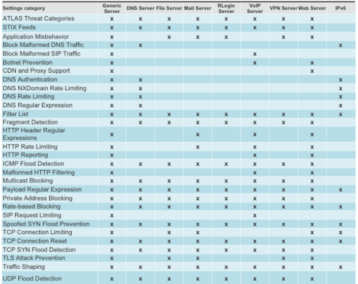

- Inbound Protection Processing Sequence
    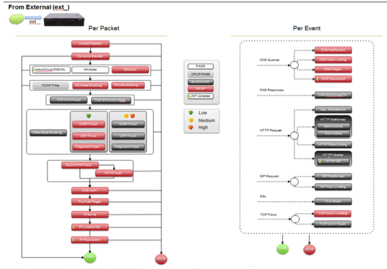

### Turning Protection Setting using Traffic Profiles

- Traffic Profile Learning

- Profile - Protections Supported

- Profile Capture

- Inaccurate Profiled Data May Result
